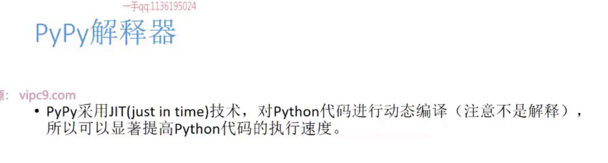
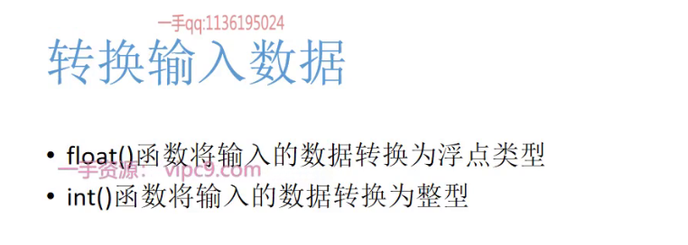

# 计算机硬件组成

[x86 x64 arm64的区别 - 赵青青 - 博客园 (cnblogs.com)](https://www.cnblogs.com/zhaoqingqing/p/13145115.html)


计算机冯诺依曼体系结构：由美籍匈牙利科学家**冯·诺依曼**提出


# 计算机软件组成


系统软件就是建立人与计算机之间的交流平台，使人可以控制计算机进行工作。


应用软件帮助我们完成特定功能：QQ


[新建标签页 (github.com)](https://github.com/996icu/996.ICU)

# Python

特点：Python是一种**解释型、面向对象、动态数据类型**的高级程序设计语言


## 编译型语言和解释型语言

​	python相比于其他语言像Java和C语言一个很大的特点就是它是解释型语言，而Java和C语言是编译型语言，因为计算机只能认识一种语言，就是二进制的机器码

​	编译型语言首先是将源代码编译生成机器是指令再由机器运行机器码。


​	解释型语言的源代码不是直接翻译成机器指令，而是先翻译成中间代码，再由解释器对中间代码进行解释运行。

全翻译完，在读


先翻译成中间代码，一行一行转换成机器码，需要一个解释器

叫一个翻译，读一行翻译一行

## 总结


### 缺点

1.运行速度慢

同一段爬虫代码的运行时间对比图：

开发效率高但运行速度低


## python应用场景

服务器的后台，网站的后台，但大公司的后台不是通过python写的，比如腾讯用的是C++,因为python效率低


脚本


## python安装

去 python.org安装


## python解释器




just in time：及时编译


## 集成开发环境pyCharm


Vs就是一种IDE 就是开发工具

下载地址：

[Download PyCharm: Python IDE for Professional Developers by JetBrains](https://www.jetbrains.com/pycharm/download/?section=windows)

# 注释1.1.3.1

就是对代码解释说明


## 单行注释 用#

#

## 多行注释用‘’‘

三个单引号‘’‘


三个双引号”“”也行

ctrl+/快捷键

python对格式要求特别严格 有缩进错误

#### 注释里的Todo

注释里todo 没有做的事


# 变量1.1.3.2

变量是用来描述计算机中的数据存储空间的


python可以同时定义多个变量


## 命名规则


## 命名规范


大驼峰就是每个单词的首字母都大写，小驼峰就是除了第一个单词后面每个单词都的首字母都大写

## 常量

python 是没有常量的概念的，我们无法从语法上保证这个变量不能修改

所以看到变量名为大写 ： 说明他是类似常量， 我们不希望进行修改


## 获取python中的关键字


# 变量类型1.1.3.3

变量类型是指变量所保存的数据类型

分为数字型和非数字型

## 数值型变量


```python
"""
数字型变量
"""
# 整型
NumberInt = 1
print(type(NumberInt))
# 浮点数 float
NumberFloat = 1.414
print(type(NumberFloat))
# Bool
NumberBool = False
print(type(NumberBool))
# 复数
NumberComplex = 1+1j
print(type(NumberComplex))
```


## 非数值型变量


## type获取变量类型


python是不需要指定变量类型的，所以是**动态类型语言**

甚至可以把age=1 编程age='RR'

## 运算符


# 人机交互1.1.3.4

种类：

1. 意念交互
2. 语音交互
3. 眼动交互
4. 体感交互
5. 打字交互

编程就算 和程序的控制台进行交互

## 输出函数


## 格式化输出


```python
"""
1.定义字符串变量 name，输出 我的名字叫 小明，请多多关照!
2.定义整数变量 student no，输出 我的学号是 00001
3.定义小数 price、weight、money，输出 苹果单价9.00 元/斤，购买了 5.00 斤，需要支付 45.00 元
4.定义一个小数 scale，输出 数据比例是 10.00%
"""
name = '我的名字叫小明，请多多关照'
print(name)
student_no = 1
print('我的学号是:%05d' % student_no)
price = 9.00
weight = 5.00
money = 45.00
print('苹果单价%.02f元/斤，购买了%.02f斤，需要支付%.02f元' % (price, weight, money))
scale = 10.00
print('%.02f%%' % scale)
```


# 输入函数1.1.3.5


```python
# 输入函数都是str字符串string
# 所以如果想输入数字必须转化为数字型
# name = input("请输入姓名")
# print(name)
age = input("请输入年龄：")
age = int(age)
age = age + 1
print(age)


```



### 输入输出练习题

```python
"""
1.计算器需求:
用户输入a
用户输入b
计算输出a+b=?
"""
# 用户输入a
a = input("请输入a：")
a = int(a)
# 用户输入b
b = input("请输入b：")
b = int(b)
print(a+b)
```


```python
"""
收银员输入苹果的价格,单位:元/斤
# 收银员输入用户购买苹果的重量,单位:斤
# 计算并输出付款金额
"""
# 收银员输入苹果的价格,单位:元/斤
Apple_SigPrice = input('请输入苹果价格：')
# 收银员输入用户购买苹果的重量,单位:斤
Apple_TotalWeight = input('请输入购买苹果的总重量:')
Apple_SigPrice = float(Apple_SigPrice)
Apple_TotalWeight = float(Apple_TotalWeight)
# 计算并输出付款金额
Payment = Apple_SigPrice * Apple_TotalWeight
print(Payment)
```


```python
"""
3.个人名片需求:
在控制台依次提示用户输入: 姓名、公司、职位、电话、邮箱
按照以下格式输出:
公司名称
姓名
职位
电话:电话
邮箱: 邮箱
"""
print('*'*50)
name = input("name,pls:")
company = input(" company name pls:")
job = input("job pls:")
tel = input("tel num pls:")
email = input("email num pls:")

print(company)
print(name)
print(job)
print(tel)
print(email)
print('*'*50)
```

# 运算符1.1.3.7

## 赋值运算符


## 比较运算符


## 逻辑运算符


## 运算符优先级


括号解决一切运算符问题

# if语句1.1.4.1

```python
if name == 'XQC':
    print("Noob")
```


## 石头剪刀布小游戏

```python
# 随机数库
import random

peo = input("请输入剪刀石头布：")
com = random.randint(0,2)
if  peo == '剪刀':
    peo_num = 0
elif peo == '石头':
    peo_num = 1
elif peo == '布':
    peo_num = 2
if peo_num  < com:
    if peo_num == 0 and com == 2:
        print(peo_num)
        print(com)
        print("peo WIN")
    else:
        print(peo_num)
        print(com)
        print("com WIN")
elif peo_num > com:
    if com == 0 and peo_num == 2:
        print(peo_num)
        print(com)
        print("com WIN")
    else:
        print(peo_num)
        print(com)
        print("peo WIN")
else:
    print(peo_num)
    print(com)
    print('equal')
```

# while 1.1.5.1


```Python
"""
计算 0 ~ 100 之间所有数字的累计求和结果0+1 +2+3+4+..+100
"""
sum = 0
index = 0
while index < 101:
    sum += index
    index += 1
print(sum)
```

