# 高级变量类型 1.2.1.1 

python中的数据类型回顾：

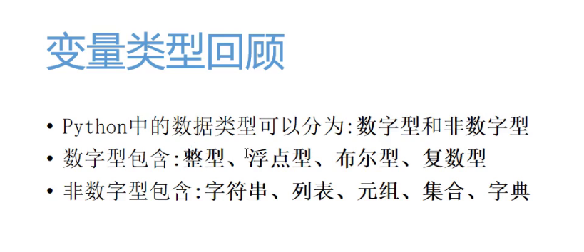

​	字符串、列表、元组、集合、字典统称为高级数据类型，他们有一个共同的特点，就是因为他们是容器

## 非数字类型变量特点

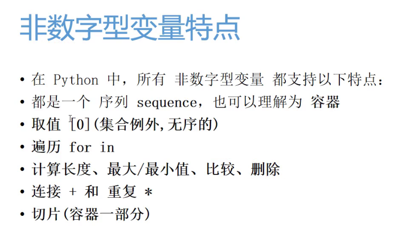

# 列表1.2.1.2

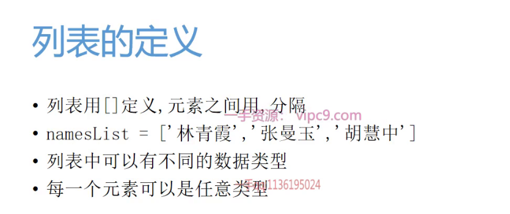

```python
MyList = ['XQC', 35, 'streamer']
print(MyList)
for count in MyList:
    print(count)

print(MyList[1])
```

## 增

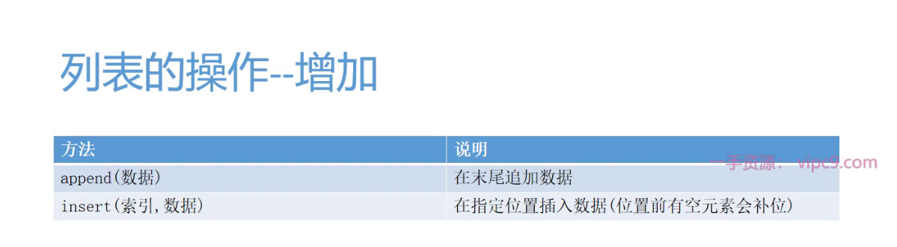

## 删

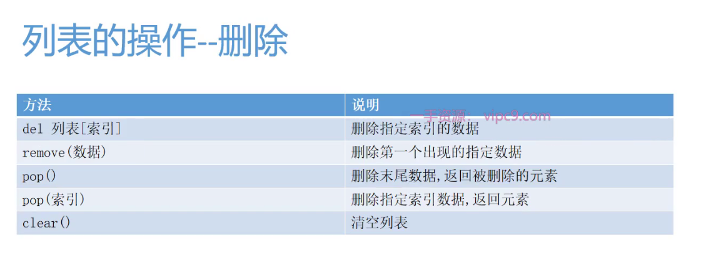

## 查

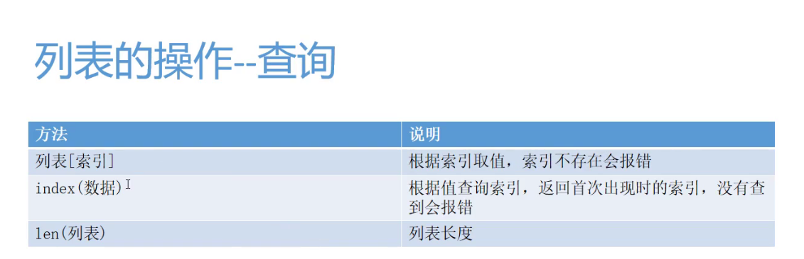

## 序(排序)

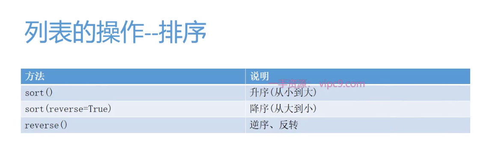

对数字型排序

## 试题 用户登录系统1.2.1.3

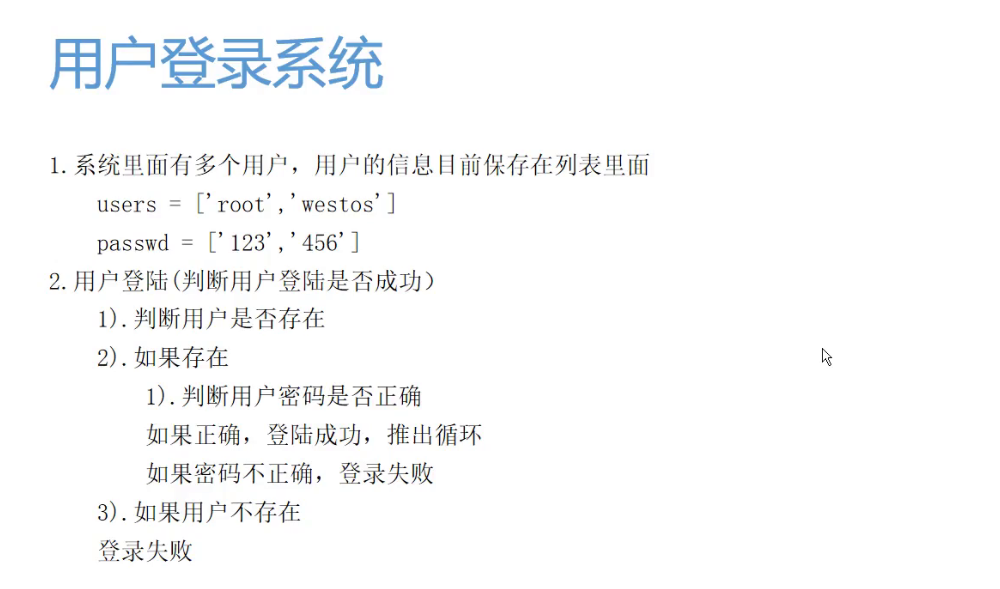

# 列表的嵌套1.2.1.4

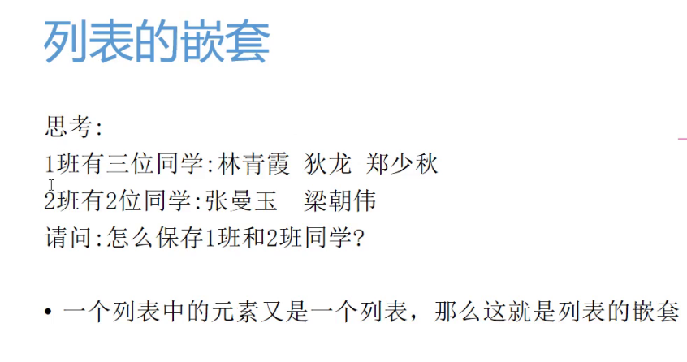

# 元组1.2.1.8

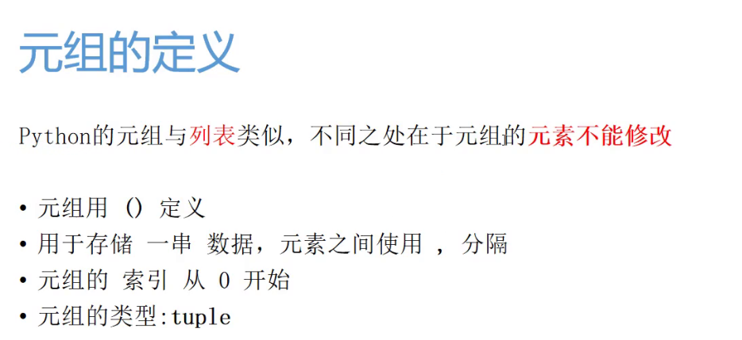

如果元组的元素只有一个，是不会带小括号的

```python
"""
元组是用()
"""
t = ('apex', "csgo")
t = apex, csgo#这种写法也是元组
print(t)
"""
如果元组内只有一个元素，print是不带括号的
"""
t = ('valorant')
print(t)
print(type(t))
##运行结果
#valorant
#<class 'str'>
```

原因就是他的类型变了

```python
如果元组内只有一个元素，print是不带括号的
"""
t = ('valorant')
print(t)
print(type(t))
#如果加上一个逗号
t = (19,)
print(t)
print(type(t))
######运行结果：
"""
valorant
<class 'str'>
(19,)
#他就又变成了tuple类型而不是int
<class 'tuple'>
"""
```

所以若想用元组但目前只有一个数据时

请务必待在括号内的数据后加上"，"逗号

## 元组的特点

不能修改：不能添加/删除/修改元素，append del 都用不了，元组变量定义出来就固定了const，不能重新声明

## 元组的应用场景

### 自动组包与自动解包

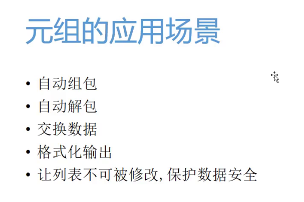

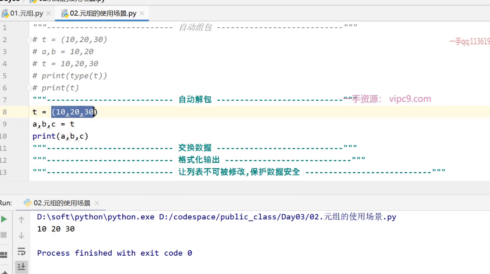

注意：自动解包必须有数量相同的变量去接收，如果变量数量不等于元组内成员个数，会报错。

### 交换变量

```python
a=10
b=20
a,b=b,a#这就相当于是元组的组包的操作
print(a,b)
```

### 格式化输出

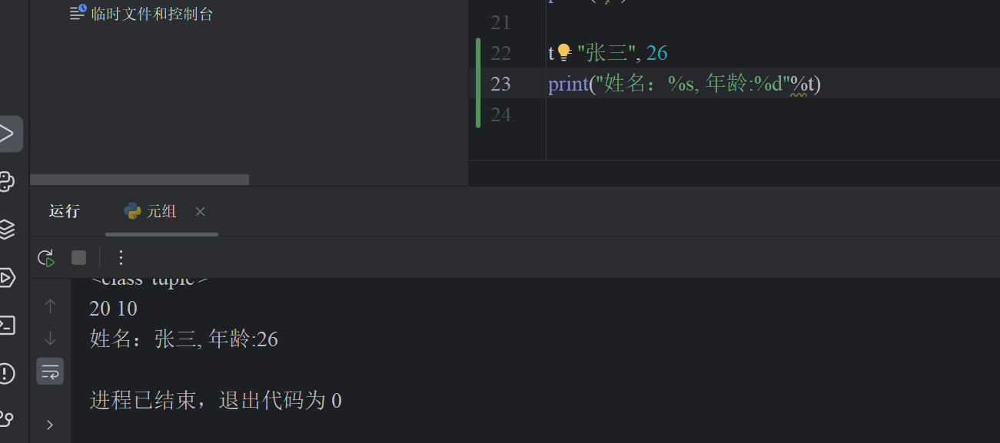

### 保护数据安全(类似于const)

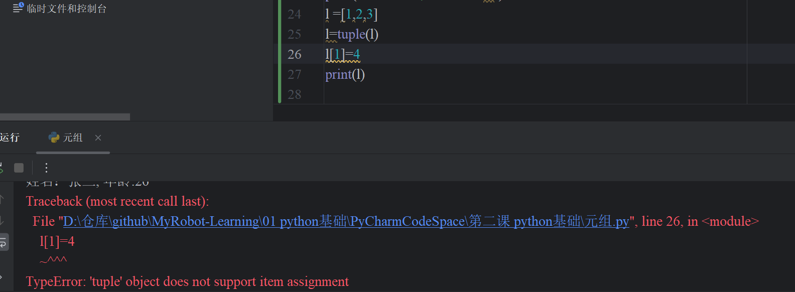

```python
# l =[1,2,3]
# l=tuple(l)
# l[1]=4
# print(l)
```

# 函数的参数1.2.2.2