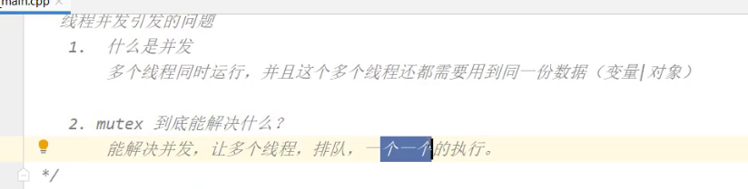

**进程: 具有独立功能程序在某个数据集合上的一次执行过程。 线程: 进程内的一个执行实体或执行单元**。

# 一、线程

> 线程是操作系统能够进行运算调度的最小单位。它被包含在进程之中，是进程中的实际运作单位。一条线程指的是进程中一个单一顺序的控制流，一个进程中可以并发多个线程，每条线程并行执行不同的任务
>
> 60年代，在OS中能拥有资源和独立运行的基本单位是进程，然而随着计算机技术的发展，进程出现了很多弊端，一是由于进程是资源拥有者，创建、撤消与切换存在较大的时空开销，因此需要引入轻型进程；二是由于对称多处理机（SMP）出现，可以满足多个运行单位，而多个进程并行开销过大。
>
> 因此在80年代，出现了能独立运行的基本单位——线程（Threads）
>
> 一般来说一个程序就对应一个进程， 有的程序为了让主进程的压力减小，一般也会开启别的进程。
>
> Android  守护进程 ， ： 天气类的软件... 

## 1. 创建线程

> 要想使用线程，需要导入头文件`#include` ,并且线程并不是linux默认的库，所以需要在cmakelist里面添加这行代码 `set(CMAKE_CXX_FLAGS "${CMAKE_CXX_FLAGS} -pthread")`

```cpp
#include <thread>
#include <iostream>

using namespace std;

void show(){
    for(int i = 0 ; i < 10 ;i ++){
        cout <<__func__ << " = " << i  << endl;
        this_thread::sleep_for(chrono::seconds(1));
    }
}


int main() {
    //让该线程执行show函数
    thread t(show) ;
    
    cout << "执行了main函数 " <<endl;
    return 0;
}
```

## 2. join 和 detach

> join 的意思是让主线程等待子线程执行结束后，在进行下一步，意思是让主线程挂起。

```cpp
#include <iostream>
#include <thread>

using namespace std;

void show(){
    for(int i = 0 ; i < 10 ;i ++){
        cout <<__func__ << " = " << i  << endl;
        this_thread::sleep_for(chrono::seconds(1));
    }
}

int main() {
    //让这个线程执行上面的show 函数
    thread t(show) ;
    
    //让主线程等待子线程运行结束后，再继续下面的逻辑
    //否则主线程运行结束，程序就结束了。
    t.join();
    cout << "执行了main函数 " <<endl;

    return 0;
}
```

detach的意思将本线程从调用线程中分离出来，允许本线程独立执行,从此和主线程再也没有任何关系。(但是当主进程结束的时候，即便是detach（）出去的子线程不管有没有完成都会被强制杀死) 。

```cpp
#include <iostream>
#include <thread>

using namespace std;

void show(){
    for(int i = 0 ; i < 10 ;i ++){
        cout <<__func__ << " = " << i  << endl;
        this_thread::sleep_for(chrono::seconds(1));
    }
}


int main() {
    //让这个线程执行上面的show 函数
    thread t(show) ;
    
    //让主线程等待子线程运行结束后，再继续下面的逻辑
    //否则主线程运行结束，程序就结束了。
    t.detach();
    cout << "执行了main函数 " <<endl;

    return 0;
}
```

## 3. 传递参数

> 往线程里面执行的函数传递参数，最长使用的办法就是`bind`机制 ， 这里以在线程内部构建学生对象，从外部传递姓名和年纪数据。

```cpp
#include <iostream>
#include <thread>

using namespace std;

class stu{
public:
    string name;
    int age;

    stu(const string &name, int age) : name(name), age(age) {
        cout <<"执行构造函数了~"  << name <<" = "<< age<< endl;
    }
}

void constructor(string name ,int age ){
    cout <<"执行构造学生的工作~·1" << endl;
    stu s(name ,age);
}

int main() {
    //这里会提示： 还不如使用lambda表达式呢~
  	thread t(bind(constructor , "张三" , 16)) ;
    
    return 0 ;
}
```

## 4. 获取线程id 和休眠

### 1. 获取线程id

> 每一个线程在执行的时候，都有自己的一个标识id， 只有在少数情况下，线程的id会变得与众不同。通过 `t.get_id()` 获取线程对一个的`id` ， 也可以使用`get_id()` 获取当前线程的 `id` 。

```cpp
#include <iostream>
#include <thread>

using namespace std;


void show(){
    cout <<"打印语句~" << endl;
}  


//在函数内部获取当前线程的id 可以使用命名空间 this_thread里面的函数get_id
int main(){
    cout <<"主线程的id="<< this_thread::get_id() << endl;
    
    //这里会提示： 还不如使用lambda表达式呢~
    thread t(show) ;
    t.get_id();
    
    return 0 ;
}
```

### 2. 线程休眠

> 让线程休眠，等待一段时间然后继续执行，这样的场景在开发的时候经常会出现，在 c++中，让线程休眠，如果是在windows可以使用 `windows.h`头文件中的`Sleep`函数 ， 如果是linux 系统，可以使用`#include `里面的`usleep`函数 或者 也可以使用 `this_thread::` 里面的 `sleep_for` 函数 .

```cpp
#include <iostream>
#include <thread>
#include <unistd.h>

using namespace std;

void show(){
    for (int i = 0; i < 10; ++i) {
        cout <<"打印语句~"<< i << endl;
        usleep(1000 * 10000);  //单位是微秒
    }
}

int main(){
    thread t(show) ;
    
    return 0 ;
}
```

## 5. 结束线程

> 线程的退出，手段还是很多的，但是万般手段中，建议使用的只有一个。
>
> 1、自行手动退出（函数返回、条件标记 false 、抛出异常等等）（建议使用）
>
> 2、通过调用ExitThread函数，线程将自行撤消（最好不使用该方法）。 
>
> 3、同一个进程或另一个进程中的线程调用TerminateThread函数（应避免使用该方法）。
>
> 4、ExitProcess和TerminateProcess函数也可以用来终止线程的运行（应避免使用该方法）。

```cpp
#include <iostream>
#include <thread>

using namespace std;

void show(){
    for (int i = 0; i < 25; ++i) {
        if(i== 3){
            cout <<"函数返回，线程终止。" << endl;
            return ; //或者在这抛出异常，也形同return。
        }
    }
}
int main() {
  	thread t(show) ;
    
    return 0 ;
}
```

## 6. 并发访问

### 线程并发导致的问题




> 由于`cout`对象并不会产生互斥 ， 让线程有先有后，所以在多线程场景下，输出的结果并不是我们想要的，显得杂乱无章。这时候可以使用`mutex` 来控制互斥

```cpp
#include <iostream>
#include <mutex>
#include <thread>
#include <unistd.h>

using namespace std;

mutex mutex1;

void fun(){
    int count=10;
    while(count>0){
        mutex1.lock(); //上锁， 从上锁到解开锁这段代码时互斥的。
        
        std::cout<<"thread_"<<this_thread::get_id()<<"...count = "<< count<<std::endl;
        count--;
        
        mutex1.unlock(); //释放锁
        
        usleep(1000 * 500);
      
    }
}

int main() {
    std::thread t1(fun);
    std::thread t2(fun);

    t1.join();
    t2.join();
    return 0;
}
```

## 7. 线程同步

> 如果有多个线程要同时访问一个变量或对象时，如果这些线程中既有读又有写操作 ， 或者同时写入 ，就会导致变量值或数据出现混乱，从而导致程序异常。
>
> 举个例子，机器人的两只手臂同时从工作台上搬离积木，完美的情况是前后交错执行，不会有空着手臂回去的情况，但是有时也会发生一些特殊的情况，比如此时工作台上只剩下最后一块积木了，两只手臂同时执行搬离的操作，此时就会有一只手臂空着回来了。多线程同步就是要解决这类问题。
>
> 为了解决这类多线程并发的问题，必须使用同步来处理。在c++里面常用互斥量来处理线程的同步问题，除了互斥量之外，还有使用`信号量`、`临界区`、`事件`等。

### 1. 使用互斥量处理同步

```cpp
#include <iostream>
#include <thread>
#include <mutex>
#include <queue>
#include <list>
#include <unistd.h>

using namespace std;


//盒子类
class Box{};

//互斥变量
mutex mutex1;

//队列，存放盒子
queue<Box*> q;

void init(){
    for(int i = 0 ; i < 10 ; i++){
        q.push(new Box());
    }
}

//从队列中移除盒子
void moveOut(string name){


    mutex1.lock();
    if(!q.empty() ){

        usleep(1000 * 300);

        q.pop();
        cout << name << " 搬走了一个盒子，剩余" << q.size() << endl;
    }

    mutex1.unlock();
}


//线程１执行的函数，每次搬走一个盒子，每次休眠100毫秒
void func1(){
    while(1){
        moveOut("func1");
        usleep(1000 * 100);
    }
}

//线程2执行的函数，每次搬走一个盒子，每次休眠50毫秒
void func2(){
    while(1){
        moveOut("func2");
        usleep(1000 * 50);
    }
}

int main() {

    init();

    thread t1(func1);
    thread t2(func2);

    //阻塞主线程
    t1.join();
    t2.join();
    return 0;
}
```


你同一个对象的锁，连续lock两次你就会发现动不了了

这个底层原理就是因为进入线程t1的时候同时也进入了线程t2，t1先执行到lock

### 2. 面向对象重构

> 接下来使用面向对象的方式，实现两个机械臂从工作台上搬运积木的场景。需要有盒子类、工作台类、左机械臂类、右机械臂类。

**1. 盒子类**

> 只需要表示盒子即可，所以盒子类中并没有任何成员变量

```cpp
class Box{};
```

**2. 工作台类**

> 工作台包含存放盒子的队列，在构造函数中，对队列进行初始化 ， 即默认工作台上有10个盒子。并且对外提供把盒子搬走的函数，为了方便打印日志，需要提供一个名字，表示当前是谁在搬运盒子。

```cpp
//工作台
class WorkTable{

    queue<Box> q ; //队列用于存储盒子
    mutex m; //互斥元

public:
    WorkTable()  {
        cout << "执行工作台的构造函数～！" <<endl;
        for (int i = 0; i < 10; ++i) {
            q.push(Box());
        }
    }

    ~WorkTable(){
        cout << "执行工作台的析构函数～！" <<endl;
    }

    //搬离盒子
    void moveOut(string name){

        //上锁
        m.lock();
        if(!q.empty() ){
            usleep(1000 * 500);
            q.pop(); //从队列中弹出盒子
            cout << name << " 搬走了一个盒子，剩余" << q.size() << endl;
        }
        //解锁
        m.unlock();
    }
};
```

**3. 机械臂**

> 机械臂类中包含一个工作台的引用，为了避免产生拷贝，该引用使用指针类型，并且提供一个循环移动盒子的函数，实际上其内部是通过指针去调用工作台的搬运盒子函数而已。并且未来为了能够应对左臂和右臂休眠时间的差异性，所以要求在移动盒子的函数中传递进来手臂的名称以及休眠的时间。

```cpp
class Hand{
    WorkTable * wt;

public:
    Hand(WorkTable *wt) : wt(wt) {}

    ~Hand() {
        delete wt;
    }

	//移动盒子
    void moveBox(string name ,long time){
        while(1){
            wt->moveOut(name);
            usleep(time);
        }
    }
};
```

**4. main函数**

> `main` 函数提供两个线程，分别对应执行左臂和右臂的 `moveBox` 函数，为了使线程能够完整运行，需要使用`join`函数阻塞线程。

```cpp
int main() {
    //构建工作台
    WorkTable wt;

    //构建father和 son对象
   	Hand leftHand(&wt);
    Hand rightHand(&wt);

    thread t1(bind(&LeftHand::moveBox , &leftHand , "right" , 1000 * 100));
    thread t2(bind(&rightHand::moveBox , &RightHand, "left" , 1000 * 50));

    t1.join();
    t2.join();

    return 0;
}
```

### 3. lock_guard

> 一般来说不建议直接调用`mutex` 的成员函数`lock` 或者 `unlock` 来执行加锁解锁的操作，这要求程序员必须准确的知道在什么位置进行解锁操作。c++ 提供了一个模板类 **lock_guard** ，可以对**mutex**进行包装，在执行**lock_guard**的构造时进行加锁操作，执行**lock_guard**析构时进行解锁操作

```cpp
#include <iostream>
#include <mutex>
#include <thread>
#include <unistd.h>

using namespace std;

mutex mutex1;


void fun(){
    int count=10;
    while(count>0){

        //执行这句话，即上锁，等本次循环结束，会自动释放锁
        lock_guard<mutex> lg(mutex1);

        std::cout<<"thread_"<<this_thread::get_id()<<"...count = "<< count<<std::endl;
        count--;

        usleep(1000 * 100);

    }
}

int main() {
    std::thread t1(fun);
    std::thread t2(fun);

    t1.join();
    t2.join();
    return 0;
}
```

### 4. unique_guard

> `unique_guard` 拥有 `lock_guard`的所有功能，并且内部还提供了加锁和解锁的操作，以便对加锁的粒度进行细化，而 `lock_guard` 的加锁范围通常是一个范围区域（比如函数） 。`unique_lock` 对于锁的管理比较灵活.它不像`lock_guard` 一样.必须要求他管理的锁在他初始化的时候必须加锁.而是可以自己灵活的.想加锁.就加锁.
>
> 值得注意的是，条件变量需要和 `unique_guard`搭配使用。

```cpp
#include <iostream>
#include <mutex>
#include <thread>
#include <unistd.h>

using namespace std;

mutex mutex1;


void fun(){
    int count=10;
    while(count>0){

        //执行这句话，即上锁，等本次循环结束，会自动释放锁
        unique_lock<mutex> ul(mutex1);


        std::cout<<"thread_"<<this_thread::get_id()<<"...count = "<< count<<std::endl;
        count--;

        ul.unlock(); //可以手动释放锁
        usleep(1000 * 100);

    }
}

int main() {
    std::thread t1(fun);
    std::thread t2(fun);

    t1.join();
    t2.join();
    return 0;
}
```

### 5. 条件变量

> 条件变量时从 `condition_variable` 直接翻译过来的，条件变量可以很好的管理多线程的并发操作。条件变量可以让线程达到某个条件的时候进入等待状态， 当条件变成对立面的时候线程继续执行。条件的变更可以依赖其他线程来完成，使用条件变量，需要引入`#include`

**如：搬运到银行存款和取款的操作，孩子去银行取款，如果余额不足时，将会进入等待状态(无需每次都去轮询账户) ， 父亲执行完存款操作后，通知孩子可以去取款了。**

**又比如： 机器人的左手臂把盒子搬运到工作台上，右手臂把盒子搬下去，并且只有工作台上有盒子的时候，右手臂才会动起来。如何知道工作台上有没有盒子？ 一种做法是： 右手臂循环的判断工作台是否有盒子，或者是休眠足够长（比如休眠一年时间）的时间再去搬运 。 另一种做法是条件变量控制，当工作台没有盒子的时候，左手臂进入休眠等待状态，等右手臂把盒子搬上来的时候**

#### 1. 条件变量入门

> 两个线程分别打印i , 只要 **线程2** 打印的数字能被5整除，则进入休眠等待状态，只有当 **线程1** 打印的数字能被10整除，才会通知 **线程1** 执行。

```cpp
#include <iostream>
#include <thread>
#include <condition_variable>
#include <unistd.h>

using namespace std;

condition_variable cv;
mutex m;

//只要运行到i能被10整除，则就通知func2运行
void func1(){
    for (int i = 1; i <100 ; ++i) {
        usleep(1000 * 1000  );
        lock_guard<mutex> lk(m);
        cout << "func1 ----  i = " << i << endl;
        if(i % 10 == 0 ){
            cout << "func1:: 当前i能整除10 ，通知func1运行..." << endl;
            cv.notify_one();
        }
    }
}

//只要i能被5整除，则进入等待状态，不往下执行了，直到cun1通知运行
void func2(){
    for (int i = 1; i < 100 ; ++i) {
        unique_lock<mutex> ul(m);
        cout << "func2 ===  i = " << i << endl;
        if(i % 5 == 0 ){
            cout << "func2:: 当前i能整除5 ，处于等待..." << endl;
            cv.wait(ul);
        }

    }
}

int main() {

    thread t2(func2);
    thread t1(func1);

    t1.join();
    t2.join();
    return 0;
}
```

#### 2. 普通办法实现搬运盒子

> 左手臂每隔3秒钟，可以搬过来一个盒子，右手臂每隔1秒钟可以搬走一个盒子。虽然休眠可以降低右手臂轮询队列的次数，但是仍然无法达到最优。它将会不止一次的判断队列是否为空。

```cpp
#include <iostream>
#include <thread>
#include <queue>
#include <unistd.h>

using namespace std;


class Box{};
queue<Box> q;

void init(){
    for (int i = 0; i < 10; ++i) {
        q.push(Box());
    }
}

void leftHand(){
    while(1){
        q.push(Box());
        cout << "左手臂往工作台放了一个盒子 , 数量：" << q.size()<<endl; ;
        usleep(1000 * 1000);
    }
}

void rightHand(){
    while(1){
        if(!q.empty()){
            q.pop();
            cout << "右手臂从工作台搬走了一个盒子,数量还剩下：" << q.size() <<endl; ;
        }
        usleep(1000 * 1500);
    }
}

int main() {

    thread t1(leftHand);
    thread t2(rightHand);

    t1.join();
    t2.join();

    return 0;
}
```

#### 3. 条件变量实现搬运盒子

##### a. 面向过程实现

```cpp
#include <iostream>
#include <thread>
#include <queue>
#include <condition_variable>
#include <unistd.h>

using namespace std;

class Box{};
queue<Box> q;
condition_variable cv;
mutex m;

void leftHand(){
    while(1){
        usleep(1000 * 3000);
        lock_guard<mutex> lk(m);
        q.push(Box());
        cout << "左手臂往工作台放了一个盒子 , 数量：" << q.size()<<endl; ;
        cv.notify_one();

    }
}

void rightHand(){
    while(1){
        unique_lock<mutex> ul(m) ;

        //只要不是空，则跳过等待
        cv.wait(ul , []{
            return !q.empty();
        });

        q.pop();
        cout << "右手臂从工作台搬走了一个盒子,数量还剩下：" << q.size() <<endl; ;

    }
}

int main() {
    thread t1(leftHand);
    thread t2(rightHand);

    t1.join();
    t2.join();

    return 0;
}
```

##### b. 面向对象实现

- 盒子类

```cpp
class Box{

};
```

- 工作台

```cpp
class WorkTable{

    //工作台上面存放数据的队列
    queue<Box*> _queue;

public:
    //弹出盒子
    Box pop(){
        //移除第一个盒子 需要判断。
        _queue.pop();

    }
    //添加盒子
    void push(Box *box){
        _queue.push(box);
    }

    //获取工作台上的盒子数量
    int size(){
        return _queue.size();
    }
};
```

- 左手臂

> 负责把盒子搬到工作台上

```cpp
//负责把盒子搬过来
class LeftHand{

    //工作台，为了避免产生拷贝，此处使用指针
    WorkTable * workTable;

public:
    LeftHand(WorkTable * workTable) : workTable{workTable}{
        cout << "构建 LeftHand对象" << endl;
    }

    ~LeftHand() {
        cout << "析构 LeftHand对象" << endl;
    }

    void moveIn(Box* box ){
        while(1) {
            //模拟搬运盒子耗时5秒
            usleep(1000 * 1000 * 5);
			
            lock_guard<mutex> lockGuard(_mutex);

            //构建盒子对象
            workTable->push(box);
            cout << "Left:: 盒子数量：" <<workTable->size() << endl;

            //添加完毕，通知等待的线程。
            cv.notify_one();
        }
    }

};
```

- 右手臂

> 负责把盒子从工作台上搬走

```cpp
//负责把盒子搬过来
class RightHand{

    //工作台，为了避免产生拷贝，此处使用指针
    WorkTable * workTable;
    condition_variable ccvv;
public:

    RightHand(WorkTable * workTable) : workTable{workTable}{
        cout << "构建 RightHand 对象" << endl;
    }

    ~RightHand() {
        cout << "析构 RightHand 对象" << endl;
    }

    void moveOut(){

        while(1){
           cout << endl;
           cout << "***************************" << endl;
           cout << "即将去搬走盒子！！" << endl;
            
			
            unique_lock<mutex> ul(_mutex);

            cv.wait(ul , [&]{
                cout << "Right :: 正在检查工作台盒子数量..." << endl;
                return workTable->size() >  0 ;
            });

            //构建盒子对象
            cout << "Right:: 从工作台搬离盒子  ，盒子数量：" <<workTable->size() << endl;
            workTable->pop();
        }
    }

};
```

### 6. async 函数

> 一般来说，函数如果在线程内部执行，当函数执行完毕后，想要获取到函数的返回值。除了在线程执行结束后，通过改变中间变量的方式之外，没有更好的办法了。 async 函数除了兼备thread的功能之外，还可以获取到函数的返回值。

#### 1. 简单使用

> 使用future的get()函数 可以获取到函数的返回值。 future意为： `未来` ， 函数的返回值是属于未来一段时间才能拿到的值

```cpp
#include <iostream>
#include <future>


using namespace std;

int add(int a , int b){
    return  a + b;
}

int main() {
    //async背后会开启线程，用于运行add函数 <int> 表示函数的返回值类型
    future<int> future = async(add, 3, 4);

    //获取add函数的返回结果，get()会阻塞主线程，知道函数执行结束
    int result = future.get();

    cout << "result = " << result << endl;
    return 0;
}
```

#### 2. async详解

**1. 启动策略**

> 默认情况下，async函数背后不一定会执行创建新的线程执行函数，也有可能在当前线程上运行指定的函数。这是由于它的启动策略决定，可以通过函数的第一个参数指定。

```cpp
//默认的启动策略
auto fut1 = std::async(f); // run f using default launch policy

//上面的代码等同于这一行。
auto fut2 = std::async(std::launch::async|std::launch::deferred,f);
```

1. **std::launch::async launch policy意味着函数f必然将运行于另一个线程之上**
2. **std::launch::deferred launch policy意味着函数 只有在std::async返回的future对象上调用get或wait时才会运行 换句话说：函数的执行被推迟至调用get或wait时。当调用get或wait时，函数将同步执行（即调用程序将阻塞，直到函数完成运行）。如果一直不调用get或wait，函数将永不执行**

**2. 异步操作**

> 在async函数的第一个参数传递 `launch::async` 即可确保函数是异步执行

```cpp
#include <iostream>
#include <future>
#include <unistd.h>

using namespace std;

void printI(){
    for (int i = 0; i < 10; ++i) {
        cout << "i == " << i << endl;
        usleep(1000 * 1000 * 1);
    }
}

int main() {
    //表示使用异步执行add函数
    async(launch::async ,printI );
    
}
```

**3. 同步操作**

> 不管是否开启新的线程，只要调用了wait() 或者 get() 都会让函数运行，并且主线程陷入阻塞状态。wait()表示阻塞主线程，不会有结果被返回。get() 的底层显示调用了wait，接着获取到函数的结果。

```cpp
#include <iostream>
#include <future>
#include <unistd.h>

using namespace std;

void printI(){
    for (int i = 0; i < 10; ++i) {
        cout << "i == " << i << endl;
        usleep(1000 * 1000 * 1);
    }
}

int main() {
    //表示使用异步执行add函数
    future<void> f = async(launch::async ,printI );
    f.get();
} 

//或者是：
int main() {
    //deferred: 表示延迟、推迟。 函数不会执行，除非后续调用get() 或  wait()
    future<void> f = async(launch::deferred ,printI );
    f.get();
    //f.wait();
    
    return 0 ;
}
```

# 二、 设计模式

## 1. 设计模式介绍

> 设计模式（Design pattern）代表了最佳的实践，通常被有经验的面向对象的软件开发人员所采用。设计模式是软件开发人员在软件开发过程中面临的一般问题的解决方案。这些解决方案是众多软件开发人员经过相当长的一段时间的试验和错误总结出来的。
>
> 使用设计模式是为了可重用代码、让代码更容易被他人理解、保证代码可靠性、程序的重用性。

- 创建型设计模式

> 与对象相关（5个）：`单例模式`，`工厂方法模式`，`抽象工厂模式`，`建造者模式`，`原型模式`。

- 结构型设计模式

> 从结构上解决模块之间的耦合问题 （7个）： `适配器模式`，`装饰者模式`，`代理模式`，`外观模式`，`桥接模式`，`组合模式`，`享元模式`。

- 行为型设计模式

> 处理类或者对象如何交互，如何分配职责（11个）： `策略模式`，`模板方法模式`，`观察者模式`，`迭代器模式`，`责任链模式`，`命令模式`，`备忘录模式`，`状态模式`，`访问者模式`，`中介者模式`，`解释器模式`。

## 2. 单例模式

> 所谓单例,就是整个程序有且仅有一个实例。该类负责创建自己的对象,同时确保只有一个对象被创建
>
> 单例模式的作用主要是为了避免创建多个实例，目的是为了产生全局唯一的一个示例。此处的全局表示的是进程内部，多个进程肯定有自己多个实例，因为操作系统按照进程来划分内存。
>
> 单例又分为饿汉式和懒汉式。饿汉式则是一上来则创建对象，而懒汉式是只有使用到的时候才会创建对象。

### 1. 懒汉式

> 懒汉式的意思是： 只有到来获取对象的时候才急忙的去创建对象

```cpp
#include<iostream>
using namespace std;

class stu {
public:
    static stu * getInstance() {
        if (instance == nullptr)
            instance = new stu();
        return instance;
    }

private:
    stu() {};
    static stu * instance;
};

//静态成员需要在外面初始化。这里不创建对象。
stu * stu::instance = nullptr;

int main() {

    stu *s1 =   stu::getInstance();
    stu *s2 =   stu::getInstance();

    //同一个实例
    cout <<( s1 == s2 ) << endl;

    return 0;
}
```

### 2. 饿汉式

> 饿汉式的写法有很多种，此处使用堆创建的方式演示。 饿汉式属于线程安全。

```cpp
#include <iostream>

using namespace std;

class stu {
public:
    static stu * getInstance() {
        return instance;
    }

    ~stu(){
        cout << "执行析构函数" << endl;
    }
private :
    stu() {
        cout << "执行构造函数" << endl;
    };
    static stu * instance ;
};

//一上来即创建对象
stu *stu::instance  = new stu();

int main() {

    stu *s1 =   stu::getInstance();
    stu *s2 =   stu::getInstance();

    //同一个实例
    cout <<( s1 == s2 ) << endl;

    return 0;
}
```

### 3. 多线程问题

> 在多个线程同时并发获取对象的情况下，还是有可能出现创建多实例的情况。

```cpp
#include<iostream>
#include <mutex>
using namespace std;

class stu {
public:
    static stu * getInstance() {
        //每次获取实例都要检查锁，效率很低。
        m.lock();
        if (instance == nullptr){
            instance = new stu();
        }
        m.unlock();
        return instance;
    }

private:
    mutex m;
    stu() {};
    static stu * instance;
};

//静态成员需要在外面初始化。
stu * stu::instance = nullptr;
```

### 4. 双锁检查

> 对获取实例的函数进行优化，执行双锁检查。上面的代码，每次获取实例都需要上锁，其实没有必要。

```cpp
#include<iostream>
#include <mutex>
using namespace std;

class stu {
public:
    static stu * getInstance() {
        //这里先做一层检查，主要是为了第二次来获取实例考虑
        if (instance == nullptr){
            //每次获取实例都要检查锁，效率很低。
            m.lock();
            if (instance == nullptr){
                instance = new stu();
            }
            m.unlock();
        }
        return instance;
    }

private:
    mutex m;
    stu() {};
    static stu * instance;
};

//静态成员需要在外面初始化。
stu * stu::instance = nullptr;
```

### 5. 指令乱序问题考虑

> 双锁检查`全称是`双重检查锁定模式 ， 简称叫做`DCLP` 。 严格来说双锁检查仍然有可能出现指令乱序的后果。例如：下面这行代码

```cpp
instance = new stu(); 
它背后的意思是这样的： 

> 第一步：为stu对象分配一片内存
> 第二步：构造一个stu对象，存入已分配的内存区
> 第三步：将instance指向这片内存区

每一个步骤可以看成是一个指令，计算机在执行指令的时候，有可能顺序是 1 - 3 - 2 的顺序，简称指令乱序。
刚好执行到3步骤的时候，线程被挂起。后来的线程发现instance 不为空，则直接返回。但是此时instance 
指向的空间并没有创建出来stu对象。做一个极端的假设，如果第一个线程此时一直被挂起，后来的线程此时已经
去访问类中成员了，那么将会发生可怕的后果。
```

### 6. 如何解决指令乱序

> 一种说法是使用 `volatile` 来解决指令乱序的问题，但是仍然有可能存在问题。另一种说法是使用 c++11之后出现的atomic 来实现原子操作。 还有一种更为简单的方法是，在多线程场景下，直接使用饿汉式即可。无需进行判断。

## 3. 观察者模式

> 观察者模式是行为设计模式之一。当您对对象的状态感兴趣并希望在有任何更改时收到通知时，观察者设计模式非常有用。在观察者模式中，监视另一个对象状态的对象称为Observer，正在被监视的对象称为Subject。
>
> 观察者模式最重要的作用就是 **解耦** ， 将观察者与被观察者解耦，使得他们之间的依赖性更小。**Subject**：抽象的目标对象

- **ConcreteSubject:** 具体目标对象 (也就是被观察的目标)
- **Observer**：是抽象的“观察”角色，它定义了一个**更新接口**，使得在被观察者状态发生改变时通知自己。这仅仅是一个抽象类（接口而已）
- **ConcreteObserver**：具体的观察者。 作为上面**Observer** 的具体实现。也就是真正去观察的角色

### 1. 简单入门

> 只要写观察者和被观察者两个角色即可。
>
> - 被观察者里面需要有两个函数：
>
>   注册观察者的函数（知道是被谁观察，以便未来通知他们）和通知观察者的函数 （在这通知观察者）
>
> - 观察者里面也需要有两个函数：
>
>   注册被观察者（知道要观察者，以便未来注销观察）和接收通知的函数（用于接收被观察者的通知）

```cpp
#include <iostream>
#include <thread>
#include <fstream>
#include <sstream>

using namespace std;


class observer;
class subject{

public:
    observer * ob;

    //应该需要知道它被那些对象观察，所以它里面一定包含有这些对象
    void addObserver(observer * ob){
        this->ob = ob;
    }


    //当这个被观察的对象的状态出现了某种变化，则需要通知那些观察它的对象。
    //所以它里面应该还有一个通知的函数，
    void notify();

};

//观察者，去执行观察动作的执行者，
class observer{

public:
    subject * sj;

    //应该要知道它观察着哪些对象，所以这里面应该有一个函数，用于设置观察谁？
    void addsubject(subject * sj){
        this->sj = sj;
    }

    //当被观察者的对象状态发生改变，它会通知这个观察者，所以这个观察者一定要有一个函数
    //用来接收这个通知
    void update(){
        cout << "观察者收到通知了。" <<endl;
    }

};


void subject::notify() {
    ob->update();
}

int main() {

    //创建观察者对象
    observer ob;

    //创建被观察者对象：目标对象
    subject sj;

    //绑定观察者和被观察者，相互绑定
    ob.addsubject(&sj);
    sj.addObserver(&ob);


    //如果遍历的次数能被5整除，则通知观察者。
    int number ;
    while(1){
        number ++;
        cout << "number = " <<number <<endl;
        if(number % 5 == 0){
            sj.notify();
        }
        this_thread::sleep_for(chrono::seconds(1));
    }
    return 0;
}
```

### 2. 进阶入门

> 此小节相比上一个小节的改变则是增加了多个观察者，并且在某些观察者对象销毁的时候，从目标对象（被观察者）里面移除该对象。

```cpp
#include <iostream>
#include <thread>
#include <fstream>
#include <sstream>
#include <list>
#include <thread>

using namespace std;


class observer;
class subject{

public:
    //如果担心观察者重复存储，所以此处可以使用set集合
    list<observer *> ob_list;

    //应该需要知道它被那些对象观察，所以它里面一定包含有这些对象
    void addObserver(observer * ob){
       // this->ob = ob;
        ob_list.push_front(ob);
    }

    void removeObserver(observer * ob){
        ob_list.remove(ob);
    }


    //当这个被观察的对象的状态出现了某种变化，则需要通知那些观察它的对象。
    //所以它里面应该还有一个通知的函数，
    void notify();

};

//观察者，去执行观察动作的执行者，
class observer{

public:
    subject * sj;
    string name;
    observer(string name ) : name(name){}

    //应该要知道它观察着哪些对象，所以这里面应该有一个函数，用于设置观察谁？
    void addsubject(subject * sj){
        this->sj = sj;
    }

    //当被观察者的对象状态发生改变，它会通知这个观察者，所以这个观察者一定要有一个函数
    //用来接收这个通知
    void update(){
        cout << name << "： 收到通知了。" <<endl;
    }

    ~observer(){
        cout << name <<" 了执行析构函数" <<endl;
        //让被观察者忘了这个对象，以后不要通知它了
        sj->removeObserver(this);
        sj = nullptr;

    }

};


void subject::notify() {
    for(observer *ob : ob_list){
        ob->update();
    }
}


//使用子线程的方式来模拟观察者2号的销毁
void observer02(subject *sj){
    observer ob2("观察者2号");
    ob2.addsubject(sj);
    sj->addObserver(&ob2);

    for(int i = 0 ; i < 10 ; i++){
        cout << "-------->休眠-==" << i <<endl;
        this_thread::sleep_for(chrono::seconds(1));
    }
}

int main() {

    //创建观察者对象
    observer ob("观察者1号");

    //创建被观察者对象：目标对象
    subject sj;

    //绑定观察者和被观察者，相互绑定
    ob.addsubject(&sj);
    sj.addObserver(&ob);

    //创建观察者2号，放置到一个线程里面。
    thread t(observer02 , &sj);


    //如果遍历的次数能被5整除，则通知观察者。
    int number ;
    while(1){
        number ++;
        cout << "number = " <<number <<endl;
        if(number % 5 == 0){
            sj.notify();
        }
        this_thread::sleep_for(chrono::milliseconds(500));
    }
    return 0;
}
```

### 3. 强化练习

> 一般来说，观察者模式并不是只有两个类： subject 和 observer 。 由于观察者模式的通用性，以及面向对象的流行，通常会把他们两个做成抽象类，然后在配合各自的子类来实现观察者模式。
>
> 比如：自习课的时候，班里除了班长认真学习之外，有的同学玩游戏，有的同学看NBA，有的同学聊微信，此时大家想了一个法子，让班长看到班主任来的时候，通知他们，别被班主任抓到。

- 抽象目标

> 这是抽象类，是所有具体对象的父类，也就是表示了所有的被观察者都具备注册观察者和通知观察者的功能

```cpp
class Observer; //需要前置声明

//抽象目标
class Subject{
public:

    virtual void addObserver(Observer*) = 0;
    virtual void notify(string action) = 0;
    virtual void removeObserver(Observer*) = 0 ;
};
```

- 抽象观察者

> 抽象类，所有观察者的父类，表示所有的观察者都可以接收到通知和取消观察者的注册

```cpp
//抽象观察者
class Observer{
public:

    Observer()= default;
    virtual ~Observer()= default;
    virtual void addSubject(Subject *sub)=0;
    virtual void update(string action) = 0;
};
```

- 目标对象

> 也就是真正发通知的被观察者。此处指的是班长。

```cpp
//具体的被观察对象 :: 班长
class ClassMonitor : public Subject{

    list<Observer *> ob_list;

public:
    //添加观察者
    void addObserver(Observer* ob){
        ob_list.push_back(ob);
    }

    //移除观察者
    void removeObserver(Observer* ob){
        ob_list.remove(ob);
    }

    //通知观察者
    void notify(string action)  override {
        for(Observer *ob :ob_list){
            ob->update(action);
        }
    }

};
```

- 观察者对象

> 这里指的是接收通知的观察者，即： 看NBA 和玩游戏的这些同学

```cpp
//具体的观察者
class NBAStudent : public Observer{
public:
    Subject *sub;

    void addSubject(Subject *sub){
        this ->sub = sub;
    }

    void update(string action){
        cout << "收到信息：" << action << " , 停止看NBA" <<endl;
    }

    ~NBAStudent(){
        sub->removeObserver(this);
    }
};

//具体的观察者
class GameStudent : public Observer{
public:
    Subject *sub;

    void addSubject(Subject *sub){
        this ->sub = sub;
    }

    void update(string action){
        cout << "收到信息：" << action << " , 停止玩游戏" <<endl;
    }

    ~GameStudent(){
        sub->removeObserver(this);
    }
};
```

- main入口测试

```cpp
#include <iostream>
#include <list>
#include <thread>

using namespace std;

int main() {


    //1. 创建目标对象
    Subject *sj = new ClassMonitor();

    //2. 创建观察者
    Observer *game = new GameStudent();
    Observer *nba = new NBAStudent();

    //3. 两者相互关联
    sj->addObserver(game);
    sj->addObserver(nba);


    game->addSubject(sj);
    nba->addSubject(sj);


    //4. 模拟事件

    int number = 0 ;
    while(1){
        number ++ ;

        cout <<"i ==" << number <<endl;
        if(number % 30 == 0 ){
            sj->notify("校长来啦！");
        }else if(number %20 == 0){
            sj->notify("年级主任来了");
        }else if(number % 10 == 0){
            sj->notify("班主任来了");
        }

        this_thread::sleep_for(chrono::milliseconds(500));
    }
    return 0;
}
```

