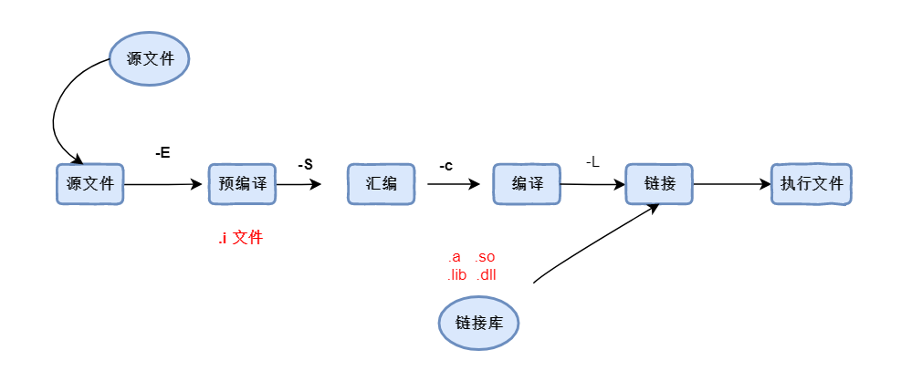

# 一、make和cmake

## 1. make

**make**，常指一条计算机指令 ，可以从一个名为`Makefile`的文件中获得如何构建程序的依赖关系。通常项目的编译规则就定义在makrfile 里面，比如： 规定先编译哪些文件，后编译哪些文件... 当编写一个程序时，可以为它编写一个`makefile`文件，不过在windows下的很多IDE 工具，内部都集成了这些编译的工作，只需要点击某一个按钮，一切就完成了。换算到手动操作的话，就需要编写一个makefile文件，然后使用make命令执行编译和后续的安装。

### 1. 关于程序编译



### 2. makefile 的规则

> 如果项目的文件很多，那么makefile的内容也会很多，但是最核心的规则即是下面的几行语句。
>
> `target`: 表示生成目标文件
>
> `prerequisites` ： 生成目标文件依赖的文件
>
> `command`： 表示命令，也就是从右到左的命令是什么。

- **makefile语法 : **

```makefile
target ... : prerequisites ...
    command
    
target ... : prerequisites ...
    command
    ...
    ...    
```

- **示例**

这是一个简单的makefile文件内容，表示最终要构建出一个main.o 文件， 根据两个源文件main.cpp 和 a.cpp构建 ， 最后的那一行表示执行构建的真正命令。

```makefile
main.o : main.cpp  a.cpp
	g++ -std=c++11 main.cpp
```

- **只想编译**

target: 表示生成目标文件 `main.o` , 文件的编译来源是 `main.cpp` `g++`: 表示编译 c++代码 ， 如果编译c代码，使用 cc（其实就是 gcc） 编译。

-c : 表示只编译，不会生成执行程序。

```makefile
main.o : main.cpp
	g++ -c main.cpp
```

### 3. makefile 入门

> 在编写makefile的时候，可以指定最终生成的程序名称，并且可以由多个目标文件组合生成。

```makefile
heima : main.o stu.o
	g++ -o heima main.o stu.o
main.o : main.cpp
stu.o :  stu.cpp
```

- 清空目标

> 在完成程序构建后，除了生成真正执行的程序文件之外，还生成了中间临时文件 ， 那么可以在makefile文件的最后，清除这些文件。 需要手动执行 `make clean` 命令

```makefile
heima : main.o stu.o
	g++ -o heima main.o stu.o

clean:
	rm heima main.o stu.o
```

**更为稳健的做法是**

> `.PPHONY` 表示`clean`是一个伪目标 ， “伪目标”并不是一个文件，只是一个标签，由于“伪目标”不是 文件，所以make无 法生成它的依赖关系和决定它是否要执行。我们只有通过显式地指明这个“目标”才能让其 生效。

```makefile
.PHONY : clean
clean :
    -rm heima main.o stu.o
```

## ２. cmake

> cmake 其实是一个工具，类似的工具有`GNU Make` QT的`qmake` , 微软的`MS nmake` ... 每一种开发工具，为了便于使用，都有自己的一套编译规则，项目编译的规则。
>
>  cmake :  cmakelist.txt   
>
>  qmake :   aa.pro
>
>  nmaeke : 
>
>  make :makefile
>
> , 在每一种标准下写一次makefile . 为了解决这些问题，Cmake应运而生。
>
> 1. 允许开发者编写一种平台无关的 **CMakeList.txt** 文件来定制整个编译流程
> 2. 然后再根据目标用户的平台进一步生成所需的本地化 Makefile 和工程文件，如 Unix 的 Makefile 或 Windows 的 Visual Studio 工程。从而做到“Write once, run everywhere”。

### 1. CmakeList.txt 解释

> 对于简单的项目，`CmakeList.txt`的内容非常简单，只有简单的几行。

```cmake
# 表示cmake的最低版本
cmake_minimum_required (VERSION 2.6)

# 表示目前编译的项目
project (day07)

# 表示当前编译使用c++14版本来编译程序
set(CMAKE_CXX_STANDARD 14)

# 表示项目的执行程序， 括号中的day07 表示最终生成的执行程序名称，  后面的表示程序的源码文件
add_executable(day07 main.cpp stu.cpp)
```

### 2. 子工程创建

> clion创建出来的工程师单一独立的工程，在同一窗口下，不允许创建两个工程，但是允许通过创建子工程。并且随着idea家族主推的项目和模块的理念，子工程的创建也符合了这一特征。每一个子工程都需要有自己的`cmaklist.txt` 并且在外部主工程的`cmakelist.txt`中注册子工程。

- 子工程的cmakelist.txt

```cmake
add_executable(bb bb.cpp)
```

- 主工程的cmakelist.txt

```cmake
cmake_minimum_required(VERSION 3.14)
project(AA)

set(CMAKE_CXX_STANDARD 14)

# 主工程标注子目录
add_subdirectory(BB)

add_executable(aa aa.cpp)
```

### 3. 变量

> 在cmakelist.txt 中，也可以定义变量。以方便未来能继续使用这份数据。需要注意的是，变量也可以做增量设置，有点类似容器中的追加的意思。

```cmake
set(AGE 18) #定义一个变量AGE  值：18

set(CMAKE_CXX_STANDARD 14) # 定义一个变量CMAKE_CXX_STANDARD  名称14

set(AGE ${AGE} 19);
```

- 输出变量数据

```cmake
# 输出警告信息
message(WARNING "这是警告信息")　　

# 输出正常
message(STATUS "这是正常输出")


set(AGE ${AGE} 19);
message(STATUS ${AGE})
```


## 3. 导入第三方依赖

> 在C/C++中，项目最终都会分成两个部分内容，一个是 `头文件( .h )` 一部分是`源文件( .cpp )` 。 如果要编写好的功能给其他程序使用，通常会把源文件打包形成一个动态链接库文件( .so .dll ） 文件 。 值得注意的是，头文件一般不会打包到链接库中，因为头文件仅仅只是声明而已。 链接库也增加了代码的重用性、提高编码的效率，也可看看成是对源码的一种保护。

### 1. 什么是库

> 库是写好的现有的，成熟的，可以复用的源代码。现实中每个程序都要依赖很多基础的底层库，不可能每个人的代码都从零开始，因此库的存在意义非同寻常 。 本质上来说库是一种可执行代码的二进制形式，可以被操作系统载入内存执行。库有两种：`静态库（.a、.lib）` 和 `动态库（.so、.dll）`

```
windows`上对应的是 `.lib` `.dll
linux` 上对应的是 `.a` `.so
```

- 静态链接库

> 静态库最终需要和使用的源程序，打包到一起形成一个新的可执行程序。这就使得有关程序运行依赖的库已经在程序中包含，即便到了客户机上，也能够运行。静态库对程序的更新、部署和发布页会带来麻烦。如果静态库liba.lib更新了，所以使用它的应用程序都需要重新编译、发布给用户。 linux下的静态库文件是 .a 而windows的静态库文件是.lib

- 动态链接库

> 动态库在程序编译时并不会被连接到目标代码中，而是在程序运行是才被载入。**不同的应用程序如果调用相同的库，那么在内存里只需要有一份该共享库的实例**，规避了空间浪费问题。动态库在程序运行是才被载入，也解决了静态库对程序的更新、部署和发布页会带来麻烦。用户只需要更新动态库即可，**增量更新**。

### 2. 使用命令生成库

> 一般来说，只会把源码打包到库当中，而头文件则会被排除在外。 假设现在有一个 `heima.h`头文件 和 对应的源文件`heima.cpp`

**-fPIC **:（ Position-Independent Code） 作用于编译阶段，告诉编译器产生与位置无关代码(Position-Independent Code)，则产生的代码中，**没有绝对地址，全部使用相对地址，故而代码可以被加载器加载到内存的任意位置，都可以正确的执行。这正是共享库所要求的，共享库被加载时，在内存的位置不是固定的。**

**-shared:** 生成共享目标文件。通常用在建立共享库使用

```makefile
//linux
g++ -fPIC -shared heima.cpp -o heima2.so

windows
g++ -fPIC -shared heima.cpp -o heima2.dll
```

### 3. 导入动态库

> 导入动态库是c/c++ 开发中必不可少的一个环节，由于clion使用cmake来管理项目。
>
> 导入依赖库，需要导入两个部分的内容：头文件和源文件。源文件一般已经被打成了.so文件，所以实际上就是导入头文件和 导入.so文件。

#### 1 . 导入头文件

> 头文件一般会放置在一个文件夹include中，可以把这个文件夹拷贝到工程内部，也可以放置在外部磁盘上，只需要指定地址找到它即可。

```cmake
include_directories("3rdparty/heima/include")
```

#### 2. 导入库文件

> 如果只导入了头文件，而没有到实现文件，那么会抛出异常，比如：xxx未定义之类的错误。导入so文件

- 直接和执行程序关联

```cmake
# 导入头文件
include_directories("3rdparty/heima/include")

# 添加执行程序
add_executable(main main.cpp)

#给程序关联上so文件
target_link_libraries(main ${PROJECT_SOURCE_DIR}/3rdparty/heima/lib/libitcast.so)
```

- 添加多个依赖库

```cmake
# 导入头文件
include_directories("3rdparty/heima/include")
# 导入另一个库的头文件
include_directories("3rdparty/itcast/include")

# 添加执行程序
add_executable(main main.cpp)

#给程序关联上so文件 这里表示关联当前项目下的3rdparty文件夹下的heima/lib/libheima.so 文件
target_link_libraries(main ${PROJECT_SOURCE_DIR}/3rdparty/heima/lib/libheima.so)
target_link_libraries(main ${PROJECT_SOURCE_DIR}/3rdparty/itcast/lib/libitcast.so)
```

- 还可以使用变量的方式声明，再引用

```cmake
# 导入头文件
include_directories("3rdparty/heima/include")
# 导入另一个库的头文件
include_directories("3rdparty/itcast/include")

# 添加执行程序
add_executable(main main.cpp)

#使用变量声明
set(ITCAST_LIB ${PROJECT_SOURCE_DIR}/3rdparty/itcast/lib/libitcast.so)
set(ITHEIMA_LIB ${PROJECT_SOURCE_DIR}/3rdparty/heima/lib/libheima.so)

#给程序关联上so文件
target_link_libraries(main ${ITCAST_LIB})
target_link_libraries(main ${ITHEIMA_LIB})
```

- 使用find_library 查找库文件

> 在知道地址路径的情况下可以使用find_library来查找库文件，相比于前面的直接设置，find_library还可以设置查找的规则。

```cmake
# 导入头文件
include_directories("3rdparty/heima/include")
# 导入另一个库的头文件
include_directories("3rdparty/itcast/include")
#find_library (<VAR> name1 [path1 path2 ...])

# 查找库文件，第一个ITCASTLIB 表示变量名，即找到之后用这个变量来存着库文件
# 第二个icast 表示要查找的库名称。 cmake具有隐式命名的规则， libaa.so  ， 那么此处只需要写aa即可
# 第三个 HINTS 也可以写成PATHS 表示指定路径的意思
# 第四个 后面写的就是地址，表示到这个地址去查找库文件， 地址可以写多个。
find_library(ITCASTLIB itcast HINTS  ${PROJECT_SOURCE_DIR}/3rdparty/google/itcast/lib)
find_library(HEIMALIB heima HINTS  ${PROJECT_SOURCE_DIR}/3rdparty/google/heima/lib)


# 添加执行程序
add_executable(main main.cpp)
target_link_libraries(main ${ITCASTLIB} ${HEIMALIB})
```

- 查找指定路径下的多个库文件

> 有时候一个项目会打出来多个so文件，它们会放在同一个目录中，此时可以使用find_library 配合 foreach 来查找库

```cmake
# 设置在哪些路径下查找动态库
set(GOOGLE_PATH ${PROJECT_SOURCE_DIR}/3rdparty/google/heima/lib)
set(GOOGLE_PATH ${GOOGLE_PATH} ${PROJECT_SOURCE_DIR}/3rdparty/google/itcast/lib)

# 设置查找的动态库有哪些
set(GOOGLE_LIBS_COM itcast heima)


# 遍历循环动态库，其实就是遍历两次，第一次遍历得到 itcast名字，第二次得到heima的名字
# 这里只是遍历得到名字而已。
foreach(google_com ${GOOGLE_LIBS_COM})

# 遍历第一次去查找libitcast.so , 第二次去查找libheima.so 
# 所以前面的这个变量名称也得跟着动态变化，不能固定写，否则永远只会有一个so文件。
    find_library(lib_${google_com} ${google_com} PATHS
            ${GOOGLE_PATH}
            NO_DEFAULT_PATH)

# 找到之后，使用变量GOOGLE_LIB寄存起来，使用增量设置。
    set(GOOGLE_LIB ${GOOGLE_LIB}; ${lib_${google_com}})
endforeach()

# 添加执行程序
add_executable(main main.cpp)

# 最后在这里与程序关联上
target_link_libraries(main ${GOOGLE_LIB})
```


