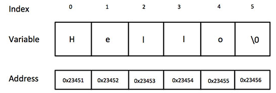
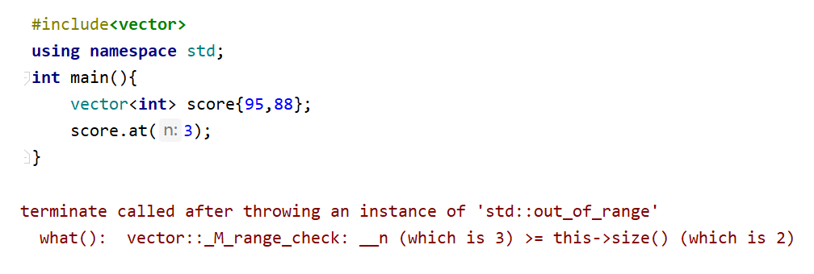
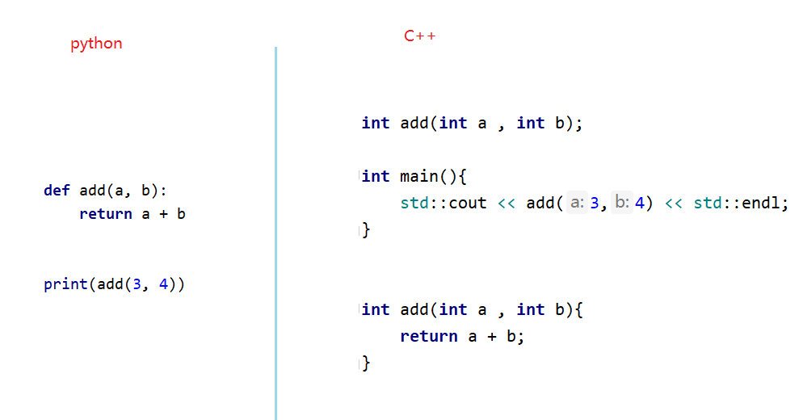

## 一、 字符串

> 字符串是最常用的一种数据类型了，在python中声明字符串和声明其他类型的数据一样，都非常的简单。但是在c++中，对于字符串的操作，相对来说要稍微复杂一些。
>
> C++ 提供了以下两种类型的字符串表示形式：
>
> - C 风格字符串
> - C++ 引入的 string 类类型

### 1. C 风格字符串

> C 风格的字符串起源于 C 语言，并在 C++ 中继续得到支持。字符串实际上是使用 **null** 字符  **\0** 终止的一维字符数组。如下面的声明和初始化创建了一个 "Hello" 字符串。由于在数组的末尾存储了空字符，所以字符数组的大小比单词 "Hello" 的字符数多一个。

```cpp
int main(){
    
    char greeting[6] = {'H', 'e', 'l', 'l', 'o', '\0'};

    //可以简写成：
    char greeting2[] = "Hello";
    
    
    return 0 ;
}
```



### 2. C风格字符串操作

#### 1. 遍历字符串

> 字符串实际上背后还是一个数组，所以可以使用数组遍历的手法来获取每一个字符 。 

```cpp
#include<iostream>
int main(){
    
	//最后总会跟着一个\0的空字符，此时括号中如果写长度，必须大于等于6
	char  name[] = "hello";

    for (int i = 0; i < sizeof(name ) / sizeof(char); ++i) {
        std::cout << name[i] << std::endl;
    }
}
```

#### 2. 字符串其他操作

> C语言中提供了针对字符串操作的大量函数， 比如获取`字符串长度` 、` 拷贝字符串`，`拼接字符串`等等。
>

```cpp
#include <iostream>

int main(){
    
    //拷贝字符串
    char  name[] = "hello";
    char name2[6];

    //参数一： 目标字符串， 参数二：源字符串
    strcpy(name2 , name);
    std::cout << name2 << std::endl;
    
    //拼接字符串
    strcat(name2 , " , 张三");
    std::cout << name2 << std::endl;

    // 返回字符串长度
    int len = strlen(name2);
    std::cout << "name2的长度：" << len << std::endl;
    
    return 0 ;
}
```

### 2. C++ 风格字符串

> C++ 标准库提供了 **string** 类类型,支持上述所有的操作，另外还增加了其他更多的功能。需要引入 `#include<string> ` ，由于string类声明在命名空间 std ,所以在使用的首要注意 命名空间的联合使用 。

```cpp
//引入string库
#include <string>

using namespace std;

int mian(){
    
    string s1;
    string s2 {"北京"};
    string s3{s2};
    
    string s4 = "你好";
    
    s1 = s3;
    return 0 ;
}
```

### 3. C++风格字符串操作

- 拼接字符串

> c++的字符串拼接，使用起来比较方便，直接使用`+` 操作即可。

```cpp
#include<string>
using namespace std;

int main(){
    string part1 {"c++"};
    string part2 {" is a powerful"};

    string sentence ; 
    sentence = part1 + part2 ;
    return 0 ;
}
```

- 获取指定位置的字符

> 可以使用[]和 at（）操作字符串

```cpp
#include<string>
using namespace std;

int main(){
    string s1 {"i love c++"};

    cout << s1[3]<<endl;
    cout << s1.at(0) << endl;
   return 0 ;
}
```

- 遍历字符串

```cpp
#include<string>
using namespace std;

int main(){
    string s1 {"abcdef"};

    for(char s : s1){
        cout << s << endl;
    }

    for(int s : s1){
        cout << s <<endl;
    }
	return 0 ;
}
```

- 截取字符串

```cpp
#include<string>
using namespace std;

int main(){

    substr(开始索引， 截取长度);

    string s1 {"This is a test"};
    cout << s1.substr(0 , 4) ; // This
    
	return 0 ;
}
```

- 获取字符（字符串）在字符串中的索引

```cpp
#include<string>
using namespace std;
int main(){
    find(搜索的字符)

    string s1 {"This is a test"};
    cout << s1.find("This") ; // 0 
    cout << s1.find("is") ; // 2
    cout << s1.find("test") ; // 10 
    
   return 0 ;
}
```

- 获取字符串长度

> length() : 返回字符串长度


### 4. 练习

```cpp
给定一串字符串，判定里面有多少个数字，多少个字母。并且把最后那个字母a修改为大写字母A

修改用的函数是：replace（修改起始索引位置，修改的横跨长度，修改成什么字符）;

判断是否是字母和数字使用的是 isalpha () 和  isdigit()  可以引入#include<ctype.h>
```

## 二、 Vector

> Vector其实很大程度上和数组一样，只是**数组是固定长度，而vector是不定长度（动态增长）**。 假设我们需要记录明年的测试成绩，但是我们并不知道明年会有多少个学生。那么可以有两种选择，定义一个固定长度的数组，这个长度超过假设的长度， 另一种办法就是使用动态数组，比如是： vector
>
> **vector 在C++  STL(标准模板库)中的一个容器，可以看成是对容器的一种扩展。**在运行时可以改变长度 , 与数组具有相似的语法 , 相比数组更高效 , 提供越界检查

### 1.  声明和初始化

* 声明

> 使用vector除了要导入`#include `之外，由于它声明于std命名空间里面，所以要配合std命名空间使用

```cpp
#include <vecotr>
using namespace std;

int main(){
    
    vector <char> vowels; 
    vector <int> test_score;

    // =========================
    vector <char> vowels(5);  //声明一个初始大小为5的char类型vector
    vector <int> test_score(10);
   	return 0;
}
```

* 初始化

```cpp
#include <vecotr>
using namespace std;

int mian(){
    //数组定义
    int test_score []{100,99,18,81}

    //vector定义
    vector <char> vowels {'a' , 'e' , 'i' , 'o' ,'u'}; 
    vector <int> test_score{ 100 ,98,95,90,80};
    vector <double> temperatures{26,20.7};
    
    return 0;
}
```

### 2. 访问vector

> 访问 `vector`中的元素有两种方式，一是仍以数组的方式，另一种是使用`vector`提供的`at`函数

* 数组的语法

```cpp
#include <iostream>
#include <vector>
using namespace std;

int main(){
    vector<int> test_score {100,90,85};

    cout << "第一个成绩是: " <<test_score[0] << endl;
    cout << "第二个成绩是: " <<test_score[1] << endl;
    cout << "第三个成绩是: " <<test_score[2] << endl;

    cout << "第三个成绩是: " <<test_score[3] << endl;  //不会检查越界
 	return 0 ;   
}
```

* vector的语法

```cpp
#include <iostream>
#include <vector>
using namespace std;

int main(){
    
    vector<int> test_score {100,90,85};

    cout << "第一个成绩是: " <<test_score.at(0) << endl;
    cout << "第二个成绩是: " <<test_score.at(1) << endl;
    cout << "第三个成绩是: " <<test_score.at(2) << endl;
    
    cout << "第三个成绩是: " <<test_score.at(3) << endl; //抛出越界异常
    return 0 ;
}

```

### 3.  操作vector

- 修改vector中的元素

```cpp
#include <vector>
using namespace std;

int main(){

    vector<int> test_score {100,90,85};
    test_score.at(0) = 73;
    
	return 0 ;
}
```

- 往vector中追加元素

```cpp
#include <vector>
using namespace std;

int main(){
    vector<int> test_score {100,90,85};

    test_score.push_back(80); // 100 , 90 , 85 , 80
    test_score.push_back(95); // 100 ， 90 ， 85 ， 80 ， 95

	return 0 ;
}
```

- 越界检查

> 只要当我们使用了vector的语法去获取超出索引的元素时，就会抛出异常。而使用数组的语法去获取元素，则不会进行越界检查



* 遍历vector

```cpp
#include <iostream>
#include <vector>
using namespace std;

int main(){
    
    //使用下标遍历
    vector<int> scores{ 100 ,95 ,88 ,80 ,75};
    for (int i = 0; i < scores.size(); ++i) {
        cout << scores[i] << endl;
    }

    //基于范围for遍历
    vector<int> scores{ 100 ,95 ,88 ,80 ,75};
    for(int score : scores){
        cout << score << endl;
    }
    return 0 ;
}
```

### 4. 二维vector

> 二维vector和二维数组实际上差不太多，二维数组是数组里面装的是数组，二维vector指的是vector里面装的还是vector，在未来碰到矩阵相关的存储操作，多半使用vector来作为媒介。 比如下面的例子，演示了使用vector来存储3个班的考试成绩。每个班的成绩单独使用一个vector来存储。

```cpp
#include <iostream>
#include <vecotr>
using namespace std;

int main(){

    //声明并初始化vector
    vector<vector<int>> scores {
            {95,77,80,85},
            {58,89,93,100},
            {69,73,81,97}
    };

    for (int i = 0; i < scores.size(); ++i) {
        for (int j = 0; j < scores[i].size(); ++j) {
           cout << scores[i][j] <<"\t" ;
        }
        cout << endl;
    }
	return 0 ;
}
```

### 5 . 练习

```
使用二维vector记录三个学生的6门学科成绩，并且计算每个学生的总分，平均分。
```

## 三、 函数

### 1. 函数介绍

> 在大多数地方，c++ 和 python的函数是一样的，都是用来包裹定义好的语句，避免重复拷贝粘贴。不过还是有些许不一样的地方。
>
> 1. python的函数是以回车换行结尾，c++的函数是以 大括号结尾
> 2. python的函数通常使用缩进方式来表示函数体， ，c++使用大括号区域来表示
> 3. python是动态类型语言，而c++是静态类型语言，所以有时候需要像声明变量一样，声明函数。



### 2. 定义函数

> 函数的定义一般可以包含以下几个部分： `方法名称`、`方法参数`、`返回值`、`方法体` ， 根据可有可无的设置，函数一般会有以下4种方式体现。

- 声明并调用函数

```cpp
#include <iostream>
using namespace std;

void say_hello(){ 
    count << "hello" << endl;
}

int main(){
    
    say_hello();
    return 0 ;
}
```

#### 1. 无返回值无参数

```cpp
void say_hello(){ 
    count << "你好 " << endl;
}

int main(){
    say_hello();
    return 0 ;
}
```

#### 2. 无返回值有参数

```cpp
#include<iostream>

using namespace std;

void say_hello(string name){ 
    count << "你好 "<< name << endl;
}

int main(){
    say_hello("张三");
    return 0 ;
}
```

#### 3. 有返回值无参数

```cpp
#include<iostream>

using namespace std;

string say_hello(){ 
   return "你好 张三";
}

int main(){
    cout << say_hello() << endl;
    return 0 ;
}
```

#### 4. 有返回值有参数

```cpp
#include<iostream>

using namespace std;

string say_hello(string name){ 
   return "你好 "+ name;
}

int main(){
    cout << say_hello("张三") << endl;
    return 0 ;
}
```

### 3. 函数原型

> 一般来说，c++的函数一般包含声明和定义两个部分。因为c++是静态类型语言，程序属于自上而下编译，所以在使用函数前，必须先表示函数的存在，告诉编译器函数所需要的参数以及函数的返回值是什么。

#### 1. 函数定义在前

> 在调用函数之前，事先先定义好函数。

```cpp
#include <iostream>
using namespace std;

//函数定义 ，函数的真正实现。
int add(int a , int b){
    return a + b ; 
}

int main(){
    cout << add(1 ,2)<< endl;
    return 0 ;
}
```

#### 2. 使用函数原型

> 把函数分成声明和定义两部分，函数的原型定义在调用的前面，具体实现可以放在后面。

```cpp
#include <iostream>
using namespace std;

//函数声明 ，也叫函数原型 并不知道这个函数具体是如何实现的。只是有一些基本架子而已。
int add (int a , int b);

int main(){
    cout << add(1 ,2)<< endl;
    return 0 ;
}

//函数定义 ，函数的真正实现。
int add(int a , int b){
    return a + b ; 
}
```

### 4. 分离式编译

> 一般说来，函数的声明 ( 函数原型 )通常都会放到头文件中，之所以称之为头文件是因为它总是在main函数的前面就引入进来。头文件一般以 .h 或者 .hpp 结尾，通常用于 写类的声明（包括类里面的成员和方法的声明）、函数原型、#define常数等，但一般来说不写出具体的实现

* math.h

> 为了能够让声明和定义能够快速的被关联上，通常它们的名称会被定义成一样的，这已经成为了一种默认的规定

```cpp
//函数声明
int add (int a , int b);
```

* math.cpp

> 在源文件中对前面头文件的函数作出具体实现。

```cpp
#include "math.h"

//函数定义 ，函数的真正实现。
int add(int a , int b){
    return a + b ; 
}
```

* main.cpp

```cpp
#include <iostream>  
#include "math.h" //这里使用"" 表示从当前目录查找

int main(){
    add(1 ,2);
    return 0 ;
}
```

### 5. 函数重载

> 在许多语言中，经常会见到两个或者两个以上的函数名称是一样的，当然他们的 **参数个数** 或者 **参数类型** 或者是 **参数的顺序** 是不一样的。这种现象有一个学名叫做 **重载** overload， 由于python属于动态类型语言，不区分数据类型，参数可以是任意类型，所以它没有重载。
>
> 下面的示例代码即是对加法运行进行了重载，以便能够针对不同的数据类型，不同的参数个数做出匹配

```cpp
int add(int a , int b){
    return a + b ;
}

int add(int a , int b , int c){
    return a + b + c;
}


int add(double a , double b){
    return a + b ;
}

int main(){
    add(3, 3);
    add(3, 3, 3);
    add(2.5 , 2.5);
        
    return 0 ;
}
```


### 6. 函数参数

> 实际上所有的编程语言函数传参都是采用拷贝的方式，把原有的数据拷贝给现在的参数变量，进而能够在函数中让这份数据参与计算。需要注意的是，默认情况下，参数变量得到只是原有数据的一份拷贝而已。所以无权对外部的数据进行修改。
>

#### 1. 值传递

> C++默认情况下，处理函数参数传递时，多数使用的是值的拷贝，少数部分除外。

```cpp
#include<iostream>
using namespace std;

void  scale_number(int num);

int main(){
    int number{1000};
    scale_number(number);
    
    //打印number 1000
    cout << number <endl;
    return 0 ;
}

void scale_number(int num){
    if(num > 100)
        num = 100;
}
```

#### 2. 传递数组

> 函数的参数除了能传递普通简单的数据之外，数组也是可以传递的。但是数组稍微有点特殊，这里多做讲解。
>
> 1. 前面提过，形参实际上就是实参的一份拷贝，就是一个局部变量。
> 2. 数组的数据太大，如果都进行拷贝，那么比较麻烦，也造成了浪费
> 3. 所以实际上传递数组的时候，并不会进行整个数组的拷贝，而只是传递数组的第一个元素内存地址 （指针 ） 进来。
> 4. 数组的数据还是在内存中，只是把第一个元素（也就是数组的起始）内存地址传进来而已。
> 5. 这就造成了函数的内部根本无法知道这个数组的元素有多少个。

```cpp
#include<iostream>
using namespace std;

using namespace std;
//传递数组长度
void 	print_array(int number[] , 5 );

int main(){
    //声明数组
    int array []{1,2,3,4,5};
    
    //打印数组
    print_array(array , 5);
    
    return 0 ;
    
}

//传递数组，打印数组
void print_array(int array[] , int size){
    for (int i {0} ; i < size ; i++){
        count << array[i] << endl;
    }
}
```

#### 3. 传递引用

> 目前为止，我们所有函数的参数传递，都是对数据进行了一份拷贝（数组除外）。那么在函数的内部是不能修改值的，因为这仅仅是一份值得拷贝而已（函数外部的值并不会受到影响）。如果真的想在函数内部修改值，那么除了数组之外，还有一种方式就是传递`引用`。
>
> **引用实际上只是原有数据的一种别名称呼而已，使用 `&` 定义**

```cpp
#include<iostream>
using namespace std;


void  scale_number(int &num);

int main(){
    int number{1000};
    scale_number(number);
    
    //打印number100
    count << number <endl;
    return 0 ;
}

void scale_number(int &num){
    if(num > 100)
        num = 100;
}
```

#### 4. 练习

> 有一个装有6个学科分数的vector，请把这个vector传给另一个函数changeScore()函数，在该函数内部 请使用基于范围的for循环对vector进行遍历，把vector里面所有低于60分的分数，修改为：100分。

### 7 . 函数是如何被调用工作的

> 1. 函数是使用函数调用栈来管理函数调用工作的。
>    1. 类似盒子的栈
>    2. 遵循后进先出
>    3. 可以往里面执行压栈和出栈动作（push 和 pop）
> 2. 栈的结构和激活记录
>    1. 函数必须把它的返回值返回给调用它的函数(A ---> B)
>    2. 每次函数的调用都需要创建一次激活记录，然后把它压入栈中(push)
>    3. 当一个函数被调用完毕的时候，就需要从栈中弹出（pop）
>    4. 函数的参数以及内部的局部变量都是存储在栈中。
> 3. 函数栈有可能抛出栈溢出异常（Stack Overflow）
>    1. 一旦函数调用栈中被push进来的函数记录过多，就有可能出现。（例如：无限循环调用 | 递归 ）

```cpp
void func2(int &x , int y , int z){
    x +=y+z;
}

int func1(int a , int b){
    int result{};
    result += a + b;
    func2(result , a , b );
    return result ; 
}

int main (){
    int x{10};
    int y{20};
    int z{};
    
    z = func1(x , y );
    
    cout << z << endl;
    return 0 ;
}
```

### 8 . 内联函数

> 函数可以使我们复用代码，但是一个函数的执行，需要开辟空间、形参和实参进行值得拷贝，还要指明函数返回、以及最后回收释放资源的动作，这个过程是要消耗时间的。

* 作为特别注重程序执行效率，适合编写底层系统软件的高级程序设计语言，如果函数中只有简单的几行代码，那么可以使用`inline` 关键字来解决了函数调用开销的问题

```cpp
#include<iostream>

inline int calc_Max (int a, int b)
{
    if(a >b)
        return a;
    return b;
}

int main(){
    
    int max = calc_Max(3, 8);
    std::cout << "max = " << max << std::endl;
    
    return 0 ;
}
```

> 增加了 inline 关键字的函数称为“内联函数”。内联函数和普通函数的区别在于：当编译器处理调用内联函数的语句时，不会将该语句编译成函数调用的指令，而是直接将整个函数体的代码插人调用语句处，就像整个函数体在调用处被重写了一遍一样。
>
> 有了内联函数，就能像调用一个函数那样方便地重复使用一段代码，而不需要付出执行函数调用的额外开销。很显然，使用内联函数会使最终可执行程序的体积增加。以时间换取空间，或增加空间消耗来节省时间，这是计算机学科中常用的方法。

### 9. 范围规则

> 在学习过程，我们会定义很多变量或者引用、这些变量由于定义的位置不同，所以它们的作用域范围也不同。一般会划分成几种类型： `代码块` | `局部变量` | `静态变量` | `全局变量`

- 单独代码块

```cpp
#include<iostream>
using namespace std;

int main(){
    
    int  num{10};
    int  num1{20};
    
    cout << num << num1 << endl;
    
    {
        int num{100};
        cout << "num = "<< num << endl;
        cout << "num1 = "<< num1 << endl;
    }
    
}
```

- 函数中局部变量

```cpp
#include<iostream>
using namespace std;

int num{300};
void local_example(int x){
    
    
    int num{1000};
    cout << "num =" << num << endl;
    
    num = x ;
    cout << "num =" << num << endl;
 
    
}
```

- 静态本地变量

1. 只会初始化一次
2. 重复调用函数也只会初始化一次。

```cpp
#include<iostream>
using namespace std;

void static_local_example(){
    
    static int num{100};
    cout << "num ="<< num << endl;
    num+=100;
    cout << "num ="<< num << endl;
}

int main(){
    static_local_example();
    static_local_example();
    return 0 ;
}
```

- 全局变量

> 通常声明在所有函数和类的外部 ,若存在局部变量和全局变量同名情况下，可以使用 域操作符 `::` 来访问全局变量

```cpp
#include<iostream>
using namespace std;

int age = 99;
int main(){
    
    int age =18 ;
    cout << ::age << endl;
    return 0 ;
}
```

### 10. 打卡作业

1. 有两个字符串 A ， B ， A 为源字符串，B 为要删除的字符串，判断A是否包含B ，如果包含，请把A 里面包含B的字符删除后，输出全新的字符串A，否则直接输出源字符串A。

```cpp
string a = "ab123def78cc09"; //源字符串
string b = "cc";//要删除字符串
字符串的删除函数： a.delete()  | a.remove() | a.erase() 这三个函数，必有一个！
```

2. 定义一个计算器，提供加减乘除功能

1. 定义一个calc.h  作为加减乘除 四个函数的声明
2. 定义一个calc.cpp 作为计算器的具体实现
3. 定义一个main.cpp 作为程序的入口


3. 使用二维vector   用于保存张三、李四、王五，三人的6个学科的成绩，

1. 定义一个二维vector，名叫：score_vector，用来存储三个学生的6个学科成绩
2. 定义一个initScore（vector<vector<int>>）函数负责从键盘录入成绩  获取3个人，6个学科成绩
3. 定义一个函数updateScore（vector<vector<int>>） ，用于更新分数，把每个人的不及格的成绩全部修改成99分，
4. 定义一个函数 printScore （vector<vector<int>>），遍历打印三个人的每个学科成绩。
5. 要求使用函数原型、分离式写法（头文件和源文件） 、函数传递引用，基于范围for循环。
6. 禁止定义全局静态vector ，要求2 ，3 ，4 步骤的函数要携带参数，把二维vector传递进去。
7. 超纲： 应该要考虑引用，否则更新的操作无法实现。具体使用可看上面的引用。  
8. 应该有3个文件 stu.h  、stu.cpp , main.cpp
   1. stu.h :用于声明三个函数
   2. stu.cpp用于实现三个函数
   3. main.cpp 用于程序的执行入口

```cpp

vector<vector<int>> score_vector;

int main (){
    
    initScore( score_vector ); //往这个二维vector里面装成绩
    
    updateScore( score_vector ); // 遍历二维vector，更新成绩  【必须要用引用 | 指针】
    
    printScore( score_vector ); //打印成绩。
    
    //超纲： 引用。
    return 0 ;
}
```
