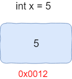

# 一、 指针

## 1. 什么是指针

> ***指针其实就是一个变量，不过它的值是一个内存地址*** ， 这个地址可以是变量或者一个函数的地址
>
> 当你声明明一个变量的时候，计算机会将指定的一块内存空间和变量名进行绑定；这个定义很简单，但其实很抽象，例如：int x = 5; 这是一句最简单的变量赋值语句了， 我们常说“x等于5”，其实这种说法是错误的，x仅仅是变量的一个名字而已，它本身不等于任何值的。这条statement的正确翻译应该是：“将5赋值于名字叫做x的内存空间”，其本质是将值5赋值到一块内存空间，而这个内存空间名叫做x。切记：x只是简单的一个别名而已，x不等于任何值。



- 为什么需要指针?

> 不就是使用变量或者调用函数吗？难道不能直接调用吗？那么需要指针做什么呢？

```cpp
实际上是可以的，但是并不是所有的情况都可以。比如：
1. 在内部函数中，可以使用指针访问外部函数中定义的某个变量x, 因为它并不是声明在自己的函数范围内。
2. 指针在处理函数传递数组的时候非常高效 ， 传递的是数组的首元素地址。
3. 我们还可以在堆内存中申请一块区域，这块区域甚至没有一个变量名称，唯一的访问方式是通过指针。
4. 可以使用你指针访问指定的内存地址（游戏修改器） 内存修改器 | 金山游侠 | CE 。。。 xxx内存修改器
```

## 2. 声明和初始化

### 1. 声明指针

> 1.声明指针的时候要记得初始化，如果没有初始化，指针存放的将会是垃圾数据(因为你根本不知道它指向何方)。如果暂时不知道指针指向何方，则可以把这个指针设置为空指针。

```cpp
int main(){
	//初始化指针
    int a = 3 ;
    int *p0 = &a; //p0是一个指针，指向的是一个int类型的数据，这个数据是3.

    //空指针
    int *p1 = nullptr;
    int *p2 = NULL;
    int *p3 = 0 ;    
    
    return 0 ;
}
```

### 2. 指针地址和大小

> 指针实际上也是一个变量，也会有自己的内存空间，也会有自己的长度大小。获取指针的内存地址，依然使用取地址符 `&` ， 长度大小依然使用`sizeof` 来获取

```cpp
#include <iostream>

int main(){
    int age = 88;
    int *p = &age;

    cout << "指针的地址是： " << &p <<endl;
    cout << "指针存储的是： " << p <<endl;
    cout << "指针大小是： " << sizeof(p) <<endl;
    cout << "age的大小是： " << sizeof (age) <<endl;
  	return 0 ;
}
```

### 3. 两种创建指针的方式

> 指针接受的值只有地址，根据内存分区的划分，指针可以接收**栈内存** 和 ** 堆内存**的地址。 这也就形成了指针的创建有两种方式。

* 栈内存

> 栈内存的空间较小，一般在这个区域存放据局部变量 |  函数的参数这些数据。当函数执行结束，栈内存会自动回收这些变量所占用的空间

```cpp

#include <iostream>

int main(){
    int age = 88;
    int *p = &age;  //函数执行结束， age所占用空间会自动回收
  	return 0 ;
}

```

* 堆内存

> 堆内存的空间相对较大，一般这个区域需要程序员采用 **new ** 关键字来开辟空间， 并且空间的回收也是由程序员使用 **delete** 关键字来操作

```cpp

#include <iostream>

int main(){
    int age = 88;
    int *p = &age;  //函数执行结束， age所占用空间会自动回收
    
    //需要手动配合delete 删除
    delete p ;
  	return 0 ;
}

```

## 3. 指针dereference（ 解引用）

> 所谓的指针dereference就是，指针就是一个变量，存放的是一个地址。这个地址有可能是变量 a 或者是变量b的地址。有了这个地址，我们可以通过**dereference**操作符 `*` 去获取到a对应的值或者b对应的值。

```cpp
#include<iostream>
using namespace std;

int main(){
    
    //定义一个变量score，赋值100
    int score {100}

    //定义一个指针score_ptr 指向score的地址。
    int *score_ptr{&score};

    //通过指针，获取到指向位置的数据 打印100
    cout << *score_ptr << endl; 

    //使用指针修改原来的score
    *score_ptr = 200 ;
    
    //使用指针和变量的方式打印score，结果都输出200
    cout << *score_ptr << endl;  
    cout << score << endl; 
	return 0 ;    
}
```

###  练习

> 定义一个函数，用于交换两个变量的值。请使用指针来完成
>
> int main(){
>
> ​		int a = 3 ; 
>
> ​        int  b = 4 ;

> ​      swap(a , b);

​      cout << "a = " << a <<endl;

​      cout << "b = " << a <<endl;

> }

## 4. 数组和指针的关系

> 数组其实和指针是存在一些内在联系的，如下：
>
> 1. 根据数组名字取到的内存地址，是数组的第一个元素地址
> 2. 指针其实是一个变量，这个变量存放的值是内存地址
> 3. 如果一个指针和数组是同样的类型，并且指针存放的地址正好是数组的某个元素地址，那么可以通过该指针操作数组

### 1. 数组与指针

```cpp
#include<iostream>
using namespace std;

int main(){
    
    //定义3个长度的int类型数组
    int scores []{100, 95 , 98};

    //直接打印数组，实际上是打印数组第一个元素的地址   0x61fec8
    cout << scores  << endl;  
    
    //使用*操作符是根据地址获取数据，所以取到的是第一个元素 ： 100
    cout << *scores  << endl; 

     //声明指针，存放的是数组第一个元素的地址
    int *score_ptr{scores};  
    
    //打印指针，其实输出它保存的地址，即数组首元素地址 0x61fec8
    cout << score_ptr  << endl;  
    
    //解引用，输出的是数组的首元素 100
    cout << *score_ptr  << endl; 
    
    return 0 ;
}
```

### 2. 指针运算

> 如果指针指向的是数组的第一个元素地址，那么同样可以通过对指针进行加减运算，来获取其他的元素 。值得注意的是，指针的相加并不是单纯数字上的相加，而是指针对应类型占用字节的相加

```cpp
#include<iostream>
using namespace std;

int main(){

    //定义3个长度的int类型数组
    int scores []{100, 95 , 98};
    
    //定义一个int类型指针，指向的是数组的首元素
    int *score_ptr{scores};

    //使用数组的手法打印数组
    cout << score_ptr[0]  << endl; //100
    cout << score_ptr[1] << endl; //95
    cout << score_ptr[2] << endl; //98

  
	//对指针进行加法运算。由于score_ptr 是int类型，
    //而int类型占用4个字节，所以每次相加打印出来的地址都会变长4个字节
    cout <<score_ptr  << endl; // 0x7fffacde9420
    cout <<(score_ptr+1)  << endl; // 0x7fffacde9424
    cout <<(score_ptr +2) << endl; // 0x7fffacde9428
    
    //指针解引用取值
    cout <<*score_ptr  << endl; // 100
    cout <<*(score_ptr+1)  << endl; // 95
    cout <<*(score_ptr +2) << endl; // 98

    return 0 ;
}
```

### 3. 堆中存放数组

> 除了能在栈内存创建数组，也可以把数组放到堆内存去。当然这一切都离不开 **new**关键字。

```cpp
#include<iostream>
using namespace std;

int main(){

    //表明在堆内存中开辟6个空间来存放数据
    int * score = new int[6];
    
    score[0] = 10 ;
    score[1] = 20 ;
    score[2] = 30 ;
    score[3] = 40 ;
    score[4] = 50 ;
    score[5] = 60 ;
    
    //删除早前开辟的空间 ， 此处不要忘记了[]
    delete[] score;
    return 0 ;
}
```

### 练习

>  有一个int类型数组，存储着张三的6个学科成绩，其中有的学科成绩不及格，现在想使用updateScore() 函数来更新不及格的分数为100分。updateScore (int count  , int [] scores)  count : 为数组的长度，  scores 用于接收数组。 在函数内部使用指针运算，修改分数。

## 5. 指针与常量

### 1. 指针常量

> `const int *p` 表示指针指向常量 ， 不允许修改对应的值，但是可以指向别的地方， 这和常量修改值一样。

```cpp
int main(){
    
	//定义高分和低分的变量
    int high_score{100};
    int low_score{75};

    //使用指针常量指向高分。这里的const修饰的是指向的数据
    const int *score_ptr {&high_socre};

    //不允许修改值，因为此时编译器会认为high_score 是一个常量
    *score_ptr = 86 ; // 错误
    
    //可以指向其他位置。
    score_ptr = &low_score ; // 正确
    
    //当然也可以通过变量方式来修改值。
    high_score = 88;

	return 0 ;
}
```

### 2. 常量指针

> `int* const p` 表示这个指针是常量指针，不能再指向别的地方了，但是可以修改目前指向地方的值

```cpp
int main(){
	
    int high_score{100};
    int low_score{75};
	
    //表示这个指针是一个常量，这里的const修饰的是指针
    int *const score_ptr{&high_score};

    //允许修改值，但是不允许再做其他指向
    *score_ptr = 86 ; // 正确
    score_ptr = &low_score ; // 错误
    return 0 ;
}
```

### 3. 常量指针指向常量

> `const int* const p` 表示这个指针是常量指针，并且它指向的位置的值也是常量

```cpp
int main(){

    int high_score{100};
    int low_score{75}l

    //第一个const是修饰指向的数据，第二个const是修饰指针。
    //表示不管是指针还是指向的数据，都是常量 
    const int *const score_ptr{&high_score};

    //既不允许修改指向，也不允许修改指向的值
    *score_ptr = 86 ; // 错误
    score_ptr = &low_score ; // 错误 
 
    return 0 ;
}
```

## 8 打卡作业

1. 定义结构体stu, 包含学生的姓名（字符串）、学号（字符串）、成绩（vector<int>）6个学科

2. 定义一个vector来保存张三、李四、王五三个学生的信息 ，请使用学生的指针类型。。

   1.  vector< stu* > stu_vector;

3. 三个学生采用new的方式创建出来，保存在堆内存中。

4. 定义initScore函数负责录入学生的信息。 姓名 , 学号 ， 6个学科成绩

5. 定义updateScore函数负责更新学生的沉寂。成绩小于60的，更新为60

6. 定义printScore函数打印学生的信息： 姓名、学号、总分、平均分

7. 使用分离式写法： stu.h  , stu.cpp , main.cpp

   1. stu.h 包含 结构体stu的声明， 三个函数的声明
   2. stu.cpp 包含三个函数的具体实心。
   3. main.cpp 作为程序的入口

8. 三个函数传递vector的时候，请使用指针类型传递。

   initScore(vector <int> & score_vector)

   initScore(vector <stu*>  *score_vector)


