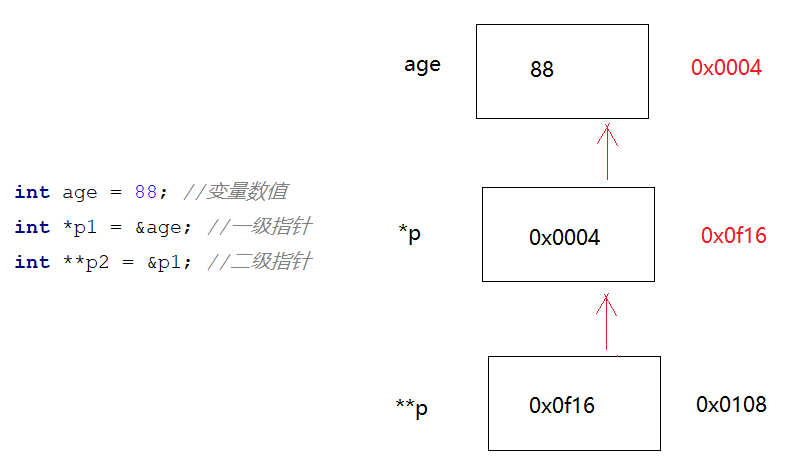

# 二、指针与函数

## 1. 参数传递指针

> 函数的参数，除了传递普通的变量，引用之外，还可以把指针当成参数来传递

```cpp
#include <iostream>
using namespace std;

//函数原型
void double_data(int *int_ptr);

int main(){
    int value{10};
    
    //修改前，输出为10
    cout << value << endl;
    
    //在函数内部修改value的值
    double_data(value);
    
    //修改后，输出为20
    cout << value << endl;
    
}

void double_data(int *int_ptr){
    *int_ptr *=2;
}
```

>  在某些情况下，传递指针比其他方式的传递要合适得多，比如下面有一个函数负责交换传递进来的两个参数的值， 此时如果不使用指针或者引用，则无法实现该功能

```cpp
#include <iostream>
using namespace std;

void swap(int *a , int *b);

int main (){
    
    int x{100},y{200};
    
    //交换前打印 x : 100 , y : 200
    cout << x <<" = " << y <<endl;
    
    swap(&x , &y)
    
    //交换前打印 x : 200 , y : 100
    cout << x <<" = " << y <<endl;
    
}

void swap(int *a , int *b){
    int temp = *a ;
    *a = *b ;
    *b = temp;
}
```

## 2. 函数返回指针

> 函数平常除了返回标准的数值之外，其实也可以返回指针。

```cpp
#include <iostream>
using namespace std;

//返回两个参数中的最大者
int *calc_largest(int *ptr1 , int *ptr2)；

int main(){
    int a = 100；
    int b = 200；
    
    //使用指针指向最大数值
    int *largest_ptr = calc_largest(&a , &b);
    
    //输出：200
    cout << *largest_ptr << endl ;
    return 0 ;
}

int *calc_largest(int *ptr1 , int *ptr2){
	//解引用获取到数据后比较 ： 
    if(*ptr1 > *ptr2){  
        return ptr1;
    }else{
        return ptr2;
    }
}
```

**注意**： 不要返回一个函数内部的一个局部变量指针 ， 因为本地变量的声明周期应该只位于函数内部。一旦函数执行完毕则被释放。

```cpp
#include <iostream>
using namespace std;

int *do_this(){
    int size = 10;
    return &size;
}

int main(){
    
    int *result = do_this();
    
    std::cout <<"result = " <<result << std::endl;
    
    return 0 ;
}
```

## 3. 二级指针

指向指针的指针，即可称之为二级指针。有点类似二维数组，数组里面装的是数组，即可称之为二维数组。

### 1. 二级指针介绍



### 2. 二级指针的应用

> 二级指针不如一级指针使用的那么频繁，通常出现的地方是作为函数参数传递。如果在函数的内部想要修改外部一级指针指向的数据值，那么则需要二级指针了。
>
> 如下示例所示， 如果传递的是一个一级指针，那么在外部的p依然没有被分配空间，传递进去的依然是一份值的拷贝而已 , 导致后面的指针赋值 为 42 也无法执行。

```cpp
//函数原型
void createPointer(int** p);

int main(){
    
    //空指针
	int* p = nullptr;
    
    //在函数内部对该指针初始化
    createPointer(&p);
    
    //初始化完毕后，修改指向空间的数据
    *p = 42;
    
    //释放指针
    delete p ;
    
    return 0 ;
}

void createPointer(int** p){
   // 解引用，得到的是一级指针，其实就是得到了外面的 p 那么整段话连起来就是 int *P  = new int();
  *p = new int(); 
}
```

### 3. 练习

> 有一个vector指针， 用于存储3个学生张三、李四、王五， 该vector的指针创建工作交由createContainer 函数来创建，并且该函数没有返回值。通过函数参数的方式，来创建外部vector指针。

## 4. 函数指针

### 1. 基本使用

> 函数指针的意思是指向函数的指针 。 通常来说，指针是变量，有自己的类型，那么函数指针也有类型。只不过它的类型稍微不一样而已。函数指针的类型由函数的返回值、函数的参数列表决定。 要想声明一个函数指针，只需要使用`指针`来替换`函数名`即可。

- 普通方式调用函数

```cpp
#include <iostream>

//函数原型
int add(int a , int b); 

int main(){
    
    int result = add(3,4);
    std::cout << "result = " << result << std::endl;
    return 0 ;
}

int add(int a , int b){
    return a + b;
}
```

- 使用函数指针方式调用函数

```cpp
#include <iostream>
using namespace std;

//函数原型
int add(int a , int b); 

int main(){
    
    //前半段表示声明一个函数指针add_ptr  该函数指针指向的函数返回值是int，并且有两个int类型的参数。
    //指针的小括号不能省略。
    int (*add_ptr) (int,int) =add;
    
    //普通方式调用函数
    int result =add(3,4);
    cout << "result = " << result << endl;
    
    //使用函数指针方式调用add函数
    int result2 = add_ptr(3,4) ;
    cout << "result2 = " << result2 << endl;
    
    return 0 ;
}

int add(int a , int b){
    return a + b;
}
```

### 2. 函数指针作为参数

> 有时候，也可以把某个函数A通过参数的方式传递给另一个函数B，随后在函数B里面执行传递进来的函数A。函数虽然不能直接作为参数来进行传递，但是函数指针可以。实际上在传递的时候，传递的是指针而已。
>
> 比如下面的示例： 有一个计算的函数`calc` , 允许在第三个参数传递进来具体的计算函数。

```cpp
#include<iostream>
using namespace std;

int add (int a , int b)；
int calc(int a , int b ,int (*fun)(int, int))；

int main() {
    //函数指针p，指向add函数
    //int(*p)(int ,int) = add;
    //cout << calc(3,5 , p) << endl;
    
    //函数名称可以直接使用，它实际上就是一个函数指针。
    cout << calc(3,5 , add) << endl;
    return 0 ;
}
int add (int a , int b){
    return a + b;
}

//计算的函数，最后的参数要求的是一个函数指针。
int calc(int a , int b ,int (*fun)(int, int)){
    return fun(a,b);
}
```

### 3. 函数指针的作用

> 如果一个通用的函数，需要使用到 另一个函数，但是这个函数并没有确定名称，是由其他组织或者个人开发的，那么这时候可以预留一个位置，做成函数指针 虚位以待。比如：现在有一个vector或者数组，需要交给其他个人或组织来遍历，但是这些组织或者个人的遍历手法不一样，那么这时候可以使用函数指针占位。

```cpp
//函数原型
void listScore(vector<int> scores , void (*ps)(vector<int>));
void printScore1(vector<int> scores);
void printScore2(vector<int> scores);

int main() {
    vector<int> scores {50,60,70,80,90};
    listScore(scores , printScore1);
    listScore(scores , printScore2);
    return 0 ;
}

//接收函数指针的函数
void listScore(vector<int> scores , void (*ps)(vector<int>)){
    ps(scores);
}

//打印函数1
void printScore1(vector<int> scores){
    cout << "****采用基于范围for循环遍历******" << endl;
    for(int i : scores){
        cout << i << endl;
    }
}

//打印函数2
void printScore2(vector<int> scores){
    cout << "****采用for i循环遍历******" << endl;
    for (int i = 0; i < scores.size(); ++i) {
        cout <<scores[i] << endl;
    }
}
```

### 4. typedef使用

> typedef 的作用是自己习惯的名字，来替已有的类型名称。 语法： `typedef 已知类型名称 自定义名称`

```cpp
#include<vector>

using namespace std;

//使用myint 来替代 int。
typedef int myint ;

//使用vi 来替代 vector<int>
typedef vector<int> vi; 

int main(){
   
    int a = 3 ;
    
    //此时的myint  等价于 int
    myint b = 3 ;

    vector<int> scores1{60,70,80,90}
    
    //此时的vi 等价于 vector<int>
    vi scores2{60,70,80,90};

    return 0 ;
}
```

#### 1. 未使用 typedef 简化

> 下面示例代码，没有使用`typedef` 简化函数指针

```cpp
#include<vector>
using namespace std;

void listScores(vector<int> s , void(*pfs)(vector<int>)){
    pfs(s);
}

void pirntScores(vector<int> scores){
    //遍历打印
    for(int s: scores){
        cout << s<< endl;
    }
}

int main(){
    vector<int> scores {60,70,80,90};
	
    //把printScores函数传递给listScores ， 函数名称单独使用，它实际上是一个函数指针
    listScores( scores ,pirntScores);

    return 0 ;
}
```

#### 2. 使用 typedef 简化

> 下面示例代码，使用`typedef` 简化函数指针 , 实现的功能都是一样的，只是代码简化了些

```cpp
#include<vector>
using namespace std;

// 声明一种类型，这种类型的名称叫做 pfs ,它是一种函数指针，该函数没有返回值，有两个分别是int的参数
typedef void(*pfs)(vector<int>);

//此处使用简化好的函数指针类型
void listScores(vector<int> s , pfs p){
    p(s);
}

void pirntScores(vector<int> scores){
    //遍历打印
    for(int s: scores){
        cout << s<< endl;
    }
}

int main(){
    vector<int> scores {60,70,80,90};

    //也可以选择使用变量来接收printScores
    pfs pfs1 = pirntScores;
    
     //把pfs1 传递给listScores ，实际上传递的是printScores
    listScores( scores ,pfs1);
    
    return 0 ;
}
```

### 5. 练习

> 设计一个计算器，具有增删改查函数，还有一个函数operator。该函数接收三个参数，分别是： a, b  ， 和最终执行的具体操作函数的指针。最终通过operator来调用对应的算术操作，举例如下：
>
> operator( 3, 4, , add) ; // 执行加法运算
>
> operator(3,4 , sub) ; //执行减法运算
>
> operator(3,4 , mul); //执行乘法运算
>
> operator(3,4,div) ; //除法运算。
>
> 其中第三个参数，是函数指针。


# 三、引用

## 1. 什么是引用

>引用，顾名思义是某一个变量或对象的**别名**，对引用的操作与对其所绑定的变量或对象的操作完全等价。引用在使用时，有几个要注意的地方：
>
>1. &不是求地址运算符，而是起到标志作用
>2. 引用的类型和绑定的变量类型必须相同 (指针也一样)
>3. 声明引用的同时，必须对其进行初始化，否则报错。
>4. 引用相当于变量或者某个对象的别名，但是不能再将已有的引用名作为其他变量或者对象的名字或别名 （和指针不一样。）
>5. 引用不是定义一个新的变量或对象，因此**内存不会为引用开辟新的空间存储这个引用**
>6. 不能建立数组的引用。因为数组是一个由若干个元素所组成的集合，所以无法建立一个数组的别名。

```cpp
#include<iostream>
using namespace std;

int main(){
    //语法：类型 &引用名=目标变量名；
    int a = 3 ; 
    int &b = a ;
    
    //此时a也会变成33
    b = 33;
    
    
    
    vector<string> names {"张三" ， "李四" ,"王五"};

    // 这仅仅是改变了str的值，并不会改变vector里面的元素
    for(auto str:names){
        str = "赵六"; 
    }

    //此处不会产生新的变量，所以修改的都是vector里面的元素
    for(auto &str : names){
        str = "赵六" ;
    }
	return 0 ;    
}
```

## 2. 左值和右值

> C++的表达式要么是左值 `lvalue`，要么是右值 `rvalue` 这两个名词是从C语言继承过来的。左值可以出现在赋值语句的左侧和右侧，右值只能出现在右侧。最长见到左值和右值的地方，是在函数的参数以及报错的日志信息里面。
>
> 不能简单的以等号的左右来判断是否是左值还是右值
>
> 判断是否是左值，有一个简单的办法，就是**看看能否取它的地址**，能取地址的就是左值 。使用排除法，其他的即为右值。
>
> 左值可看作是 **对象**，右值可看作是 **值** 而有时候对象也可以是左值也可以右值，一句话概括：当一个对象成为右值时，使用的是它的值（内容） ， 而成为左值时，使用的是它的身份（在内存中的位置）。

```cpp
//只能把左值赋值给引用，不能把右值赋给引用
int square(int &n){
    return n * n ; 
}

int main(){
    int x = 1000;  // x是一个左值， 而 1000 是一个右值。
    x = 1000 + 20 ;  //x 是左值， 1000 + 20 是右值，

    int b = 10; // b 是一个左值， 10 是一个右值
    b = x ;   //b是一个左值， 而 x依然是一个左值。


    int num = 10 ;
    square(num) ; //正确

    square(5) //错误。因为5是右值 ，不能赋值引用。
	return 0;    
}
```

## 3. 左值引用

> 平常所说的引用，实际上指的就是左值引用 `lvalue reference` , 常用单个 `&` 来表示。 左值引用只能接收左值，不能接收右值。**const 关键字会让左值引用变得不同，它可以接收右值**

```cpp
#include <iostream>
using namespace std;

//函数原型
int add(int &num1);
void print(vector<int> &scores);

int main(){
    
    int a = 3 ;
    int &b = a ; //ar是一个左引用，实际上可以看成是a的一个别名。

    // 这是不允许的。
    // 1. 从引用层面理解的话是： 引用接收的一个变量，给某个变量起别名
    // 2. 从左右值的层面理解是，这是一个左值引用，只能接收左值。 3 属于右值。
    int &c = 3 ;  //错误！
    
    
    int a = 3 ;
    add(a) ; //正确
    add(3) ; //错误！ 参数要求的是一个左值引用，只能赋值左值 ,3 属于右值
    
    
    vector<int> scores{60,70,80,90};
    print(scores); //正确
    print({60,70,80,90}); //错误！
}
```

## 4. 右值引用

> 为了支持移动操作，在c++11版本，增加了右值引用。右值引用一般用于绑定到一个即将销毁的对象，所以右值引用又通常出现在移动构造函数中。
>
> 看完下面的例子，左值和右值基本就清楚了，左值具有持久的状态，有独立的内存空间，右值要么是字面常量，要么就是表达式求值过程中创建的临时对象

```cpp
int main(){
   
    int i = 66;
    int &r = i ; //r 是一个左引用，绑定左值 i

    int &&rr = i ; //rr是一个右引用，绑定到左值i , 错误！ 
    int &r2 = i*42 ; //  r2 是一个左引用， 而i*42是一个表达式，计算出来的结果是一个右值。 错误！

    const int &r3 = i*42; // 可以将const的引用，绑定到右值 正确 
    int &&rr2 = i*42 ; // 右引用，绑定右值 正确
    
	return 0 ;    
}
```

- 示例

```cpp
#include<vector>
using namespace std;

//函数原型
int add(int &&num1);
void print(vector<int> &&scores);

int main(){
    int a = 3 ;
    add(a) ; //错误！参数要求的是一个右值引用，只能赋值右值
    add(3) ; //正确！ 
    
    
    vector<int> scores{60,70,80,90};
    
    //print接收的是一个右值，此处的scores是一个左值。
    print(scores); //错误！
    
    //{60,70,80,90} 属于右值。
    print({60,70,80,90}); //正确
    
    return 0 ;
}
```

