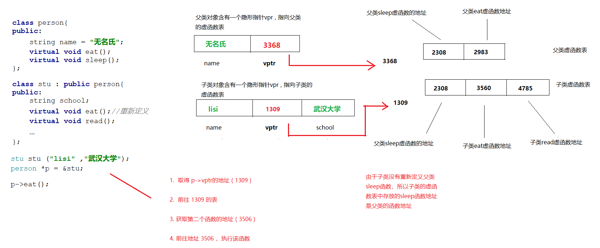

# 一、多态

## 1. 什么是多态

> 多态按字面的意思就是多种形态。当类之间存在层次结构，并且类之间是通过继承关联时，就会用到多态。
>
> C++ 多态意味着调用成员函数时，会根据调用函数的对象的类型来执行不同的函数。为了更为详细的说明多态，此处我们划分为**静态多态**和 **动态多态** 两种状态来讲解

### 1. 静态多态

> 静态多态是编译器在**编译期间**完成的，编译器会根据实参类型来选择调用合适的函数，如果有合适的函数可以调用就调，没有的话就会发出警告或者报错 。 该种方式的出现有两处地方： **函数重载** 和 **泛型编程 | 函数模板** .

```cpp
int Add(int a, int b){
    return a + b;
}

double Add(double a, double b)
{
    return a + b;
}

int main()
{
    Add(10, 20);
    
    Add(10.0,20.0);  
    
    return 0;
}
```

### 2. 动态多态

> 它是在**程序运行时**根据父类的引用（指针）指向的对象来确定自己具体该调用哪一个类的虚函数。

```cpp
A *a = new A();

Father * f = new Fahter();

Father * f2 = new Child();
```

> 动态多态的必须满足两个条件：
>
> 1. 父类中必须包含虚函数，并且子类中一定要对父类中的虚函数进行**重写**。
> 2. 通过父类对象的指针或者引用调用虚函数。

## 2. 联编机制

### 1. 父类指针指向子类对象

> 通常情况下，如果要把一个引用或者指针绑定到一个对象身上，那么**要求引用或者指针必须和对象的类型一致。 不过在继承关系下，父类的引用或指针可以绑定到子类的对象**，这种现象具有欺骗性，因为在使用这个引用或者指针的时候，并不清楚它所绑定的具体类型，无法明确是父类的对象还是子类的对象。
>
> 其底层原理是虚函数列表，在继承中子类会继承父类的虚函数表，并在下面添加自己的虚函数
>
> [cpp中，父类指针指向子类对象的底层原理_cout<<"小菜鸡"<<的博客-CSDN博客](https://blog.csdn.net/qq_58530992/article/details/129561633)

```cpp
#include <string>

using namespace std;

class person{
  
    string name;
    int age;
};

class student:public person{
  
    
};

int main(){
    
    //父类指针指向父类对象
    person *p = new person();
    
    //子类指针指向子类对象
    student *s = new student();
    
    //父类指针指向子类对象
    person *ps = new student();
 
    return 0 ;
}
```

### 2. 静态类型和动态类型

> 只有在继承关系下，才需要考虑静态和动态类型，这里仅仅是强调类型而已。所谓的`静态类型`指的是，在编译时就已经知道它的变量声明时对应的类型是什么。而`动态类型`则是运行的时候，数据的类型才得以确定。
>
> 只有在`引用`或者`指针`场景下，才需要考虑 静态或者动态类型。因为非引用或者非指针状态下，实际上发生了一次拷贝动作。

- 静态类型

> 静态类型：不需要运行，编译状态下即可知晓具体的类型

```cpp
#include<string>

using namespace std;

int main(){
    
    //编译状态下，即可知晓 a,b的类型。
    int a = 3;
    string b = "abc";
    
    return 0 ;
}
```

- 动态类型

> 只有真正运行代码了，才能知晓具体的类型

```cpp
class Father{
    
};

class Child:public Father{
    
};

 //动态类型：
 //f在编译时，类型是Father ，但在运行时，真正的类型由getObj来决定。目前不能明确getObj返回的是Father的对象还是Child的对象。
Child getObj(){
    Child c ;
    return c;
}

int main(){

	Father &f = getObj(); 
    
    return 0 ;
}
```

### 3. 访问同名函数

> 父类的引用或指针可以绑定到子类的对象 ， 那么在访问同名函数时，常常出现意想不到的效果。

```cpp
#include<iostream>

using namespace std;

class father{
public:
    void show(){
        cout << "father show" << endl;
    }
};

class children : public father{
public:
    void show(){
        cout << "children  show" << endl;
    }
};

int main(){
    father f = children();
    f.show(); // 打印father show
    
    return 0 ;
}
```

### 4. 静态联编和动态联编

> 程序调用函数时，到底执行哪一个代码块,走哪一个函数呢？由编译器来负责回答这个问题。将源码中的函数调用解释为执行特定的函数代码，称之为`函数名联编`。

> 在C语言里面，每个函数名都对应一个不同的函数。但是由于C++里面存在重载的缘故，编译器必须查看函数参数以及函数名才能确定使用哪个函数，编译器可以在编译阶段完成这种联编，在编译阶段即可完成联编也被称为：`静态联编 | 早期联编`。 程序在运行期间才决定执行哪个函数，这种称之为`动态联编 | 晚期联编`

```cpp
#include<iostream>

using namespace std;

class WashMachine{
public:
    void wash(){
        cout << "洗衣机在洗衣服" << endl;
    }
};


class SmartWashMachine : public WashMachine{
public:
    void wash(){
        cout << "智能洗衣机在洗衣服" << endl;

    }

};

int main(){
    WashMachine *w1= new WashMachine(); //父类指针指向父类对象  打印：洗衣机在洗衣服
    w1->wash();
     
    SmartWashMachine *s  = new SmartWashMachine();  //子类指针指向子类对象 打印： 智能洗衣机...
    s->wash();
    
    WashMachine *w2 = new SmartWashMachine(); //父类指针指向子类对象 打印..洗衣机在洗衣服
    w2->wash();
    
    return 0 ;
}
```

### 5. 为什么要区分两种联编

> 动态联编在处理子类重新定义父类函数的场景下，确实比静态联编好，静态联编只会无脑的执行父类函数。但是不能因此就否定静态联编的作用。动态联编状态下，为了能够让指针顺利访问到子类函数，需要对指针进行跟踪、这需要额外的开销。但是并不是所有的函数都处于继承状态下，那么此时静态联编更优秀些。

> 编写c++代码时，不能保证全部是继承体系的父类和子类，也不能保证没有继承关系的存在，所以为了囊括两种情况，c++ 才提供了两种方式。

> 正所谓两害相权取其轻，考虑到大部分的函数都不是处在继承结构中，所以效率更高的静态联编也就成了默认的的选择。

## 练习

> 一家海洋馆开业了，门口挂着牌子说：欢迎鲨鱼进来游泳。 过了几天，再贴出告示，欢迎鳄鱼也进来游泳，又过了几天，说欢迎罗非鱼也进来游泳，最后干脆直接说了，只要是鱼类的都可以进来游泳。请使用面向对象的思想，设计海洋馆馆接收鱼类的过程。 多态。
>
> //全局函数
>
> void swiming(鲨鱼 ， 鳄鱼 ， 罗非鱼 ， 金鱼， 鳗鱼，.... ....){
>
> }

## 3. 虚函数

### 1. 虚函数入门

> C++中的虚函数的作用主要是实现了多态的机制 ， 有了虚函数就可以在父类的指针或者引用指向子类的实例的前提下，然后通过父类的指针或者引用调用实际子类的成员函数。这种技术让父类的指针或引用具备了多种形态。定义虚函数非常简单，只需要在函数声明前，加上 `virtual` 关键字即可。 在父类的函数上添加 virtual 关键字，可使子类的同名函数也变成虚函数。
>
> **如果基类指针指向的是一个基类对象，则基类的虚函数被调用 ，如果基类指针指向的是一个派生类对象，则派生类的虚函数被调用。**

```cpp
#include <iostream>

using namespace std;

class WashMachine{
public:
    virtual void wash(){
        cout << "洗衣机在洗衣服" << endl;
    }
};


class SmartWashMachine : public WashMachine{
public:
   virtual  void wash(){
        cout << "智能洗衣机在洗衣服" << endl;

    }
};


int main(){
    
    WashMachine *w2 = new SmartWashMachine(); //父类指针指向子类对象 打印..洗衣机在洗衣服
    w2->wash();
    
    return 0 ;
}
```

### 2. 虚函数的工作原理

> 了解虚函数的工作原理，有助于理解虚函数。
>
> 通常情况下，编译器处理虚函数的方法是： 给每一个对象添加一个隐藏指针成员，它指向一个数组，数组里面存放着对象中所有函数的地址。这个数组称之为虚函数表（virtual function table v-table） 。表中存储着类对象的虚函数地址。
>
> 父类对象包含的指针，指向父类的虚函数表地址，子类对象包含的指针，指向子类的虚函数表地址。
>
> 如果子类重新定义了父类的函数，那么函数表中存放的是新的地址，如果子类没有重新定义，那么表中存放的是父类的函数地址。
>
> 若子类有自己虚函数，则只需要添加到表中即可。



### 3. 构造函数可以是虚函数吗

> 构造函数不能为虚函数 , 因为虚函数的调用，需要虚函数表(指针)，而该指针存在于对象开辟的空间中，而对象的空间开辟依赖构造函数的执行，这就是鸡和蛋的矛盾问题了。

```cpp
#include <iostream>

using namespace std;

class father{
public:
    virtual father(){ //报错！
        cout <<"父亲构造函数~！~" << endl;
    }
};

int  main(){
 
    father f ;
    return 0 ;
}
```

### 4. 析构函数可以是虚函数吗

> 在继承体系下， 如果父类的指针可以指向子类对象，这就导致在使用 `delete` 释放内存时，却是通过父类指针来释放，这会导致父类的析构函数会被执行，而子类的析构函数并不会执行，此举有可能导致程序结果并不是我们想要的。究其原因，是因为**静态联编的缘故**，在编译时，就知道要执行谁的析构函数。

> 为了解决这个问题，需要把父类的析构函数变成虚拟析构函数，也就是加上 `virtual`的定义。一旦父类的析构函数是虚函数，那么子类的析构函数也将自动变成虚函数。
>
> 一句话概括： 继承关系下，所有人的构造都不能是虚函数，并且所有人的析构函数都必须是虚函数。
>
> 只要在父亲的析构函数加上 virtual ，那么所有的析构函数都变成 虚函数

```cpp
#include <iostream>

using namespace std;

class father{

 public: 
    virtual ~father(){
        cout << "执行父类析构函数" << endl;
    }
};


class son : public father{
    ~son(){
         cout << "执行子类析构函数" << endl;
    }
};

int main(){
    
    father *f = new son(); //父类指针指向子类对象 
    
    //创建的是子类对象，理应执行子类的析构函数
    delete f;
    
    
    return 0 ;
}
```

## 练习

> 动物都有觅食的行为，但是每种动物吃的食物都不太一样。请使用面向对象的思想，配合虚函数来设计动物觅食的行为。

## 4. override 关键字

> 在继承关系下，子类可以重写父类的函数，但是有时候担心程序员在编写时，有可能因为粗心写错代码。所以在C++ 11中，推出了 `override` 关键字，用于表示子类的函数就是重写了父类的同名函数 。 不过值得注意的是，`override` **标记的函数，必须是虚函数。**
>
> `override` 并不会影响程序的执行结果，仅仅是作用于编译阶段，用于**检查子类是否真的重写父类函数**

```cpp
#include <iostream>

using namespace std;

class father{
public:
    virtual void run(){
        cout << "父亲在跑步" << endl;
    }
};


class son : public father{
public:
   virtual  void run() override{ //表示重写父类的函数
        cout << "孩子在跑步" << endl;
    }
};
```

## 5. final 关键字

> 在c++11 推出了final关键字，其作用有两个： (1)、禁止虚函数被重写；(2)、禁止类被继承。
>
> 注意： 只有虚函数才能被标记为final ，其他的普通函数无法标记final。

- 标记在类上

```cpp
class person final{ //表示该类是最终类，无法被继承
    
};


//编译错误，无法被继承。
class student : public person{
    
};  
```

- 标记在函数上

```cpp
class person { 
    virtual void run() final{ //表示该方法时最终方法，无法被重写
        
    }
};
class student : public person{
    
    //编译错误，方法无法被重写。
    void run(){ 
        
    }
};
```

## 6. =delete 和 =default

> 这两个关键字平常使用的不多，一般出现在类的特殊成员函数上。**=delete** 用于表示该函数禁止被调用，**=default** 以及使用编译器默认提供的函数功能。

### 1. =delete

```cpp
#include <iostream>
#include <string>

using namespace std;

class stu{

    string name;
    int age;
    
public:
    stu(string name , int age):name(name) , age(age){
        cout << "执行stu的构造函数" << endl;
    }


    //表示禁止调用拷贝构造函数
    stu(stu & s) =delete;


    ~stu(){
        cout << "执行stu的析构函数" << endl;
    }
};

int main(){
    
    stu s("张三",18) ;
    
    //编译错误。
    stu s1= s;
    
    return 0 ;
}
```

### 2. =default

> 一旦定义了有参构造函数之后，编译器将不会替我们生成无参构造函数 。 此时可以自己编写无参构造函数（哪怕函数体是空的），但是此举增加了程序员的编程工作量。更值得一提的是，手动定义的无参构造函数的代码执行效率要低于编译器自动生成的无参构造函数。

```cpp
#include <iostream>
#include <string>

using namespace std;

class stu{

    string name;
    int age;
    
public:
    
    stu() = default;
    
    stu(string name , int age):name(name) , age(age){
        cout << "执行stu的构造函数" << endl;
    }

    ~stu(){
        cout << "执行stu的析构函数" << endl;
    }
};

int main(){
    
    stu s("张三",18) ;
    
    //编译错误。
    stu s1 = s;
    
    return 0 ;
}
```

## 7. 纯虚函数

> 纯虚函数是一种特殊的虚函数，C++中包含纯虚函数的类，被称为是“抽象类”。抽象类不能使用new出对象，只有实现了这个纯虚函数的子类才能new出对象。C++中的纯虚函数更像是“只提供声明，没有实现”，是对子类的约束。

**纯虚函数就是没有函数体，同时在定义的时候，其函数名后面要加上“= 0”**。

```cpp
#include <iostream>
using namespace std;


class WashMachine{
public:
    //没有函数体，表示洗衣机能洗衣服，但是具体怎么洗，每个品牌不一样
    virtual void wash() = 0;
};

class HaierMachine:public WashMachine{
public :
    virtual void wash(){
        cout << "海尔牌洗衣机在洗衣服" << endl;
    }
};

class LittleSwanMachine:public WashMachine{
public :
    virtual void wash(){
        cout << "小天鹅洗衣机在洗衣服" << endl;
    }
};

int main(){

    //WashMachine w;  错误，抽象类无法创建对象
    WashMachine *w1 = new HaierMachine() ;
    WashMachine *w2 = new LittleSwanMachine() ;
    
    return 0 ;
}
```

**抽象类的一些特征**

1. 如果有一个类当中有纯虚函数，那么这个类就是抽象类
2. 抽象类是无法创建对象的，因为一旦能够创建对象，里面的纯虚函数没有函数体，也就不知道要执行什么逻辑了，所以禁止抽象类创建对象。抽象类不能定于对象，但可以用抽象的类定义指针!这个中**原因就是，定义一个类的对象是，编译器在编译时需要了解类的所有信息以便准确的为要实例化的对象分配内存；但是定义一个指针就不同了，指针是什么？大家都知道，无论它指向的是内部类型还是自己定义的结构体类型还是类的类型变量，它只不过就是一个具有32BIT也就是4个字节内存的空间而已，不需要其他任何信息了，所以能成功定义一个抽象类的指针变量。**
3. 抽象类当中也可以有普通的成员函数，虽然父类不能创建对象，但是子类可以创建，所以这些函数可以由子类访问。
4. 如果一个子类继承了一个父类（父类是抽象类），那么子类就必须重写所有的纯虚函数，否则视子类为抽象类，因为继承体系下，等同于子类拥有了和父类一样的代码。

## 8. 抽象类和接口

> 所谓接口，其实就是用于描述行为和功能，并不会给出具体的实现。C++中没有提供类似`interface` 这样的关键字来定义接口 ， 纯虚函数往往承担起了这部分功能，可以看成是对子类的一种约束。
>
> 抽象类可以用来定义一种事物的行为特征，洗衣机： 洗衣服。  

```cpp
class Person{
  	  Person() =default; // 可以用于初始化成员函数
      virtual ~Person()=default; //防止子类析构函数无法被调用问题
      
      
      //每个人吃什么，做什么都不一样，，即可声明为纯虚函数
      virtual void eat() = 0 ;
      virtual void work() = 0 ;
      //...
     
};
```

# 二、智能指针

## 1. 指针潜在问题

> c++ 把内存的控制权对程序员开放，让程序显式的控制内存，这样能够快速的定位到占用的内存，完成释放的工作。但是此举经常会引发一些问题，比如忘记释放内存。由于内存没有得到及时的回收、重复利用，所以在一些c++程序中，常会遇到程序突然退出、占用内存越来越多，最后不得不选择重启来恢复。造成这些现象的原因可以归纳为下面几种情况.

### 1. 野指针

> **出现野指针的有几个地方 :**
>
> a. 指针声明而未初始化，此时指针的将会随机指向
>
> b. 内存已经被释放、但是指针仍然指向它。这时内存有可能被系统重新分配给程序使用，从而会导致无法估计的错误

```cpp
#include <iostream>

using namespace std;

int mian(){
    
    
    //1. 声明未初始化
    int *p1 ;
    cout << "打印p1: " << *p1 << endl;
    
    
    //2. 内存释放后，并没有置空 nullptr
    int *p = new int(55);

    cout << "释放前打印 :  " << *p << endl;

    delete  p ;
    cout << "释放后打印 :  " << *p << endl;
    
    return 0 ;
}
```

### 2. 重复释放

> 程序试图释放已经释放过的内存，或者释放已经被重新分配过的内存，就会导致重复释放错误.

```cpp
int main(){

    int *p = new int(4);

    //重复释放
    delete p;
    delete p;

    return 0 ;
}
```

### 3. 内存泄漏

> 不再使用的内存，并没有释放，或者忘记释放，导致内存没有得到回收利用。 忘记调用delete

```cpp
int main(){

    int *p = new int(4);
    
    
    //后面忘记调用delete p;

    return 0 ;
}
```

## 2. 智能指针

> 为了解决普通指针的隐患问题，c++在98版本开始追加了智能指针的概念，并在后续的11版本中得到了提升。
>
> 在98版本提供的`auto_ptr` 在 c++11得到删除，原因是拷贝是返回左值、不能调用delete[] 等。 c++11标准改用 `unique_ptr` | `shared_ptr` | `weak_ptr` 等指针来自动回收堆中分配的内存。智能指针的用法和原始指针用法一样，只是它多了些释放回收的机制罢了。
>
> 智能指针位于`` 头文件中，所以要想使用智能指针，还需要导入这个头文件 `#include`

### 1. unique_ptr

> `unique_ptr` 是一个独享所有权的智能指针，它提供了严格意义上的所有权。也就是只有这个指针能够访问这片空间，不允许拷贝，但是允许移动（转让所有权）。

```cpp
#include<iostream>
#include <memory>

using namespace std;

int main(){
    

	//1. 创建unique_ptr对象，包装一个int类型指针
	unique_ptr<int> p(new int(10));  

    //2. 无法进行拷贝。编译错误
	//unique_ptr<int> p2 = p; 
	cout << *p << endl; 

    //3. 可以移动指针到p3. 则p不再拥有指针的控制权 p3 现在是唯一指针
	unique_ptr<int> p3 = move(p) ; 
	cout << *p3 << endl;

    //p 现在已经无法取值了。
	cout << *p << endl;
    
    //可以使用reset显式释放内存。
	p3.reset(); 

    //重新绑定新的指针
	p3.reset(new int(6));
    
    //获取到曾经包装的int类型指针
	int *p4 = p3.get() ; 
    
    //输出6
    cout << "指针指向的值是：" << *p4  << endl; 
    
	return 0 ;    
}
```

### 2. shared_ptr

> `shared_ptr` : 允许多个智能指针共享同一块内存，由于并不是唯一指针，所以为了保证最后的释放回收，采用了计数处理，每一次的指向计数 + 1 ， 每一次的reset会导致计数 -1 ，直到最终为0 ，内存才会最终被释放掉。 可以使用`use_cout` 来查看目前的指针个数

```cpp
#include <iostream>
#include <memory>
using namespace std;

class stu{

public:
    stu(){
        cout << "执行构造函数" <<endl;
    }

    ~stu(){
        cout << "执行析构函数" <<endl;
    }

};

int main(){

    shared_ptr<stu> s1 ( new stu());
    
   cout <<" cout = " << s1.use_count() <<endl; //查看指向计数
    
    shared_ptr<stu> s2  = s1;

    s1.reset();
    s2.reset();  // 至此全部解除指向 计数为0 。 会执行stu的析构函数

    return 0 ;
}
```

### 3. shared_ptr的问题

> 对于引用计数法实现的计数，总是避免不了循环引用（或环形引用）的问题，即我中有你，你中有我，`shared_ptr`也不例外。 下面的例子就是，这是因为f和s内部的智能指针互相指向了对方，导致自己的引用计数一直为1，所以没有进行析构，这就造成了内存泄漏。

```cpp
class father {
public:
    father(){cout <<"father 构造" << endl;}
    ~father(){cout <<"father 析构" << endl;}
    
    void setSon(shared_ptr<son> s) {
        son = s;
    }
private:
    shared_ptr<son> son;
};

class son {
public:
    son(){cout <<"son 构造" << endl;}
    ~son(){cout <<"son 析构" << endl;}
    void setFather(shared_ptr<father> f) {
        father = f;
    }
private:
    shared_ptr<father> father;
};


int main(){

    shared_ptr<father> f(new father());
    shared_ptr<son> s(new son());
    f->setSon(s);
    s->setFather(f);
}
```

### 4. weak_ptr

> 为了避免`shared_ptr`的环形引用问题，需要引入一个弱指针weak_ptr`，它指向一个由`shared_ptr`管理的对象而不影响所指对象的生命周期，也就是将一个`weak_ptr`绑定到一个`shared_ptr`不会改变`shared_ptr`的引用计数。不论是否有`weak_ptr`指向，一旦最后一个指向对象的`shared_ptr`被销毁，对象就会被释放。从这个角度看，`weak_ptr`更像是`shared_ptr`的一个助手而不是智能指针。

```cpp
class father {
public:
    father(){cout <<"father 构造" << endl;}
    ~father(){cout <<"father 析构" << endl;}
    void setSon(shared_ptr<son> s) {
        son = s;
    }
private:
    shared_ptr<son> son;
};

class son {
public:
    son(){cout <<"son 构造" << endl;}
    ~son(){cout <<"son 析构" << endl;}
    void setFather(shared_ptr<father> f) {
        father = f;
    }
private:
    //shared_ptr<father> father; 
    weak_ptr<father> father;  //替换成weak_ptr 即可。
};


int main(){

    shared_ptr<father> f(new father());
    shared_ptr<son> s(new son());
    f->setSon(s);
    s->setFather(f);
}
```

# 三、动态内存

## 1. 内存分区

> 在C++中内存分为5个区，分别是`堆`、`栈`、`全局/静态存储区` 和 `代码|常量存储区`| `共享内存区` 。

**栈区**：又叫堆栈，存储非静态局部变量、函数参数、 返回值等，栈是可以向下生长的

**共享内存区**：是高效的I/O映射方式，用于装载一个共享的动态内存库。用户可使用系统接口创建共享共享内 存，做进程间通讯

**堆区**：用于程序运行时动态内存分配，堆是可以向上增长的

**静态区**：存储全局数据和静态数据

**代码区**：存储可执行的代码、只读常量

## 2. new 和 delete

> 在 c++ 中 ， 如果要在堆内存中申请空间，那么需要借助 `new` 操作符，释放申请的空间，使用 `delete`操作 。而c语言使用的是`malloc` 和`free` ，实际上`new` 和 `delete` 的底层实际上就是 `malloc` 和 `free` 。

### 1. new

> 在c++中， new是一个关键字，同时也是一个操作符，用于在堆区申请开辟内存 , new的操作还具备以下几个特征：
>
> 1. 内存申请成功后，会返回一个指向该内存的地址。
> 2. 若内存申请失败，则抛出异常，
> 3. 申请成功后，如果是程序员定义的类型，会执行相应的构造函数

```cpp
#include <iostream>

using namespace std;

class stu{
    
    stu(){
        cout << "执行构造函数" <<endl;
    }
    
    ~stu(){
        cout << "执行析构函数" <<endl;
    }
    
}


int main(){
    int *a = new int();
    stu *s = new stu();

    //new的背后先创建
    return 0 ;
}
```

### 2. delete

> 在c++中，`delete` 和`new` 是成对出现的，所以就有了`no new no delete`的说法。`delete`用于释放`new` 申请的内存空间。 `delete` 的操作具备以下几个特征：
>
> 1. 如果指针的值是0 ，delete不会执行任何操作，有检测机制
> 2. delete只是释放内存，不会修改指针，指针仍然会指向原来的地址
> 3. 重复delete，有可能出现异常
> 4. 如果是自定义类型，会执行析构函数

```cpp
int main(){
    
    int *p = new int(6);
    delete p ; // 回收数据

    *p = 18 ; //依然可以往里面存值，但是不建议这么做。
    return 0 ;
}
```

## 3. malloc 和 free

> ```
> malloc` 和 free 实际上是C语言 申请内存的语法，在C++ 也得到了保存。只是与 new 和 delete 不同的是， 它们 是函数，而 new 和 delete是作为关键字使用。 若想使用，需要导入`#include
> ```

- malloc

> 1. malloc 申请成功之后，返回的是void类型的指针。需要将void*指针转换成我们需要的类型。1.
> 2. malloc 要求制定申请的内存大小 ， 而new由编译器自行计算。
> 3. 申请失败，返回的是NULL ， 比如： 内存不足。
> 4. 不会执行自定义类型的构造函数

```cpp
int main(){
    
    int *p=(int *)malloc(int); //如果申请失败，返回的是NULL
    return 0 ;
}
```

- free

> free 和 malloc是成堆出现的，所以也有了 no malloc no free的说法。 free 用于释放 mallo申请的内存空间。
>
> 1. 如果是空指针，多次释放没有问题，非空指针，重复释放有问题
> 2. 不会执行对应的析构
> 3. delete的底层执行的是free

```cpp
int main(){
    
    int *p=(int *)malloc(int); //如果申请失败，返回的是NULL
    
    free(p);
    return 0 ;
}
```