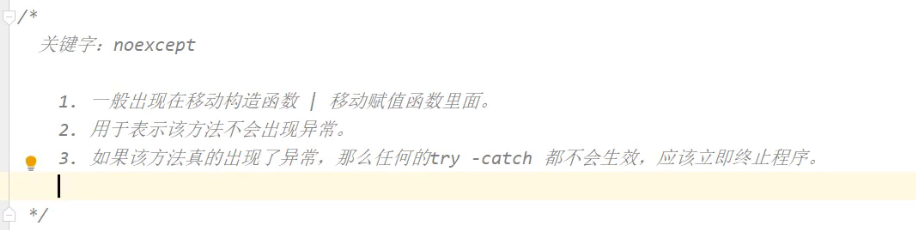
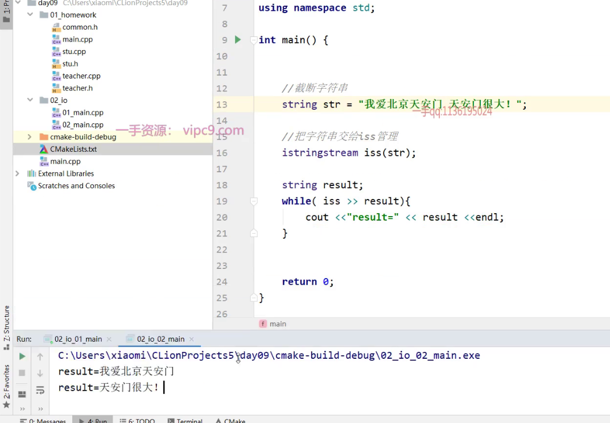
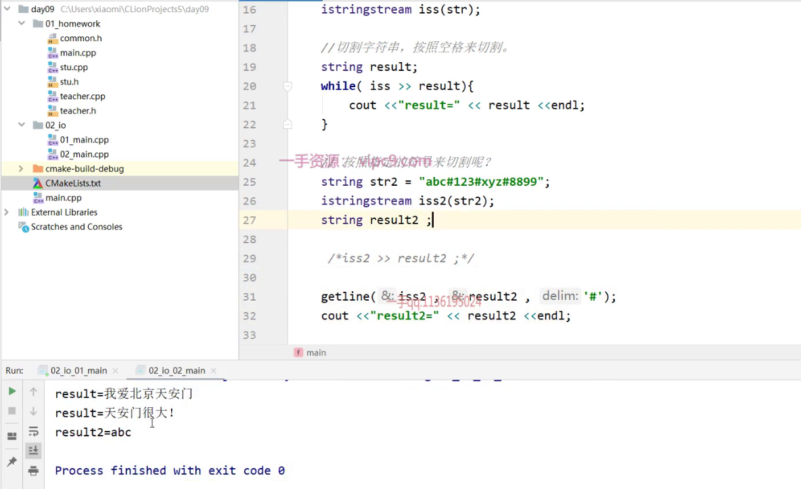
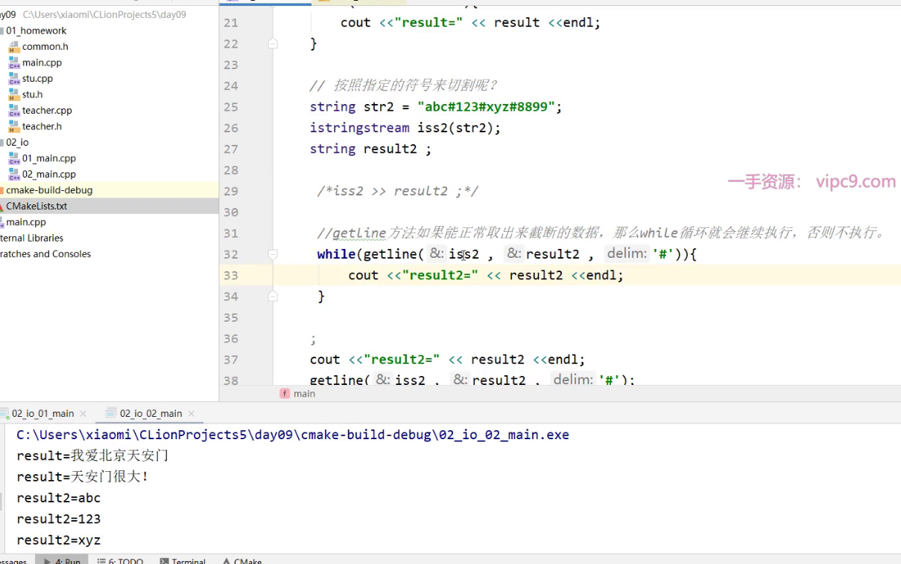

# 一、宏

> 宏替换是C/C++系列语言的技术特色，C/C++语言提供了强大的宏替换功能，源代码在进入编译器之前，要先经过一个称为“预处理器”的模块，这个模块将宏根据编译参数和实际编码进行展开，展开后的代码才正式进入编译器，进行词法分析、语法分析等等

## 1. 宏变量

> 宏变量和const 修饰的在定义语义上没有什么不同，都是可以用来定义常量，但在与const的定义进行对比时，没有任何优势可言，所以建议使用const来定义常量。

```cpp
#define MAX 30

int main(){
	int scores[MAX]; //表示一个班30个人的成绩数组。

	return 0 ;
}
```

## 2. 条件宏

> 条件宏最常出现在头文件中，用于防止头文件被反复包含。

- 头文件的条件宏

```cpp
#ifndef STUDENT_H
#define STUDENT_H
……
……
#endif
```

- 用于判断编译的条件宏

> 通过DEBUG宏，我们可以在代码调试的过程中输出辅助调试的信息。当DEBUG宏被删除时，这些输出的语句就不会被编译。更重要的是，这个宏可以通过编译参数来定义。因此通过改变编译参数，就可以方便的添加和取消这个宏的定义，从而改变代码条件编译的结果.

```cpp
#define DEBUG
#define REALEASE

#include<iostream>

using namespace std;

int main() {
    #ifdef DEBUG
        cout <<"debug模式下打印" << endl;
    #elif REALEASE
        cout <<"release模式下打印" << endl;
    #else
        cout <<"普通模式下打印" << endl;
    #endif
    
    //下面可言继续编写原有的逻辑
    cout << "继续执行逻辑代码~~~"<<endl;
    
    return 0 ;
}
```

# 二、枚举

> 在C++里面定义常量，可以使用 `#define和const`创建常量， 除此之外，还提供了枚举这种方式，它除了能定义常量之外，还表示了一种新的类型，但是必须按照一定的规则来定义。在枚举中定义的成员可以称之为 `枚举量` ，每个枚举量都能对应一个数字，默认是他们的出现顺序，从0开始。
>
> C++的枚举定义有两种方式，`限定作用域`和 `不限定作用域` ，根据方式的不同，定义的结构也不同。

## 1. 两种定义方式

### 1. 限定作用域

> 使用 `enum class` 或者 `enum struct` 关键字定义枚举，枚举值位于 `enum` 的局部作用域内，枚举值不会隐式的转化成其他类型

```cpp
enum class Week{MON,TUS,WEN,THU,FRI,STU,SUN};


int main(){

	int val =（int）Week::TUS ; //打印会是1 
    
	return 0 ;
}
```

### 2. 不限定作用域

> 使用 `enum`关键字定义，省略 `class | struct`， 枚举值与枚举类型位于同一个作用域，枚举值会隐式的转化成整数, 默认是从0开始，依次类推。 不允许有重复枚举值，因为他们属于同一个作用域。

```cpp
enum traffic_light{red, yellow , green};

//匿名的未限定作用域
enum{red, yellow , green}; //重复定义会报错，因为red\yellow\green 已经定义过了。

//手动给枚举量 设置对应的数值
enum{red = 10, yellow =20 , green =30};

int main(){
	
    //使用 域操作符来获取对应的枚举量
	int a=  traffic_light::red;
	int b = ::red; 

	return 0 ;
}
```

## 2. 枚举的使用

> 枚举的目的：增加程序的可读性。枚举类型最常见也最有意义的用处之一就是用来描述状态量。
>
> 固定一个名字， 固定的几个名字。不允许程序员在外来的编码中修改名称。
>
> 性别： 男  、 女     nan  nv     man  women      male female     1  0 
>
> 

```cpp
#include <iostream>
#include <vector>
#include <string>

using namespace std;

enum Gender{MALE , FEMALE};

class teacher{

public:
    string name;
    Gender gender;

    teacher(string name , Gender gender):name(name),gender(gender){}
};

int main(){

    teacher t1("张三" ,  Gender::MALE);
    teacher t2("李丽丽" ,  Gender::FEMALE);
    teacher t3("李四" ,  Gender::MALE);

    vector<teacher> v;
    v.push_back(t1);
    v.push_back(t2);
    v.push_back(t3);

    for(teacher t : v){
        switch (t.gender){
            case Gender::MALE: //男
                cout <<"男老师" << endl;
                break;
            case Gender::FEMALE:
                cout <<"女老师" << endl;
                break;
            default:
                cout <<"性别错误" << endl;
                break;
        }
    }
    return 0 ;
}
```


## 练习：

> ​	一个容器<vector>里面有若干个学生 ，现在需要统计一下里面的男生有多少个，女生有多少个。 请使用枚举来定义性别。

# 三、异常处理

## 1. 异常处理

异常时指存在于运行时的反常行为，这些行为超出了函数的正常功能的范围。和python一样，c++ 也有自己的异常处理机制。 在c++中，异常的处理包括 `throw表达式` 和 `try 语句块` 以及 `异常类` 。如果函数无法处理某个问题，则抛出异常，并且希望函数的调用者能够处理，否则继续向上抛出。如果希望处理异常，则可以选择捕获。

```cpp
void test(){
    try{
        autoresult = do_something();
    }catch(Some_error){
        //处理该异常
    }
}

int dosomething(){
    
    if(条件满足){
        return result;
    }else{
        throw Some_error(); //抛出异常
    }
}
```

## 2. 不使用异常机制

- 终止程序

> 可以使用 `abort` | `exit` 来终止程序的执行

```cpp
int getDiv( int a , int b){
    if(int b == 0 ){
    	abort(); // 或者是 exit(4) //括号内为错误的代码，可以使用常量定义
	}
    return a / b;
}
```

- 显示错误代码

> 与直接终止程序的突兀对比，错误代码显得更为友好些，同时也可以根据错误代码给出相应的提示。

```cpp
int getDiv( int a , int b){
    if(int b == 0 ){
    	//abort(); // 或者是 exit(4) //括号内为错误的代码，可以使用常量定义
        return -1000001;// 外部可以对此代码进行处理
	}
    return a / b;
}
```

## 3. 使用异常机制

### 1. 捕获异常

> 若程序想对异常进行处理，以达到让程序继续友好的执行下去，可以使用捕获异常。 **`exception` 是所有异常的父类 , `runtime_error` 可以作为运行时出现的异常捕获**。一旦发生异常，那么后面的语句将不会执行。
>
> 一般捕获异常，采用try{} catch(){}的结构来捕获异常，catch可以有多个。`可以使用catch(...) 来表示捕获所有异常` , 但它必须出现在所有catch的最后。

```cpp
try{
    //执行的代码逻辑
}catch(runtime_error err ){ //捕获的异常类型。
    //捕获到异常，执行的逻辑
    cout << err.what() << endl; //打印错误信息
}
```

### 2. 抛出异常

> 函数内部如果不想处理异常，可以选择抛出异常（throw） , 进而由调用的它函数处理，若该函数仍未处理，则继续往上抛出。注意： 若抛出的语句位于try语句块内，则优先匹配try 语句匹配的异常，若没有匹配上，才选择向上抛出。 throw可以抛出任意类型的异常，要求是这些类型必须是这些类的对象可复制和移动。同样抛出异常时，后面的语句不会执行。

```cpp
int calcDiv(int a, int b){

    if(b == 0){
        throw  runtime_error("除数不能为0 ");
    }
    return a / b;
}
```

### 3. noexcept

> 如果预先知道某个函数不会抛出异常，那么可以在函数定义的参数列表后面跟上关键字 `noexcept` , 通常会存在于移动构造函数 和 移动赋值函数中。即便某个函数声明不会抛出异常，但是在内部真的抛出异常，编译器仍然允许编译通过，但是在运行时为了确保不抛出异常的承诺，会调用terminate 终止程序的执行，甚至不会向上传递异常。

```cpp
stu(stu && s) noexcept { //移动赋值函数
}

void operator=(stu && s) noexcept{ //表示不会抛出异常。
    
}
```



# 四、I/O操作

> 在针对I/O操作时，标准库提供一组操作符（`manipulator`），允许程序堆输出的内容进行格式化，比如：输出数字的十六进制、浮点值的精度等。类似以前的 `endl` 就是一个操作符，但它并不是一个普通的值，是用于输出一个换行符并且兼具刷新缓冲区的功能。

## 1. 基本输入输出

### 1. 输出布尔数据

> 在c/c++中，在对bool类型的数据做输出的时候，打印的是 0 、1 ，如果希望看到的是 true 和 false ，那么可以使用 boolalpha 操作符。

```cpp
#include <iostream>

using namespace std;

int main (){

	bool flag = false;
    cout << "flag的值是：" << flag << endl; // 打印 0

    //操作符只会影响后续的输出  打印 0  false
    cout << "flag的值是：" << flag  <<" 添加操作符后："<<boolalpha << flag << endl;

	return 0 ;
}
```

### 2. 输出整形数字

> 在输出数字时，可以选择使用`十进制` 、`八进制`、`十六进制` 输出 ，它们只会影响整形数字， 默认会采用十进制输出数字

```cpp
#include <iostream>
using namespace std;
int main (){

	cout <<"十进制：" << dec  <<9 << endl;  // 9
    cout <<"八进制：" << oct  <<9 << endl;  // 10 
    cout <<"十六进制：" << hex <<10 << endl; // a

    //若想在输出前面表示打印的数值显示前缀进制标识，可以使用showbase关键字
    cout <<showbase;
    //默认即采用十进制输出
    cout <<"十进制：" << dec  <<9 << endl; 9 
    cout <<"八进制：" << oct  <<9 << endl; 011
    cout <<"十六进制：" << hex <<10 << endl;  //0xa
    cout<<noshowbase;

	return 0 ;
}
```

### 3. 输出浮点数

> c++ 对浮点数的输出默认只会输出六位 ，那么在应对较多浮点数的时候，则常常会丢失精度，导致后面的小数位无法输出。标准库也提供了针对浮点数的输出格式`cout.precision()` | `setprecision()`，允许指定以多高的精度输出浮点数。

```cpp
#include<iostream>

using namespace std;

int main(){

    double a = 10.12345678901234;
    cout.precision(3); //  设置输出多少位数字 ,该函数有返回值，为设置的精度值。
    cout  <<" a ="<<a << endl;  // 10.1 

    //或者使用setprecision() ，不过需要导入 #include <iomanip>
    //做一个标记位的设置，所以还是要连上  << 
    cout  << setprecision(5)<<" a ="<<a << endl;  // 10.123

    return 0 ;
}
```

小数点后面都是0，默认是不会被输出的，若想强制输出，可以使用showpoint关键字，配合precision 可以精确打印

```cpp
#include<iostream>
using namespace std;

int main(){

	float  f =10.00;
	cout.precision(4);
	cout <<showpoint <<"f="<< f <<noshowpoint<< endl;  //10.00

	return 0 ;
}
```

### 4. 禁止忽略空白符号

> 默认情况下，获取键盘的输入内容时会自动忽略空白符（空格符 、制表符、换行符、回车符） ， 若不想忽略可以使用 `noskipws` 禁止忽略空白符， 使用 `skipws` 还原忽略即可。

```cpp
#include<iostream>

using namespace std;

int main(){

	 cin>>noskipws;
     char c ;
     cout <<"请输入字符：" << endl;
     while(cin >> c){
         cout << c ;
     }
     cin >> skipws;

	return 0 ;
}
```


## 2. string 流

> c++中的I/O 操作，有提供专门三个针对字符串操作的流对象 ，它们定义在 `#include < sstream>` 头文件中
>
> `istringtream` :从string读取数据
>
> `ostringstream` ：向string写入数据
>
> `stringstream` ： 既能读取数据，也能写入数据

### 1. istringstream[截断字符串，默认按空格截断]

> istringstream 是以空格为分隔符，将字符串从字符串流中在依次拿出，比较好的是它不会将空格作为流。这样就实现了字符串的空格切割。
>
> 
>
> 

```cpp
#include<sstream>

using namespace std;

int main(){
    string s = "我是黑马程序员 我爱黑马程序员";
    istringstream stream(str); //或者使用  stream.str(s);
    string s;
    while(stream>>s) { // 抽取stream中的值到s
        cout<<s<<endl;      //依次输出s
    }
    return 0 ;
}
```

#### 按照指定符号来切割呢？[string默认是空格切割]

getline



再加个循环就能全取出来了 最终版：



### 2. ostringstream【拼接字符串】

oss允许你用不同类型的数据转化为字符串拼接

> 我们需要格式化一个字符串，但通常并不知道需要多大的缓冲区。为了保险常常申请大量的缓冲区以防止缓冲区过小造成字符串无法全部存储。这时我们可以考虑使用`ostringstream`类，该类能够根据内容自动分配内存，并且其对内存的管理也是相当的到位。

```cpp
#include<sstream>
#include <string>

using namespace std;

int  main(){

     int a = 55;
     double b = 65.123;
     string str = "";

     //头文件是sstream
     ostringstream oss;
     oss << a << "---" << b;

     str = oss.str();
     cout << str << endl;
     return 0;
}
```

## 3. 文件操作

> c++的文件操作和Python的文件操作有许多相似之处，其实不止它们两，大多数编程语言在对待文件处理上都大同小异。 在Python中针对文件的操作，使用了几个函数即可 `open` 、`read` 、`write` ，而在C++中处理文件操作的有三个主要对象 `istream` 、 `ostream` 、`fstream` 。 需要添加头文件 `#include `

- 文件操作常用类

> 到底是输入还是输出，是站在程序的角度看就ok.

| 数据类型 | 描述                                                         |
| :------- | :----------------------------------------------------------- |
| ofstream | 表示输出文件流，用于创建文件并向文件写入信息。               |
| ifstream | 表示输入文件流，用于从文件读取信息。                         |
| fstream  | 示文件流，且同时具有 ofstream 和 ifstream 两种功能，这意味着它可以创建文件，向文件写入信息，也可以从文件读取信息。 |

- 文件操作模式

| 模式标志   | 描述                                                         |
| :--------- | :----------------------------------------------------------- |
| ios::app   | 追加模式。所有写入都追加到文件末尾。                         |
| ios::ate   | 文件打开后定位到文件末尾。                                   |
| ios::in    | 打开文件用于读取。                                           |
| ios::out   | 打开文件用于写入。                                           |
| ios::trunc | 如果该文件已经存在，其内容将在打开文件之前被截断，即把文件长度设为 0。 |

### 1. 读取文件

> 标准库中提供了针对文件读写操作的类，可以对文件的每行进行读取，由于后续操作矩阵数据的机会更多，所以此处就以文件存储的是矩阵数据为例。

#### a. 简单示例

> 文件仅仅是一些简单的字符串。

```cpp
#include <iostream>
#include <string>
#include <fstream>

using namespace std; 

int main(){

    //构建文件对象， ../表示上一级目录，因为执行的时候是exe文件，它位于debug目录，并不和
    //test.txt 处于同级目录， in表示仅仅是读取文件内容 
    //ios:: 表示域操作符，表示使用ios这个对象里面的in静态常量
    fstream file{"../test.txt" , ios::in};

    //文件是否能正常打开
    if(file.is_open()){
        string line ;

        //getline 用于读取文件的整行内容，直到碰到文件末尾或者超过字符串可存储的最大值才会返回
        while (getline(file , line)){
            cout << line << endl;
        }
        //关闭文件
        file.close();
    }else{
        cout << "文件无法正常打开! "<<endl;
    }
	return 0 ;
}
```

#### b. 二维vector操作示例

> 文件中存放如下所示的 3 * 4 的矩阵数据，需要读取出来，然后使用vector来存储。

```cpp
1, 6, 2, 10.5
11, 15.2, 2, 21
3, 9, 1, 7.5
```

- 示例代码

```cpp
#include <iostream>
#include <string>
#include <fstream>

using namespace std; 

int main(){

        fstream matrixFile{"../matrix.txt" , ios_base::in};

        string line;

        if(matrixFile.is_open()){
          //循环读取每一行，直到文末

          //针对每一行操作的对象，用于字符串切割、转化
          stringstream ss ;

          //用于接收每一个数字
          float number ;

          //整个矩阵数据
          vector <vector<float>> matrixVector;


          //存储每一行的矩阵
          vector <float> rowVector;


          while(getline(matrixFile , line)){
              cout << "line = " << line << endl;


              //每次开始前都清空行vector的数据
              rowVector.clear();

              //每次包装前，都清空内部数据
              ss.clear();

              //包装line数据，以便一会进行切割，
              ss.str(line);


              //循环进行转化。
              while(ss >> number){

                  //获取下一个字符，如果是逗号或者空白 则忽略它，丢弃它。
                  //然后while循环继续执行，获取下一个数字
                  if(ss.peek() == ',' || ss.peek() == ' '){
                      ss.ignore();
                  }
                  //往行里面追加数据
                  rowVector.push_back(number);
              }
              //每一行填充完毕之后，再存储到大的vector中
              matrixVector.push_back(rowVector);

          }

          //关闭文件
          matrixFile.close();


          //最后在这里，遍历打印二维vector即可。

            for (int i = 0; i <matrixVector.size() ; ++i) {

                for (int j = 0; j <matrixVector[i].size() ; ++j) {
                    cout << matrixVector[i][j] << " ";
                }

                cout << endl;

            }
      }else{
          cout << "文件打开失败"<<endl;
      }
    return 0 ;
}
```

### 2. 写入文件

> 实际上和读取文差不多，如果能从文件中读取内容，那么往文件中写入内容也没有多大难处。

#### a. 简单示例

```cpp
#include <iostream>
#include <fstream>

using namespace std; 

int main(){

    //若问写入操作，文件不存在，会自动创建文件
    //out： 每次写入都会覆盖源文件内容
    //app: 在末尾处追加内容
    fstream file{"../test2.txt",ios::app};

    if(file.is_open()){
        cout << "正常打开文件"<<endl;

        //写入数据
        file << "，hi c++";

        //写入换行
        file << endl;
        //写入结束
        file.close();
    }else{
        cout << "无法正常打开文件" << endl;
    }
	return 0 ;
}
```

#### b. 二维vector操作示例

> 现在要做的是把二维vector的矩阵数据，写入到文件中。

```cpp
#include <iostream>
#include <vector>
#include <fstream>

using namespace std; 

int main(){
  //构建vector
    vector<vector<float >> matrixVector{
            {1, 6, 2, 10.5},
            {11, 15.2, 2, 21},
            {3, 9, 1, 7.5}
    };
    
    //构建文件对象
    fstream matrixFile{"../matrix.txt",ios::app};
    //文件能否正常使用
    if(matrixFile.is_open()){
        //开始遍历vector
        for (int i = 0; i < matrixVector.size(); ++i) {
            //遍历每一行
            for (int j = 0; j <matrixVector[i].size(); ++j) {
                //往文件写入数字
                matrixFile << matrixVector[i][j] ;

                //只要不是末尾的数字，那么都追加一个 ,
                if(j != matrixVector[i].size()-1){
                    matrixFile << ",";
                }
            }
            //写入换行
            matrixFile << endl;
        }
        //关闭文件
        matrixFile.close();
        cout << "文件写入完毕" << endl;
    }else{
        cout << "文件写入失败" << endl;
    }
  
    return 0 ;
} 
```

