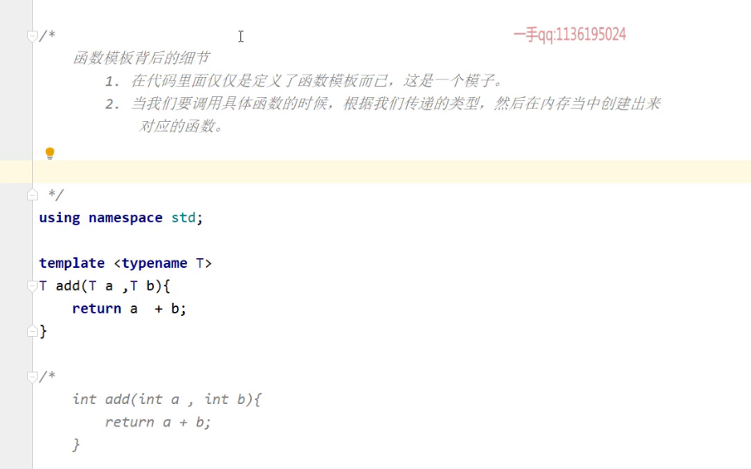
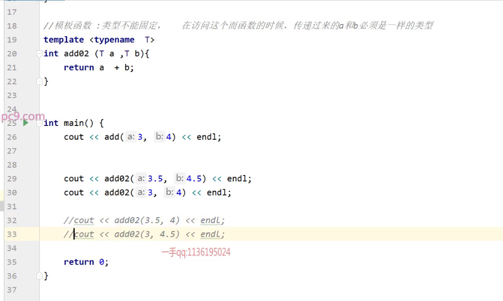
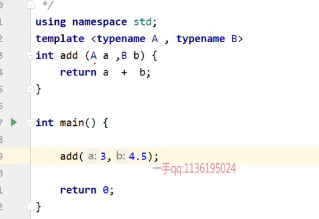
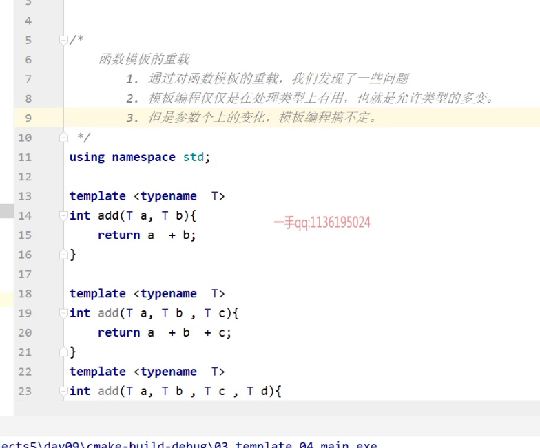
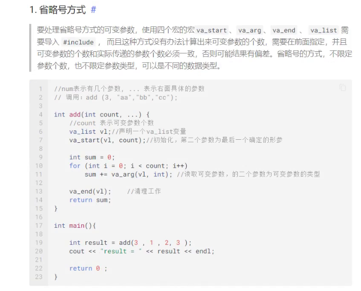
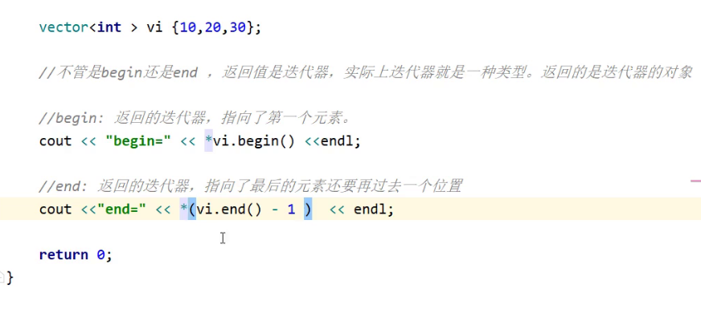
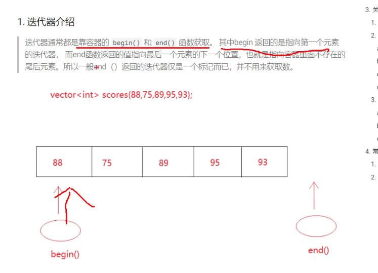
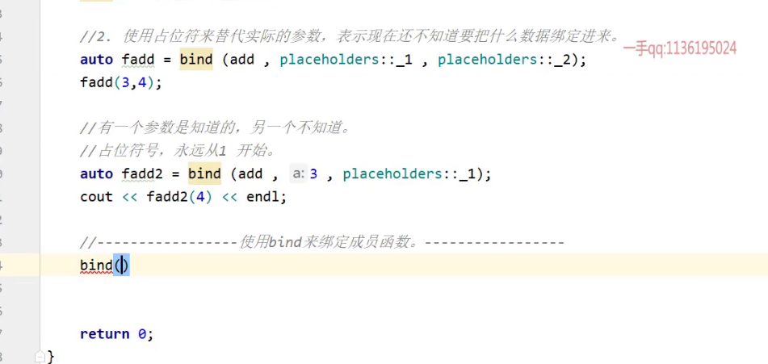

# 一、模板编程

模板编程的必要性(意义所在)

1. 模板编程主要是为了简化函数的参数类型、返回值类型
2. 为了能够让函数匹配更多的数据类型，可以使用模板编程，（函数模板/模板）
3. 模板编程是为了让我们匹配更多的类型，而不仅仅是一种类型
4. 

## 1.模板编程的必要性

> 在c++中，变量的声明必须指出它的类型，提高了编译运行效率，但是在某些场合下就有点缺陷。比如：需要定义计算两个数之和的函数，由于未来计算的数值有可能是整数、也有可能是浮点数，所以需要为这些类型准备对应的函数，但是这些函数的内部逻辑都是一样的，他们的唯一区别就是所接收的数据类型不同而已。那么有没有一种情况使得编码的时候暂时的忽略掉类型这个特性，等运行时在动态决定。

```cpp
#include <iostream>

using namespace std;

int add(inta ,int b){
    return a + b;
}

float add(float x , float y ){
    return x + y;
}

int main(){
    
    int result = add(3, 4 ) ;
    cout << "result  = " << result << endl;
    
    int result2 = add(3.5 ,4.5 );
    cout << "result2 = " << result2 << endl;
    
    return 0 ;
}
```

注意：



如果这么写， 函数模板的参数必须是同种类型，否则会报错，也就是类型不能固定的时候，在访问这个函数的时候，传过来的a和b必须是一样的类型。 因为参数类型是同一个模板 T和T的

所以就用俩模板就好了呀。注意模板不要加分号;



## 2. 函数模板

#### **C++编译器不支持模板的分离式编译**。

[C++使用函数模板出现“无法解析的外部符号”的问题_c++函数模板无法解析外部符号-CSDN博客](https://blog.csdn.net/leo_csdn_/article/details/104880255)

使用模板不要分离式编译，因为他不会认识这个T1和T2是不是你声明里的东西

> 函数模板是通用函数的描述，使用模板来定义函数，让编译器暂时忽略掉类型，使用参数把类型传递给模板，进而让编译器生成对应类型的函数。函数模板仅仅是表示一种模型罢了，并不是真正可以直接调用的函数，需要在使用的时候传递对应类型，生成对应类型的函数。
>
> 模板的定义以`template`关键字开始，后面跟随着参数列表，使用`<>` 包含

```cpp
#include <iostream>

using namespace std;

template<typename T>
T add(const T& t1 ,const T& t2){
    return t1 + t2;
}

int main(){
    
    int result = add<int>( 3, 5);
    cout <<"result = " << result << endl;


    int result = add( 3, 5);
    cout <<"result = " << result << endl;

    return 0 ;
}
```

### 1. 函数模板重载

> 如普通函数一般，函数模板也可以重载，以便灵活应对更多的需求

```cpp
#include <iostream>

using namespace std;

template<typename T>
T add(const T& t1 ,const T& t2){
    return t1 + t2;
}

template<typename T>
T add(const T& t1 , const T& t2 , const T& t3){
    return t1 + t2 + t3;
}

int main(){
    
    int result1 = add( 1, 2 );
    int result2 = add( 1, 2 ,3);

    cout <<"result1 = " << result1 << endl;
    cout <<"result2 = " << result2 << endl;
    
    return 0 ;
}
```

- 
- 模板可变参数

> 如果一个函数接收的参数个数不确定，并且都是同一种类型的参数，那么可以使用可变参数的写法来简化代码。 可变参数使用 ... 来表示，通常可变参数也称之为 **参数包 ** ，用于表示它可以对多个参数打包成一个整体。

## 3. 可变参数

> 在C++ 中一般函数的参数个数都是固定的，但是也有一种特殊的函数，他们的参数个数是可变的。针对这种情况C++中提供了**initializer_list**和**省略号**两种方法，其中**initializer_list**要求可变参数的类型必须都一致，而**省略号**方式则不具备这种限制，要更加灵活。

### 1. initializer_list 方式

> c++ 11引入的一种方式，它需要导入`#include<initializer_list > ` ， 参数必须放在一组`{}` 里面，并且元素的类型必须是一样的。相比于前面省略号的方式，initializer_list 就显得简单许多。

```cpp
#include <iostream>
using namespace std;

int add(initializer_list<int> il) {
    int sum = 0;
    for (auto ptr = il.begin(); ptr != il.end(); ptr++){ 
        sum += *ptr;
    }
    return sum;
}

int main(){
    int result = add({10,20,30}); //传递的参数必须放置在一个 {} 里面
    
    cout << "result = " << result << endl;
   
    return 0 ;
}

```

### 其实还有个省略号方式



## 4. 可变参数模板

> 函数模板解决了相同功能、不同数据类型造成多个方法重载的局面，而当模板的参数类型都是一样的，或者有多个一样的参数类型一样，那么使用可变参数来改进模板函数，就显得更为美观。对于参数包来说，除了获取大小之后，程序员更想关注的是，如何获取里面的数据。

```cpp
#include <iostream>
using namespace std;

template<typename T > 
int add(initializer_list<T> il) {
    int sum = 0;
    for (auto ptr = il.begin(); ptr != il.end(); ptr++){ 
        sum += *ptr;
    }
    return sum;
}

int main(){
    int result = add({10,20,30}); //传递的参数必须放置在一个 {} 里面
    
    cout << "result = " << result << endl;
   
    return 0 ;
}
```

## 5. 类模板编程

> 有时候继承、包含并不能满足重用代码的需要，这一般在容器类里面体现的尤为突出。例如： 我们定义了一个容器类，Container， 这个Container类可以实现类似verctor一样的工作，能保存数据，能修改数据，并且**数据的类型不限制**，但是**针对数据的操作都是一样**的。那么类模板编程就成了不二之选了。

### 1. 类模板编程的必要性

> 这里以栈作为参照对象，定义一个模板类，实现栈一样的功能。

```cpp
class Stack{
private :
    enum{MAX = 10}; //表示这个Stack容器最多只能装10个。
    int top =0 ; //表示最顶上的索引位置
    string items[MAX]; //定义一个数组，以便一会装10个元素
public:
    bool isempty(){
        return top == 0;
    }
    bool isfull(){
        return top == MAX;
    }
    //压栈
    int push(string val){
        if(isfull()){
            return -1;
        }
        //没有满就可以往里面存
        items[top++] = val;
    }
    //出栈
    string pop(){
        if (isempty()){
            return "";
        }
        //如果不是空 top 只是指向位置，而数组获取数据，索引从0开始，所以先--
        return items[--top] ;
    }

    string operator[](int index){
        if(isempty() || index > --top){
            cout <<"容器为空或者超出越界" << endl;
            return "";
        }
        return items[index];
    };
};
```

### 2. 类模板

> 上面的Stack容器仅仅只能针对string这种数据类型，如果想存自定义的类型或者其他类型，那么Stack就无法满足了。 要定义类模板，需要在类的前面使用`template ` , 然后替换里面的所有string 即可，这样Stack就能为所有的类型工作了。 如果是自定义类型，那么需要自定义类型提供无参构造函数，因为数组的定义会执行对象的构造。若想避免构造的工作发生，可以使用`allocator`来操作。

```cpp
template <typename T> class Stack{
private :
    enum{MAX = 10}; //表示这个Stack容器最多只能装10个。
    int top =0 ; //表示最顶上的索引位置
    T items[MAX]; //定义一个数组，以便一会装10个元素
public:
    bool isempty(){
        return top == 0;
    }
    bool isfull(){
        return top == MAX;
    }
    //压栈
    int push(const T& val){
        if(isfull()){
            return -1;
        }
        //没有满就可以往里面存
        items[top++] = val;
    }
    //出栈
    T pop(){
        if (isempty()){
            return "";
        }
        //如果不是空 top 只是指向位置，而数组获取数据，索引从0开始，所以先--
        return items[--top] ;
    }

    T operator[](int index){
        if(isempty() || index > --top){
            cout <<"容器为空或者超出越界" << endl;
            return "";
        }
        return items[index];
    };
};
```

#  二、容器

## 1. 顺序容器

> 所谓的顺序容器指的是，在容器的内部，元素的摆放是有顺序的。通常 `vector`已经足以满足大部分开发了。

|       容器       |                             描述                             |
| :--------------: | :----------------------------------------------------------: |
|    **string**    |              与vector相似，尾部插入\|删除速度快              |
|    **array**     |        固定大小数组，支持快速随机访问，不能添加和删除        |
|    **vector**    | 可变大小数组，支持快速随机访问，在尾部之外的位置插入和删除 速度慢 |
|    **deque**     |       双端队列，支持快速随机访问，两端插入和删除速度快       |
| **forward_list** |   单向链表、只支持单向顺序访问，插入和删除快，查询和更新慢   |
|     **list**     |           与单向链表不同，它是双向链表，其他一样。           |

- deque

```cpp
#include <deque>
#include <iostream>

using namespace std;

int main(){
    deque<int> deque;

    deque.push_back(10);
    deque.push_back(20);
    deque.push_back(30);

    cout <<"第一个是：" <<deque.front() << endl;
    cout <<"最后一个是："<< deque.back()<<endl;
    cout <<"长度是：" << deque.size() <<endl;
    cout << deque[0] << " " << deque.at(1) << endl;

    deque.at(0) = 100;


    for(int i :deque){
        cout <<" --> " << i <<endl;
    }
    return 0 ;
}
```

- forward_list

```cpp
#include <forward_list>
#include <iostream>

using namespace std;

int main(){


    forward_list<int> flist{80, 70, 90};

    //1. 添加:: 只能在头的位置追加
    flist.push_front(100);

    //2. 添加:: 在第一个位置的后面，插入一个新的元素。 需要使用迭代器来完成
    flist.insert_after(flist.begin() , 35);

    //3. 删除:: 直接给元素值即可
    flist.remove(70);

    //4. 修改元素值： 也可以使用迭代器的方式修改值
    flist.front() = 10;
    *flist.begin()  = 20;
    cout <<"第一个元素是：" << flist.front() << endl;


    cout << "排序后打印：" << endl;
    flist.sort();
    for(auto i = flist.begin() ; i != flist.end() ; i++){
        cout << "--->" << *i << endl;
    }
    return 0 ;
}
```

- list

```cpp
#include <list>
#include <iostream>

using namespace std;

int main(){


    list<int> list1{80, 70, 90};

    //添加数据
    list1.push_front(10);
    list1.push_back(20);

    //删除元素
    list1.remove(70);

    //修改元素
    list1.front() = 10;
    cout << "第一元素：" <<list1.front() << endl;
    *list1.end() = 20 ;
    cout << "第一元素：" <<list1.back() << endl;

    //遍历链表：
    for (auto i  = list1.begin();  i != list1.end() ; i++) {
        cout <<" ---> "<< *i << endl;
    }


    return 0 ;
}
```

## 2. 迭代器

> 早前访问数组、vector、字符串时，都可以使用索引下标的方式访问，实际上还有一种访问的机制 ： **迭代器** 。(queue不可以)所有标准库中的容器都可以使用迭代器，但是只有少数几个支持下标索引的方式。与指针相似，迭代器也能对对象进行间接访问，但是不能简单认为，指针就是对象，也不能直接认为迭代器就是对象。只是可以通过迭代获取到数据。
>
> 

### 1. 迭代器介绍

> 迭代器通常都是靠容器的 `begin()` 和 `end()` 函数获取。 其中begin 返回的是指向第一个元素的迭代器， 而end函数返回的值指向最后一个元素的下一个位置，也就是指向容器里面不存在的尾后元素。所以一般end（）返回的迭代器仅是一个标记而已，并不用来获取数。
>
> 



### 2. 迭代器运算

> 由于begin() 的返回值只会指向第一个元素，若想获取到后面的元素，可以对迭代器进行运算，它的用法和指针的运算是一样的。通过 + - 的操作，来让返回前后元素对应的迭代器。 在迭代器的内部，重载了`*`运算符函数。通过它可以直接获取到数据
>
> 
>
> 不管迭代器的begin还是end，它返回的是一种迭代器的类对象，迭代器是一个类

### 3. 使用迭代器

```cpp
#include <iostream>
#include <vector>

using namespace std;

int main(){
    
    vector<int> s{88,85,90,95,77};
    cout <<*s.begin() << endl; //88
    cout <<*(s.begin()+1) << endl; //85
    //...
    cout <<*(s.end()-1) << endl;//77

    //遍历容器
    for(auto i = s.begin() ; i != s.end() ; i++){
        cout << *i << endl;
    }
    
    return 0 ;
}
```

## 3. 关联容器

> 关联容器和顺序容器有很大的不同，顺序容器的元素在容器中是有顺序的（按照添加先后计算） ， 而关联容器并不计较顺序的概念，因为他们是按照关键字来访问元素的。C++中常用的关联容器有两个：`map` 和 `set` , map 有点类似 python 里面的`字典`，使用键值对的形式来存储

### 1. pair介绍

> pair定义在头文件`#include ` 中，一个pair保存两个数据成员，它是类模板，所以在创建对象的时候，需要添加泛型参数，以用来表示所保存的数据类型。

```cpp
#include <iostream>
#include <utility>
#include <string>

using namespace std;

int main(){
    pair<string ,int> p("张三",17) ;
	cout << p.first  << p.second <<endl;
    return 0 ;
}
```

### 2. map操作

> map 只允许产生一对一的关系，也就是一个关键字对应一个值，如生活中大多数人，一人一套房差不多。但是也有人是名下多套房，这时候可以使用`multimap`, 它允许一个关键字对应多个值。 它们都定义在头文件 `#include` 中。

#### a. 添加

> 不允许key 有重复的。

```cpp
#include <iostream>
#include <map>
#include <string>

using namespace std;

int main (){

    map<string , string> address_map ;

    //匹配可变参数列表
    address_map.insert({"张三" , "星湖花园1号"});
    address_map.insert(make_pair("李四" , "星湖花园1号"));
    address_map.insert(pair<string ,string>("王五" , "星湖花园1号"));

    //有疑问
    address_map.insert({"张三" , "星湖花园2号"}); //与第一个同关键字，会覆盖原有数据

    return 0 ;
}
```

#### b. 访问

> map可以使用【】的方式来获取指定的元素，要求传递进来的是`key`关键字

```cpp
#include <iostream>
#include <map>
#include <string>

using namespace std;

int main(){
    //访问指定元素
    string address = address["张三"] ;
    cout << address << endl;

    //使用at函数访问
    string address2 = map.at("张三2")
    cout << address2 << endl;    
    return 0 ;
}
```

#### c. 删除

> 除了能使用迭代器的方式删除之外，关联容器由于使用了关键了记录数据，所以删除的时候也可以根据关键字来删除数据。

```cpp
#include <iostream>
#include <map>
#include <string>

using namespace std;

int main(){
    //迭代器方式删除。
    for(auto i = address_map.begin() ; i != address_map.end() ; i++){
        cout <<i->first << " =  "<< i->second << endl;
        if(i->first == "李四"){
            address_map.erase(i);
        }
    }

    //使用关键字删除
    address_map.erase("王五");

    //清空整个map
    address_map.clear();
 	return 0 ;   
}
```

#### d. 修改

> 修改其实就是替换，但是如果还是用insert 是无法起作用的，因为它会执行唯一检查。使用 at函数，对某一个特定关键字的位置修改值。

```cpp
#include <iostream>
#include <map>
#include <string>

using namespace std;

int main(){
    map<string , int> map;
    map.insert( {"张三1" ,18});
    map.insert( {"张三2" ,28});
    map.insert( {"张三3" ,38});

    cout <<map["张三1"] << endl; //18

    map.at("张三1") = 99;

    cout <<map["张三1"] << endl; //99
	return 0 ;
}
```

- 容量查询

> 判断是否为空、获取大小、判断是否存在key

```cpp
#include <iostream>
#include <map>
#include <string>

using namespace std;

int main(){
    map<string , int> map;
    map.insert( {"张三1" ,18});

    //判断是否为空
    bool empty = map.empty();
    cout <<"empty = " << empty << endl;

    //获取大小
    int size = map.size();
    cout <<"size = " << size << endl;

    //查询该key在map中的个数，可用来判断是否存在该key
    int count = map.count("张三1");
    cout <<"count = " << count << endl;
	return 0 ;
}
```

### 3. set操作

> set就是关键字的简单集合，并且容器内部元素不可重复且有顺序。当只是想知道一个值是否存在时，set是最有用的。 set 为不可重复容器，而multiset为可重复容器。

> 在set中每个元素的值都唯一，而且系统能根据元素的值自动进行排序。set中元素的值不能直接被改变。set内部采用的是一种非常高效的平衡检索二叉树：红黑树，也称为RB树(Red-Black Tree)。RB树的统计性能要好于一般平衡二叉树。使用set需要导入头文件 `#include `

#### a. 添加元素

```cpp
#include <set>

using namespace std;

int main(){
    
    //创建空白set容器
   // set<int>s ;

    //创建容器并初始化，可变参数往里面赋值，但是这里添加了重复的3. 后面的3不会被添加进去。
    set<int> s1{3,4,5,6,3};

    s.insert(16);
    s.insert({7,8,9,10}); //也可以接收可变参数
    
    return 0 ;
}
```

#### b. 遍历set

> 遍历的逻辑和其他含有迭代器的容器一样。

```cpp
#include <set>
#include <iostream>

using namespace std;

int main(){
    set<int> s1({3,4,5,6,3});
    for(auto p = s1.begin(); p != s1.end() ; p++){
        cout <<*p << endl;
    }
    return 0 ;
}
```

#### c. 删除指定元素

> 还是使用`erase` 函数删除 。

```cpp
#include <set>
#include <iostream>

using namespace std;

int main(){

    set<int> s1({3,4,5,6,3});
    for(auto p = s1.begin(); p != s1.end() ; p++){
        cout <<*p << endl;
        if(*p == 4){
            s1.erase(p);
        }
    }

    //清空这个容器
    s1.clear();
 
    return 0 ;
}
```

- 容量查询

> 判断是否为空、获取大小、判断是否存在key

```cpp
set<int> s1({3,4,5,6});

//判断是否为空
bool empty = s1.empty();
cout <<"empty = " << empty << endl;

//获取大小
int size = s1.size();
cout <<"size = " << size << endl;

//查询该key在map中的个数，可用来判断是否存在该key
int count = s1.count("张三1");
cout <<"count = " << count << endl;
```

## 4. 常用容器函数

> 到目前为止，容器的操作基本上也就包含了增删改查这些基本的功能，但是有时候可能会面临一些特殊的操作，比如：查找特定元素、替换或删除特定值、对容器进行重新排序等等。标准库并未给每个容器实现这些操作的函数，而是定义一组`泛型算法` 。 算法大部分包含在 `#include ` | `#include `

### 1. 只读函数

> 这一类算法只会读取元素，并不胡改变元素。常见的有 ： `find` | `cout` | `accumulate`

- accumulate

> 它定义在头文件`#include ` 中，所以不要忘记了导入头文件，它的功能是对一个容器的所有元素取和。

```cpp
#include <numeric> 
#include <iostream>
#include <set>

using namespace std;

int main (){
    
    set<int> s1({3,4,5,6});
    //参数一：求和的起始范围 迭代器
    //参数二：求和的结束范围 迭代器
    //参数三：最初的求和值，
    int a = accumulate(s1.begin(), s1.end() , 0 );
    cout <<a << endl;

    //cbegin() 和 cend() 的 c 其实是const的意思。
    int a2 = accumulate(s1.begin(), s1.end() , 0 );
    cout << a2 << endl;
    
    return 0 ;
}
```

- qaual

> 比较两个不同类型的容器是否保存了相同的值，比较的是里面保存的值，容器里面的元素类型要一样。

```cpp
#include <numeric>
#include <iostream>
#include <set>
#include <vector>

using namespace std;

int main (){

    set<int> s1{1,2,3,4,5};
    vector<int> v1{1,2,3,4,5};

    bool flag = equal(s1.begin(), s1.end(),v1.begin());

    cout <<"flag = " <<flag <<endl;
    return 0 ;
}
```

### 2. 写入函数

- fill

> 给定一个范围，把这个范围的元素全部替换成指定的值。实际上也是填充的意思。

```cpp
#include <vector>
#include <iostream>

using namespace std;

int main(){
    
    vector<int> scores {10,20,30,40,50,60,70};

    fill(scores.begin() ,scores.end() , 0 ); //从起始到结束，全部用0替换。
    //fill(scores.begin()+1 ,scores.end() , 0 ); //从第一个元素后面开始替换成0 
    
    for(int score :scores){
        cout <<"score = " << score <<endl;
    }    
    return 0 ;
}
```

- 拷贝

> 由于数组是不允许拷贝的，若要对数组进行一次拷贝，通常使用copy 函数来实现

```cpp
#include <iostream>

using namespace std;
int main(){

    int scores[] {66,77,88,99,100};
    
    
    int size = sizeof(scores) / sizeof(int);
    
    int scores2[ size ];
    //参数一，表示起始位置，参数二： 结束为止，参数三：拷贝的目标位置
    copy(begin(scores), end(scores) , scores2);
    
    for(int i = 0 ; i < size; i++){
        cout << i << " = " << scores2[i] << endl;
    }
 
    return 0 ;
}
```

- 替换

> 对一个容器中，某一段范围的某一个指定元素，替换成指定的值。 需导入头文件`#include `

```cpp
#include <iostream>
#include <algorithm>
#include <vector>

using namespace std;
int main(){

    vector<int> scores {30,20,30,40,30,60};

    //把容器中，从开始到结束为止，所有的30，替换成100.
    replace(scores.begin(),scores.end(),30 , 100);
    
    for(int score : scores){
        cout << " ===> " <<score <<endl;
    }
    
    return 0 ;
}
```

- 容器元素重新排序

> 有时候有些容器在存储数据时，并没有排序的概念，如果要排序使之输出有一定的格式，可以选择使用`sort`对容器进行排序 需导入头文件`#include `

```cpp
#include <iostream>
#include <vector>
#include <algorithm>

using namespace std;
int main(){

    vector<string> scores{"ab","bc","aa","abc","ac"};

    //默认使用字母表顺序排序
    sort(scores.begin(),scores.end());
    
    for(int score : scores){
        cout << " ===> " <<score <<endl;
    }
 
    return 0 ;
}
```

- 删除重复元素

> 除了set不接受重复元素之外，其他容器都可以接收重复元素，当然map稍微特殊一点，因为它是键值对形式存储，要求的是key不允许重复，值实际上可以重复。

```cpp
#include <iostream>
#include <vector>
#include <algorithm>

using  namespace std;

int main() {

    vector<int> stu_vector{ 100,90,88,75,90,88,90};

    //如果是我们自己做。遍历 ---> 不重复的元素，装到一个vector，然后返回vector
    sort(stu_vector.begin() , stu_vector.end());


    //先排序，然后确定唯一值，所有不重复的值先放前面， 重复的值放后面， 这个end就是指向了
    //最后一个不重复的值位置
    auto end = unique(stu_vector.begin() , stu_vector.end());


    //删除从最后不重复位置开始一直删除到vector的末尾位置，
    //因为所有的重复元素都已经赶到了末尾。 其实并不是删除，只是隐藏了而已。
    stu_vector.erase(end , stu_vector.end());

    for (int a : stu_vector){
        cout << a << "\t";
    }
    cout <<"vector的长度是：" <<stu_vector.size() << endl;
    cout << "vector的下标4的元素是："<< stu_vector[4] << endl;
    cout << "vector的下标5的元素是："<< stu_vector[5] << endl;

    return 0;
}
```

- 自定义排序

> 默认情况下容器中的排序算法是按照字母表顺序排序，但有时候，我们希望按照自己定义的规则排序，比如我们希望字数多的字符串排在后面，而不是看字母表顺序。mysort 的参数位置还要一个好听的名字，叫做“谓词” ，一元谓词表示这个函数接收一个参数，二元谓词表示接收两个参数，这个函数还要求有一个返回值，以方便底层排序获取我们的定义的排序规则。

```cpp
#include <iostream>
#include <vector>
#include <algorithm>

using  namespace std;

int main() {
    //回调函数，由sort内部调用，并且要求返回结果。
    bool mysort(const string& a , const string& b){
        return a.size() < b.size();
    }

    vector<string> vv{"ab","bc","aa","abc","ac"};

    //默认使用字母表顺序排序 按照我们规定的排序算法排序
    sort(vv.begin(),vv.end() , mysort);

    //如果字数一样，长度一样，那么再按字母表顺序排序，可以使用stable_sort
    stable_sort(vv.begin(),vv.end() , mysort);
    
    
    for(string ss :vv){
        cout <<"===>" << ss <<endl;
    }
    return 0 ;
}
```

# 三、 函数对象

## 1. function对象

> C++语言中有几种可调用对象：`函数`、`函数指针`、`lambda表达式`、`bind创建的对象` 以及`重载了函数调用运算符的类`。
>
> 在前面讲解函数指针的时候，提过，函数指针也是有类型的，函数指针的类型，由函数的返回值类型和参数共同决定。而function的出现让这个定义更为简化。function是一个模板类，可以用来表示函数的类型，当然需要在定义的时候，表示函数的返回值类型以及参数的类型。 除了能使用函数指针来调用函数之外，其实也可以声明一个`function`的对象，接收某一个函数，直接调用function的对象，也等同于调用函数。

### 1. 函数指针回顾

```cpp
#include <functional>
#include <iostream>

using namespace std;

int add (int a ,int b){
    return a + b ;
}

int main(){
    //函数指针
    int (*padd)(int , int) =add;
    cout << padd(3,4) <<endl;

    return 0 ;
}
```

### 2. function 使用

#### 1. 接收全局函数

```cpp
#include <iostream>
#include <functional>

using namespace std;

void print(int a , string b){
    cout <<a <<" = " <<b << endl;
}

int main(){

    //使用function对象接收函数 <void (int , string)>
    //前面的void 表示返回值  <>表示接收的参数类型，个数要对应上。

    function<void (int ,string)> f = print;
    f(3, "奥巴马");

    return 0 ;
}
```

#### 2. 接收lambda表达式

```cpp
#include <iostream>
#include <funtional>
using namespace std;

int main (){

    function<int (int ,int)> f = [](int a ,int b){return a + b ;};
    cout << f(1 , 2 ) <<endl;
	return 0 ;
}
```

#### 3. 接收静态成员函数

```cpp
#include <iostream>
#include <functional>
using namespace std;


class stu{
public:
    static int run(string name ,int age){
        cout <<age <<" 的 "<< name << " 在跑步... "<< endl;
    }
};


int main (){

    function <int (string ,int)> f = stu::run;
    f("奥巴马" , 19);

    return 0 ;
}
```

#### 4. 接收成员函数

> 接收成员函数时，需要额外提供，调用函数的对象实体，可以是对象，可以是引用，可以是指针。也就是参数的第一个位置写调用这个函数的对象实体

```cpp
#include <iostream>
#include <functional>

using namespace std;

class stu{
public:
    int run(string name ,int age){
        cout <<age <<" 的 "<< name << " 在跑步... "<< endl;
    }
};


int main (){    
    
    //实际上我门想的应该是这样： 因为run 函数的返回值是int, 接收两个参数(string ,int)
    //但是不能这么做，因为这个函数是非静态函数，也不是全局函数，它是成员函数，不能直接调用，
    //如果编译通过，那么直接使用f("aa" , 18) ; 显然是不允许的。
    //function <int ( string , int )> f0 =  &stu::run;   //错误写法


    function <int (stu , string , int )> f1 =  &stu::run; //正确写法 对象
    function <int (stu& , string , int )> f2 =  &stu::run; //正确写法 对象引用
    function <int (stu* , string , int )> f3 =  &stu::run; //正确写法 指针

    //真正调用run();
    stu s1;
    f1(s1 , "张三" , 18 ); //会发生拷贝 这里指的是stu发生拷贝，

    stu s2;
    f2(s2 , "张三" , 18 ); //避免发生拷贝 ， 这里指的是stu发生拷贝，，引用指向实体

    stu s3;
    f3(&s3 , "张三" , 18 );
    return 0 ;
}
```

## 2. bind

> c++ 11推出的一套机制`bind` ，它可以预先把指定可调用实体的某些参数绑定到已有的变量，产生一个新的可调用实体，这种机制常常出现在回调函数中。说的简单点就是，有一个可以直接调用的实体，但是可以对这个实体进行一下包装，包装出来的实体，也可以调用，那么调用这个包装的实体，等同于调用原来的实体。

* `bind` 到底绑的是什么呢?

> 可以理解为把函数 、函数的实参以及调用函数的对象打包绑定到一起。然后用一个变量来接收它，这个变量也就是这些个打包好的整体。

### 1. 绑定全局函数

```cpp
#include <iostream>
#include <functional>

using namespace std;

int add3(int a ,int b){
    cout <<"执行了add函数" << endl;
    return a + b;
}

int main (){

    //可以看成是把p 绑定到add3上， 以后使用p() 等同于 add3()
    //但是bind的一个好处是，参数不用在后续调用p()的时候传递了，因为在绑定的时候已经传递进来了。
    auto p1 = bind(add3 , 3 ,4 );
    int result1 = p1();
    cout <<"result1 = "<< result1 << endl;

    //也可以是用function来接收，但是由于参数的值已经在bind的时候传递进去了，所以接收的时候
    //function的参数可以使用() 表示无参。否则在调用p1的时候，还必须传递参数进来
    function<int ()> p2 = bind(add3 , 5 ,4 );
    int result2 =p2();
    cout <<"result2 = "<< result2 << endl;

    return 0 ;
}
```

### 2. 当定成员函数

> `bind` 也可以 bind 类中的某个成员函数

```cpp
#include <iostream>
#include <functional>
#include <string>

using namespace std;


class stu{
public :
    int run(string name ,int age){
        cout <<age << " 的 " << name << "在跑步" << endl;
        return 10;
    }
};

int main (){
    stu s ;
    
    function<int ()> f= bind(&stud::run , s , "张三" ,18);
    f();
    
    //****************************************************
    //使用auto 完成类型推断。
    auto b = bind(&stu::run,s,"张三",18 );
    b();

	return 0 ;
}
```

### 3. 使用 placeholders占位

> 在绑定的时候，如果一时半会还不想传递实参，那么可以使用 `placeholders`来占位，第一个占位的索引位置是1，第二个占位的索引是2，依次类推。

```cpp
#include <iostream>
#include <functional>
#include <string>

using namespace std;


class stu{
public :
    int run(string name ,int age){
        cout <<age << " 的 " << name << "在跑步" << endl;
        return 10;
    }
};


int main(){

    stu s ;
    //placeholders::_1 , 表示run的第一个参数，现在先不给，后面调用的时候再给。
    //占位的个数不限制，可以全部占位，后面在传递真正的实参。
    auto b = bind(&stu::run,s,placeholders::_1,18 );
    b("王五");

    //当然使用function来接收的话，就显得复杂些，所以平常建议使用auto
    //因为在绑定的时候，并没有传递run函数的第一个实参，那么表示这个实参在调用的时候在传
    //function在接收的时候，必须与函数完全比配，所以 f的参数必须带上 string
    //如果所有的数据都在后面给了，那么<>里面的()就可以空着了
    stu s2 ;
    function <int (string)> f = bind(&stu::run,s2, placeholders::_1,19 );
    f("李四");

    return 0 ;
}
```


