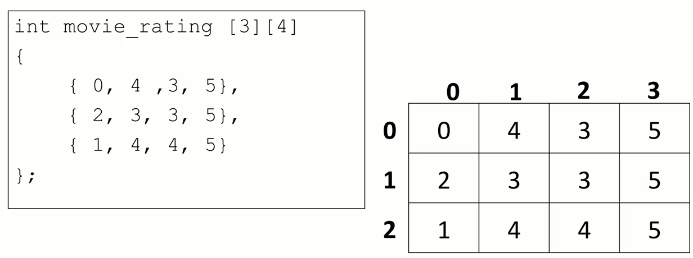

## 一、背景介绍

> **C++ **是一种通用的，面向对象的编程语言，由`Bjarne Stroustrup`于1979年设计，是C语言的扩展，并提供了一些额外的功能，例如类，继承，默认函数参数等。
>
> C ++在现代起着不可或缺的作用，因为许多现代系统（例如操作系统，Web浏览器，数据库等）在其代码库的至少某些部分中都包含C ++代码。而且，由于C ++的速度，它在性能至关重要的领域中非常有用。

### 1. 学习C++的几大理由

1. C ++是世界上最受欢迎的语言之一，40年时间常年霸占TIOE 排行榜前列。
2. C++ 加入了面向对象特性的支持，并且程序的运行速度是其他语言无法比拟的。
3. 学习C++有助于我们理解上层编程语言许多背后的故事。（如：Java空指针异常，Python高阶函数）
4. 嵌入式、无人驾驶、游戏引擎首选。

### 2 . 与python比较

> 程序有两种执行方式，解释执行和编译执行。

* python是一种解释语言，不需要经过编译，是一边解释一边执行，由于底层封装了很多库供程序员使用，所以开发起来方便快捷，且能够很好地跨平台，写一些小工具小程序特别合适。 大部分代码使用已经写好的库。
  * 弱类型语言  | 动态类型语言
    * 都不用关心类型
* c++ 则属于编译语言，是一种需要编译后运行语言，编译后通过链接，整合其他依赖库，然后生成机器码（可执行文件），以后再运行，无需编译。在指定环境下编译运行，运行效率高 。大部分的代码都是从0开始动手，
  * 强类型语言 | 静态类型语言
    * 必须得写类型。

## 二、环境准备

### 1. 安装编译环境

> gnu 系列（mingw ,cygwin） 、Calng 、 MSVC...

### 2. 安装开发工具

> 开发工具种类繁多，有`VS` | `Dev-C++` | `code lite` | `clion`| `Qt Creator`

## 三、HelloWorld

### 1. 入门示例

* 示例代码如下:

```cpp
#include<iostream>

int main (){
    std::cout << "hello world !" << std::endl;
    return 0 ;
}
```

理解：

`#include` ： 引入输入输出库

`int main(){}` ： 主函数入口

`std::` .... 输出打印

`return 0` : 函数返回值，一般0 表示正常执行返回。

### 2.  命令行编译

> 实际上除了使用IDE工具编写C++代码之外，也可以使用记事本编写，然后使用命令行的方式编译执行写好的C++代码。

```cpp
#include <iostream>

int main() {
    
    std::cout << "Hello world!" << std::endl;

    return 0;
}
```

* 打开命令行，输入以下命令即可

```cpp
g++ -Wall -std=c++11 main.cpp
    
g++ -Wall -std=c++14 main.cpp -o main.exe    
```

`g++`: 是编译工具.

`-Wall`: 编译过程中显示所有的警告.

`-std=c++11`: 使用c++11版本进行编译.

`main.cpp`: 要编译的cpp文件

编译执行完成后,Windows下默认生成 a.exe 文件，linux下默认生成 a.o 文件，macos下默认生成 a.out 文件

`-o`: 指定输出文件名称

### 3. 注释

> 每一种语言都有注释，以便程序员对其编写的代码进行解释说明。c++采用 `//` 和 `/* */` 实现单行和多行注释。

```cpp
#include <iostream>

int main (){
   
    // 我是c++的单行注释
	std::cout << "hello world" << std::endl;
    
    /*
   	 	我是c++的多行注释
		我可以写多行
    */
    std::cout << "hello world" << std::endl;
    
    return 0 ;
}

```

## 四、数据类型和变量

### 1. 数据类型

> 与其他静态类型语言一样，C++也具备大多数语言的数据类型。除下表给出的数据类型之外，其实还有 `short` | `long` | `long long `  等 。 关于数据类型占用的字节长度其实不用刻意的去背，c++提供`sizeof()函数`来获取某种数据类型占用的空间大小。

| 数据类型     | 声明                                        |
| ------------ | ------------------------------------------- |
| 整数类型     | int                                         |
| 单精度浮点数 | float                                       |
| 双精度浮点数 | double                                      |
| 字符         | char                                        |
| 字符串       | string  c++里面的字符串 ，C语言字符串char[] |
| 布尔         | bool                                        |

```cpp

#include <iostream>

int main(){
    
    std::cout <<"int类型占用空间：" << sizeof(int) << std::endl;
    std::cout <<"char类型占用空间：" << sizeof(char) << std::endl;
    std::cout <<"double类型占用空间：" << sizeof(double) << std::endl;
    std::cout <<"bool类型占用空间：" << sizeof(bool) << std::endl;
   
    retrn 0 ;
}
```

### 2、变量

#### 1. 声明和初始化

> 任何编程语言都会涉及数据的存取，把数据存放在内存中，从内存中取出存放的数据，为了更快的操作这些数据，一般会给他们起一个名称，以便未来能够操作数据，这些名字在编程语言里面，被称之为**变量** 。 
>
> c++ 是强类型语言，任何变量在使用前必须先声明，并且在声明的时候必须要指定该变量的数据类型，即该变量未来能够存储的数据类型。

```cpp
int main(){
    
    //1. 先声明 ， 后赋值
    int age ;
    double price;
 
    age = 10 ;
    price = 20.3;

    //2. 声明并立即初始化赋值
    int age = 20 ;
    return 0 ;
}
```

* 变量声明以及初始化常用手法：

```cpp
int main(){
    int age ; //未初始化

    int age = 21 ; // C 方式初始化

    int age (21); //构造方法初始化

    int age {21} ; //c++ 11标准开始的方式
	return 0 ;    
}
```

* 我们不仅能查看数据类型占用的空间大小，也能查看变量占用的空间大小。

```cpp

#include <iostream>

int main(){
    
    int age = 18 ; 
        
    // 下面两句话打印出来的大小是一样的。
    std::cout <<"age占用空间：" << sizeof(age) << std::endl;
    std::cout <<"char类型占用空间：" << sizeof(char) << std::endl;
   
    retrn 0 ;
}
```

#### 2. 变量命名规则

> 1. **可以包含字母 、 数字 和下划线**
> 2. **必须以字母或者下划线开始**
>
> 注意：在C++中，大写字母和小写字母被认为是两个不同的字符。因此，sum和SUM是两个不同的变量名。一般地，变量名用小写字母表示，与人们日常习惯一致，以增加可读性。应注意变量名不能与C++的关键字、系统函数名和类名相同

| 有效命名 | 无效命名 |
| -------- | -------- |
| Age      | 2020_Age |
| age      | Age+1    |
| _age     | $age     |
| My_Age   | My Age   |
| Int      | return   |

#### 3. 常量

> 常量其实和变量没有多大区别， 有名字， 占据存储空间，可以是任何的基本类型，但只有一点不同，常量的值不允许变更。C++中的常量的声明需要使用 `const` 关键字，而python中的常量默认约定是全大写表示。

```cpp
int main(){
    
    const double pi {3.1415926};
    const int months_in_year{12};

    pi = 2.5 ; //将会出现编译错误
    
    return 0 ;
}
```

## 五、输入和输出

> 任何编程语言都要输入和输出，python的输入输出是` input`  和 ` print` , C语言的输入输出是 `scanf` 和  `printf` ， 而C++的相对要复杂些，它使用  `std::cin`   和 `std::cout` 来操作输入输出 。 C++的输入输出，需要导入` iostream `库 。

### 1. 输出

> 一般在输出的后面跟上  `std::endl` 来表示输出结束，**它除了含有换行的功能之外，还具备了刷新数据打印缓冲区的功能。**

```cpp
#include <iostream>

int main (){
    
    //由于没有换行，两个单词会出于同一行。
     std::cout << "Hello";
     std::cout << " world";
    
    
    //兼备换行的输出
    std::cout << "Hello" << std::endl;
    std::cout << " world" << std::endl;
    
    
    //可以连续输出打印，这其实是一种叫做：链式调用的手法
     std::cout << "Hello " << " World" << " , I love C++!"<< std::endl;
    return 0 ;
}
```

### 2. 输入

> 输入旨在获取键盘的数据输入。 不过获取输入前的提示语句得使用 `std:: cout `来输出提示。

```cpp
#include <iostream>

int main (){
    std::cout << "请输入您的年龄："<<std::endl;
    
    int age ;
    std::cin >> age;
    
    std::cout << "您的年龄是：" << age <<std::endl;
    
    return 0 ;
}
```

### 练习

> 从键盘输入两个数字，并打印两数之和

## 六、条件与循环

### 1. 条件判断

#### 1. if语句

> 条件判断即是生活中的对某个事物进行判断，比如：父子间对此次考试成绩进行约定，如果超过90分，则可以自由活动一天，如果超过80分，可以休息半天，如果低于80分，则要乖乖去 写作业。

```cpp
#include <iostream>

int main (){
    
    std::cout << "请输入此次考试的成绩：" << std::endl;
    
    int score ;
    std::cin >> score;
    
    if( score  >  90){
         std::cout << "可以休息一天" << std::endl;
    }else if(score > 80){
         std::cout << "可以休息半天" << std::endl;
    }else{
         std::cout << "乖乖去写作业" << std::endl;
    }
    
    return 0 ;
}
```

#### 2. switch语句

> 许多语言中都包含switch，比如：java 、javascript 、php 等，而python是个例外，python没有switch。，实际上`switch`和 `if` 语句块很相似, 它是完全的等价条件判断，但是一旦满足某个`case`的条件，那么其他`case` 就不会再进行判断。
>
> 注意： switch判定的条件，只允许判定 `char` | `int` |`枚举` 类型

```cpp
#include <iostream>

int main (){
    std::cout << "请输入此次考试的成绩评级" << std::endl;
	char level ;
    std::cin >> level;
    switch (level){
        case 'A':
            std::cout << "优秀" << std::endl;
            break;
        case 'B':
            std::cout << "良好" << std::endl;
            break;
        case 'C':
            std::cout << "及格" << std::endl;
            break;
        case 'D':
            std::cout << "仍需继续努力" << std::endl;
            break;
        default:
            std::cout << "输入错误。" << std::endl;
            break;
    }
	return 0 ;
}
```

### 2. 运算符操作

#### 1. 关系运算符

> 表示大小、相等操作的运算符，python和c++表示方法是一样的。

| Operator              | Python | C++  |
| --------------------- | ------ | ---- |
| equal                 | ==     | ==   |
| not equal             | !=     | !=   |
| greater than          | >      | >    |
| less than             | <      | <    |
| greater than or equal | >=     | >=   |
| less than or equal    | <=     | <=   |

#### 2. 逻辑运算符

> 有时候需要对多个条件进行一起判断，比如：前面的考试约定，不仅要考察语文的成绩还要考察数学的成绩，不仅仅是单科成绩了。

| Operator   | Python | C++  |
| ---------- | ------ | ---- |
| 并且       | and    | &&   |
| 或者       | or     | \|\| |
| 非（取反） | not    | !    |

```cpp
#include <iostream>

int main (){
    int chinese_score ;
    int math_score ;
    
    std::cout << "请输入此次语文考试的成绩：" << std::endl;
    std::cin >> chinese_socre;
       
    std::cout << "请输入此次数学考试的成绩：" << std::endl;
    std::cin >> math_score;
    
    if( chinese_socre > 90 && math_score > 90){
         std::cout << "可以休息一天" << std::endl;
    }else if(score > 80 && math_score > 80){
         std::cout << "可以休息半天" << std::endl;
    }else{
         std::cout << "乖乖去写作业" << std::endl;
    }
    
    return 0 ;
}
```

#### 3. 三元运算符

> 一般来说，非真即假的情况下，如果表达式比较简单，通常会采用三元运算符来实现。在相比之下，c++的三元运算符比python的要简单些。比如下面的例子：如果考试成绩大于90，评为A ，否则评为B，此时针对一个条件的判断，只有两种结果，那么使用三元表达式在简洁程度上要胜过 `if` 语句。

```cpp
#include <iostream>

int main (){

	int score;
    std::cout << "请输入此次语文考试的成绩：" << std::endl;
    
    std::cin >> score;

    /*
        //python的三元表达式：

        result = 'A' if 100 > 90   'B'
        print(result)
    */

    //c++
    char result = score > 90 ? 'A' : 'B';
    std::cout << "您的语文成绩评级为：" << result <<std::endl;
    
    return 0 ;
}
```

### 3. 循环控制

> 如果需要让某件事重复执行多次，那么循环操作再合适不过了。在c++里面，循环操作有：`while` | `do-while` | `for` 三种实现方式 。 比如模拟路口信号灯闪烁场景

#### 1. while

```cpp
#include <iostream>
#include <synchapi.h>

int main (){
	
    int count = 0 ;
 	while(count < 10){
        std::cout << "红灯还在亮着..." << std::endl;

        //单位是毫秒
        Sleep(1000);
        cout++;
    }
	return 0 ;
}
```

#### 2. continue 和 break

> 有时候我们需要对循环的每一次操作，都做一次过滤检查，满足条件的让循环跳过当前，进行下一次循环，或者直接退出循环。在大部分编程语言里面， continue和 break正扮演着这样的角色。比如下面打印1 到 20 的偶数。 如果打印到了16，则直接退出整个循环。

```cpp
#include <iostream>
#include <synchapi.h>

int main (){
	
    int number = 1 ;
 	while(number <= 20){
       
        if(number == 16){
            break;
        }
        
        //满足条件，表示当前的number是奇数。
        if(number % 2 != 0  ){
            continue;
        }
        
        std::cout << "当前打印的数字是： " << number << std::endl;
        
        number++;
    }
    
     std::cout << "循环已结束! "<< std::endl;
	return 0 ;
}
```

#### 3. do-while

> do-while结构与while差不多，区别只在于前者是上来先执行操作后判断，后者是先判断再执行循环操作

```cpp
#include <iostream>
#include <synchapi.h>

int main (){
	
    int count = 0 ;  
    do{
        std::cout << "红灯还在亮着..." << std::endl;
         //单位是毫秒
        Sleep(1000);
        cout++;
    }while(cout < 10);
    
	return 0 ;
}
```

#### 4. for

> 在众多循环语句中，`for` 循环是使用频率最高的一种。

```cpp
#include <iostream>
#include <synchapi.h>

int main (){	
    for(int cout  = 0 ; cout < 10 ; cout ++){
         std::cout << "红灯还在亮着..." << std::endl;
         //单位是毫秒
        Sleep(1000);
    }    
	return 0 ;
}
```

### 练习

编程计算图形的周长。程序可计算圆形、矩形的周长，根据用户选择的图形类型来计算。，然后根据不同图形输入不同参数的值，计算图形的周长

```cpp

请选择你要计算的图形类型（1. 圆形 ，2. 矩形）
1
请输入圆的半径
10
圆的周长是：  2 * 3.14 * r 


```

## 七、命名空间

> 假设这样一种情况，当一个班上有两个名叫 张三的学生时，为了明确区分它们，我们在使用名字之外，不得不使用一些额外的信息，比如他们的家庭住址，或者某些特征等等。
>
> 同样的情况也出现在 C++ 应用程序中。例如，您可能会写一个名为 a 的变量，在另一个可用的库中也存在一个相同的变量 a。这样，编译器就无法判断您所使用的是哪一个。
>
> 因此，引入了**命名空间**这个概念，专门用于解决上面的问题，它可作为附加信息来区分不同库中相同名称的函数、类、变量等。使用了命名空间即定义了上下文。**本质上，命名空间就是定义了一个范围。**

### 1. 自定义命名空间

> 使用命名空间范围内的成员（变量、函数、类），需要使用 域操作符`::`

```cpp
#include <iostream>

//深圳的张三
namespace shenzhen{
    string name = "张三";
}

//武汉的张三
namespace wuhan{
    string name = "张三";
}

int main() {
    std::cout << shenzhen::name << std::endl;
    return 0;
}
```

### 2. 使用using指令

> 可以使用 **using namespace** 指令，这样在使用命名空间时就可以不用在前面加上命名空间的名称。这个指令会告诉编译器，后续的代码将使用指定的命名空间中的名称。

```cpp
#include <iostream>
using namespace std;

int main(){
    count<<"hi c++" << endl;
    return 0 ;
}
```

###  练习

上海和香港都有迪士尼，使用命名空间的方式描述香港和上海两地迪士尼的特征(地址、价格、开营时间...) 。请通过获取用户输入的方式，把对应迪士尼的的信息打印出来。 

## 八、数组

> `c++`的数组实际上和`python`的 `list` 差不多，都是具有下标（索引） ， 稍有不同的是，`python`的`list`不区分类型，而`c++`的数组必须是同一类型。 

### 1. 声明和初始化

> 数组是一系列相同类型的元素，放置在连续的内存位置，数组中的元素都可以通过索引来单独操作它们。 若查看某个变量存储地址可以使用 取地址符 `&`


* 声明

> 仅仅声明，而没有初始化的数组，内部的元素无法得到保证，系统会随机进行赋值。

```cpp
#include <iostream>

int main (){
    
    int scores[5];
    
    //这里遍历打印出来，数组的元素是随机的。
    for(int s : scores){
        std::cout << "s=" <<s << std::endl;
    }
	return 0 ;
}
```

* 初始化

```cpp
int main(){
    //数组类型 数组名称  [元素个数]{初始化列表}

    //1. 声明后再初始化
    int scores [5];
    scores[0] = 11;
    scores[1] = 22;
    scores[2] = 33;
    scores[3] = 44;
    scores[4] = 55;


    //2. 声明并初始化
    int scores [5]{100,89,95,70,80};

    int socres [10]{88,75}; //剩下的都会以0占位，只初始化了前两位

    int socres [10]{0}; // 表示10个长度的数组，每个元素都是0

    //3. 自动推算数组大小
    int socres[]{22,33,44,55,66}; //数组长度没有指定，根据后面初始化长度来推断。
	return 0 ;
}
```

### 2. 访问数组

* 获取数组中的某个元素

> 数组是具有下标（索引）的容器，可以使用下标 （索引）来获取 , 下标（索引）从 `0`  开始。型如： `数组名称[元素索引]`

```cpp
#include <iostream>

int main(){
   
    //声明并初始化数组
    int scores [5]{100,89,95,70,80};

    std::cout<<"数组的第一个元素是: "<< scores[0]<<std::endl;
    std::cout<<"数组的第二个元素是: "<< scores[1]<<std::endl;
    std::cout<<"数组的第三个元素是: "<< scores[2]<<std::endl;
    std::cout<<"数组的第四个元素是: "<< scores[3]<<std::endl;
    std::cout<<"数组的第五个元素是: "<< scores[4]<<std::endl;


    //越界，不会报错，但是输出内容不是我们想看到的
    std::cout<<"数组的第一个元素是: "<< scores[5]<<std::endl; 

    //修改指定位置的元素
    scores[0] = 66;
    
    return 0 ;
}
```

* 遍历数组

> c++的数组，并没有提供获取长度的方法，所以不能直接遍历。一种是直接指定遍历的长度，一种是通过代码计算出数组的长度 ,一种是使用c++11提供的基于范围的for循环

```cpp
#include <iostream>

int main(){
    //定义数组
    int  scores[]{100,95,97,88,85,80,75};

    //直接指定数组
    for(int i = 0; i < 7; i++){
        std::cout << scores[i] << std::endl;
    }
    
    //手动计算数组长度
    int length = sizeof(scores) / sizeof(int);
    for(int i = 0 ; i < length; i++){
         std::cout << scores[i] << std::endl;
    }

    
    //+++++++++++++++++++++++++++++++++++++++++++++++++++
    
    //c++11 提供的for循环 
    for(int score : scores){
          std::cout <<cores[i] << std::endl;
    }
    return 0 ;
}
```

### 3. 多维数组

> 数组里面的元素存储的还是数组，即可称之为多维数组。二维数组是常见的多维数组，再多维度的数组阅读起来就稍微有点复杂了。二维数组的操作实际上实际上和一维数组并没有多大区别。

* 声明

> 数组类型 数组名称[x] [y]; x可以认为是有多少行 ， y可以认为是有多少列。多维数组无法进行长度推断，所以具体到行列的长度



### 4.  练习

> 使用数组保存张三 , 李四， 王五6个学科成绩，并且计算每个人的总成绩、平均分。成绩从键盘录入。
>
> 要求使用二维数组。


## 九、打卡作业


		1. 使用命名空间定义三个学生，包含变量：姓名、学号、表示6个学科成绩的数组
		
		2. 从键盘获取三个学生的以上信息。（注意：每个学生有6科成绩要记录）
		
		3. 输入完成后，展示每个学生的姓名、学号、总分、平均分。
